# The Late 1980s: Booting Up  
# 1980年代后期：启动
---
On September 20, 1987, Professor Werner Zorn from the University of Karlsruhe, Germany, sent China's first email from the Institute for Computer Application in Beijing to the University of Karlsruhe. The email's content was "Across the Great Wall, we can reach every corner in the world." This event is widely regarded as the prelude to China's internet era, marking the country's initial connection to the global network.

1987年9月20日，德国卡尔斯鲁厄大学的维纳·措恩教授在北京的计算机应用技术研究所，向卡尔斯鲁厄大学发出了中国的第一封电子邮件。邮件的内容是“越过长城，我们能到达世界的每一个角落”。这一事件被广泛认为是中国互联网时代的序幕，标志着中国与全球网络的首次连接。

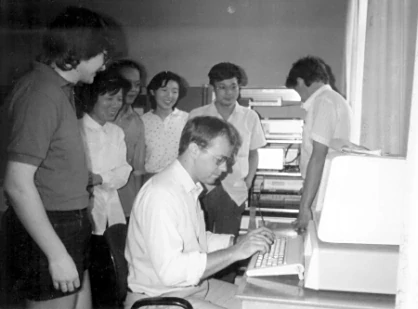

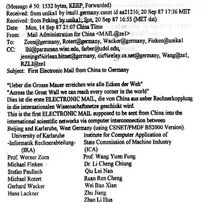

---
In March 1988, the China Academic Network (CANET) project launched, initially connecting 28 scientific institutions. By early 1988, China established its first X.25 packet-switched network (CNPAC) covering nine major cities. The National Computing and Networking Facility of China (NCFC) received approval in October 1989 as a World Bank loan project, bringing together the Chinese Academy of Sciences, Peking University, and Tsinghua University.

1988年3月，中国学术网（CANET）项目启动，最初连接了28个科研机构。到1988年初，中国建立了第一个X.25分组交换网络（CNPAC），覆盖了九个主要城市。1989年10月，国家计算机与网络设施（NCFC）作为世界银行贷款项目获得批准，汇集了中国科学院、北京大学和清华大学。

---
A crucial milestone occurred on November 28, 1990, when the .CN country code top-level domain was officially registered with Qian Tianbai as administrative contact and Professor Wang Yunfeng working alongside Werner Zorn to facilitate the registration. The domain servers were initially hosted at the University of Karlsruhe in Germany until 1994.

一个关键的里程碑出现在1990年11月28日，当时中国的.CN国家代码顶级域名正式注册，钱天白担任管理联系人，王云峰教授与沃尔纳·佐恩一起促进了注册工作。域名服务器最初托管在德国卡尔斯鲁厄大学，直到1994年。

---
The early 1990s marked China's transition from experimental connections to genuine internet integration. By the end of 1992, three major academic networks were operational: CASNET (Chinese Academy of Sciences), TUNET (Tsinghua University), and PUNET (Peking University). Tsinghua's TUNET became China's first campus network using TCP/IP structure with FDDI backbone technology.

1990年代初期标志着中国从实验性连接转向真正的互联网整合。到1992年底，三个主要的学术网络已投入运营：中国科学院的CASNET、清华大学的TUNET和北京大学的PUNET。清华的TUNET成为中国第一个采用TCP/IP结构和FDDI骨干技术的校园网络。

---
On March 12, 1993, Vice Premier Zhu Rongji proposed the ambitious Golden Bridge Project, part of the "Three Golden Projects" that would form China's information infrastructure. Premier Li Peng approved $3 million in funding on August 27, 1993. The NCFC backbone network connecting major academic institutions was completed in December 1993 using high-speed optical cables and routers.

1993年3月12日，朱镕基副总理提出了雄心勃勃的“金桥工程”，这是形成中国信息基础设施的“三大金工程”之一。李鹏总理在1993年8月27日批准了300万美元的资金支持。1993年12月，国家计算机与网络设施（NCFC）的骨干网络建设完成，连接了主要的学术机构，采用了高速光纤电缆和路由器。

---
The historic breakthrough came on April 20, 1994, when NCFC's 64K international special line via Sprint achieved full TCP/IP connection to the Internet, making China the 77th country with full functional Internet access. This date is now celebrated as the beginning of China's Internet era.

历史性的突破发生在1994年4月20日，当时NCFC通过Sprint的64K国际专线实现了与互联网的完全TCP/IP连接，使中国成为第77个拥有完全功能互联网接入的国家。这个日期现在被视为中国互联网时代的开始。

---
On May 15, 1994, the Institute of High Energy Physics, Chinese Academy of Sciences, established the first domestic Web server and launched China's first website, aimed at introducing advancements in high technology. One section of the site also provided information on economics, culture, and commerce. It was later renamed "China Window" and became one of the main channels for China to release information via the global Internet.

1994年5月15日，中科院高能物理研究所，建立了国内第一个Web服务器， 推出中国首套网页，用于介绍高科技发展情况， 其中一个栏目还提供包括经济、文化、商贸等方面的信息，后更名为“中国之窗”，成为中国利用国际互联网发布信息的主要渠道之一。

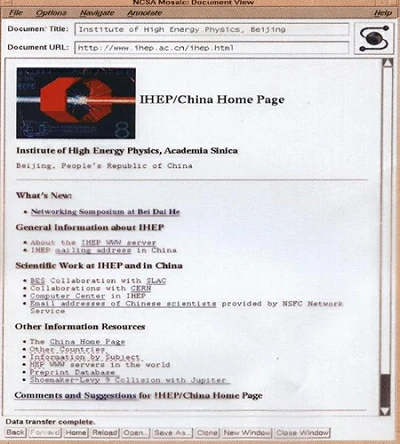

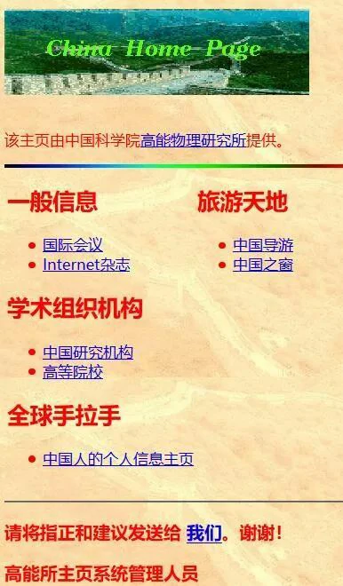

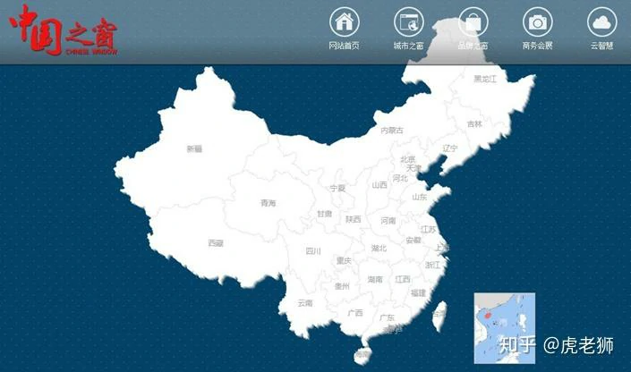

---
On May 21, 1994, China established its CN domain server domestically, ending foreign hosting of Chinese domains.

1994年5月21日，中国在国内建立了CN域名服务器，结束了中国域名的外部托管。

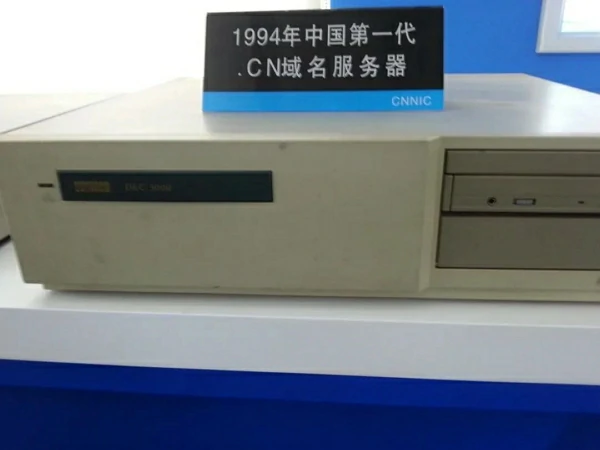

---
July 19, 1994 saw the formation of China Unicom, the first competitor to challenge the telecommunications monopoly, with initial capital of 1.34 billion RMB from the Ministry of Electronics Industry, Ministry of Electric Power, Ministry of Railways, and other stakeholders.

1994年7月19日，成立了中国联通，这是第一个挑战电信垄断的竞争者，最初的资金来自电子工业部、电力工业部、铁路部等多个股东，共计13.4亿元人民币。

---
January 1995 marked the launch of ChinaNet by China Telecom, with commercial services beginning in January 1996. The network, nicknamed "163" after its dial-up access number, initially connected to the US via 64K Sprint lines in Beijing and Shanghai.

1995年1月，中国电信推出了ChinaNet，并于1996年1月开始提供商业服务。这个网络因为其拨号接入号码而被昵称为“163”，最初在北京和上海通过64K的Sprint线路连接美国。

---
In 1995, the first internet cafe in China, Shanghai 3C+T Internet Cafe, was established, charging 10-15 RMB per hour. This marked the first peak in the development of the internet cafe industry. The primary function of internet cafes gradually shifted from browsing websites to gaming, with popular games such as Age of Empires, Red Alert, StarCraft, Counter-Strike, and Prince of Persia taking center stage.

1995 年，国内首个网吧上海 3C+T 网吧诞生，收费 10-15 元 / 小时，网吧行业也迎来第一个发展高峰。网吧主要功能逐渐从浏览网页过渡到游戏，以帝国时代、红色警戒、星际争霸、CS、波斯王子等游戏为主。

---
Mid-1995 – There are 40,000 internet users in China, up from only 3,000 earlier that year.  
1995年年中 ——中国有 40,000 名互联网用户，而当年早些时候只有 3,000 名。

---
On October 20, 1995, *China Trade News* went online, becoming the first media outlet in China to join the Internet. To date, unofficial statistics show that over a hundred media outlets have launched electronic versions.

1995年10月20日，《中国贸易报》走上互联网，成为中国第一个上网的媒体。至今，不完全统计，已有百余家媒体有了电子版。

---
The regulatory framework began taking shape with the State Council passing the "Temporary Regulation for Management of Computer Information Network International Connection" on January 23, 1996. This established that ISPs must be licensed and internet traffic must route through approved backbone networks.

监管框架开始成型，国务院于1996年1月23日通过了《计算机信息网络国际连接管理暂行规定》。该规定要求互联网服务提供商（ISP）必须获得许可证，互联网流量必须经过批准的骨干网络。

---
Starting from the second half of 1996, 20 students from Fudan University in Shanghai became the first beneficiaries of the domestic remote teaching experiment, with online classes marking a first in China. All the students needed was a PC, a modem, and a telephone line, without the need to attend physical classes. The course content was systematically uploaded to the Fudan University campus network, and the subject being taught was computer networks, truly using the network to learn about the "network".

从1996年下半学期开始，上海复旦大学20名学子成为国内首次远程教学试验的受益者，通过网络授课也是国内首次。学生只需一台PC机，一个调制解调器和一条电话线就够了，不必到课堂听课。老师将课程内容有计划放入复旦大学校园网络上，而此次授课内容恰为计算机网络，真正的是用网络学“网络”。

---
In November 1996, the Sparkice Internet Cafe opened at the west gate of the Beijing Capital Indoor Stadium, becoming the first internet cafe in China. The internet cafe combined the global information network system of the Internet with coffee and dining culture, offering both leisure and entertainment functions. This made "hanging out at an internet cafe" a trendy activity.

1996年11月，北京首体西门实华开网络咖啡屋开张，成为中国第一家网络咖啡屋，网络咖啡屋结合了电脑Internet全球信息网络系统与咖啡餐饮文化，兼具休闲娱乐功能，使“泡网吧”成为一种时尚。

---
In January 1997, the magazine *Online Life* (English name: *Internet & Intranet*) was launched, becoming China's first magazine dedicated to the Internet. It was a monthly publication, sponsored by the former Computer and Microelectronics Development Research Center of the Ministry of Electronics Industry.

1997年1月，《网上生活》（英文名《Internet＆Intranet》）杂志面世，为我国第一本Internet杂志，该杂志为月刊，由原电子部计算机与微电子发展研究中心主办。

---
1997 – NetEase is founded. One of China’s foundational internet companies, it provides games, news, communications, and a good old-fashioned internet portal.  
1997年 – 网易成立。它是中国基础互联网公司之一，提供游戏、新闻、通信和良好的老式互联网门户。

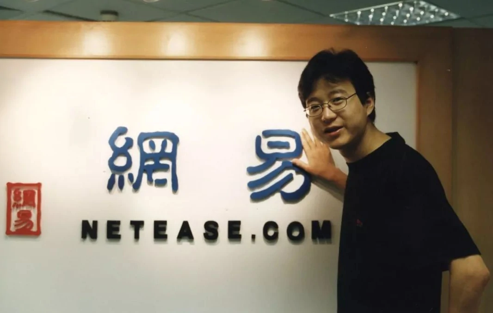

---
In early 1998, the 43-episode series *Water Margin* was broadcast during prime time on China Central Television and also made available on the Internet, setting a trend in China's film and television industry. It was met with enthusiastic reception from online users.

1998年初，43集《水浒传》在中央电视台黄金时间播出，并上了因特网，开中国影视界风气之先，获得网民热烈欢迎。

---
On February 15, 1998, 34-year-old Charles Zhang launched Sohu (Sohoo), the first fully Chinese-language and most popular online search engine in China. By October 5, 1998, just seven months later, Zhang Chaoyang was named one of *Time* magazine's 50 "Digital Heroes."

1998年2月15日，34岁的张朝阳推出第一家全中文的、也是中国最受欢迎的网上搜索引擎———搜狐（Sohoo），1998年10月5日张朝阳成为美国《时代》周刊50名“数字英雄”之一，时间仅仅7个月。

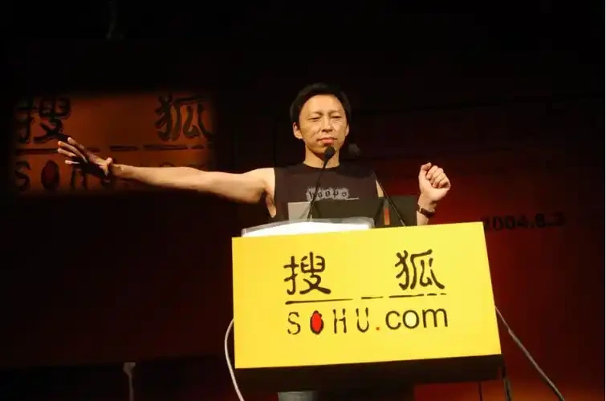

---
In June 1998, during the "World Cup", major Chinese internet companies seized the opportunity to launch their first large-scale online business initiatives. *Stone Richsight* was the most active Chinese website, specifically organizing a "translation" team that utilized network reporters from around the world to quickly send back reports.

1998年6月，“世界杯”期间，中国各大网络公司以此为契机，发动第一次大规模网络商业行动。“四通利方”是最为活跃的中文网站，专门组织了“翻译”班子，利用在世界各地的网络记者，以最快速度向回发稿。

---
On June 16, 1998, during a routine check, staff members of an information network in Shanghai discovered that the network had been attacked by an unauthorized intruder. On July 13, the suspect, Yang, was arrested. This was the first case of computer hacking in China.

1998年6月16日，上海某信息网的工作人员在例行检查时，发现网络遭到不速之客的袭击。7月13日，犯罪嫌疑人杨某被逮捕。这是我国第一例电脑黑客事件。

---
On June 26, 1998, Zhang Shuxin, the general manager of *InfoHighWay*, resigned, shocking the industry. Following this, Chief Engineer Jiang Zuoxian and Vice President Zhang Pu also left the company. On November 26, 1998, 15 senior executives of *InfoHighWay* resigned collectively, causing a significant "shockwave" in the industry.*InfoHighWay* was a well-known large private ISP company in China, and the changes in its senior leadership and its future direction became a hot topic in both the industry and the media.

1998年6月26日，“瀛海威”总经理张树新辞职，令业内震惊。随后总工程师姜作贤、副总裁张朴亦离瀛海威而去。1998年11月26日，“瀛海威”15位高级管理人员再一次集体辞职，引发业内一次不小的“地震”。“瀛海威”公司是中国闻名的一家大型民营ISP公司，其高层领导更替、未来走向成为业界及新闻界一个热门话题。

---
In the second half of 1998, Zhongxi Company pioneered the introduction of Chinese-language domain name registration. On the Internet, domain names typically required registration in English. The launch of Chinese domain name registration by Zhongxi Company marked a significant step forward in the localization of the Internet. Zhongxi decided to offer free Chinese domain names to 10 government agencies and 10 enterprises among the first batch of applicants.

1998年下半年，中西公司首创推出中文注册域名。在因特网上，注册域名通常都需要注册英文名字，中西公司中文域名注册的推出使因特网汉化的程度大大向前迈进了一步。中西公司决定在第一批申请单位中为10家政府机构和10家企业提供免费中文域名。

---
On November 6, 1998, China's first online university, the Multimedia Information Education College of Hunan University, opened its doors. Over 1,000 students at 15 remote teaching sites across 14 cities and regions in the province began their first lesson via the public multimedia network. This marked the official launch of multimedia distance education in China.

1998年11月6日，中国第一所网上大学———湖南大学多媒体信息教育学院开学，分布在全省14个地、州、市的15个远程教学点的1000余名学生，通过公众多媒体网开始了第一堂课的学习。这标志着中国多媒体远程教育已正式启动。

---
On December 16, 1998, the Beijing municipal government’s "Capital Window" work meeting revealed that the "Capital Window" website had been launched, becoming China's first large-scale "government network". People could directly communicate with the mayor through online channels such as the Mayor's Mailbox, providing the public with a new avenue to understand government policies — the internet. Beijing planned to have all city government agencies (including the municipal party committee, people’s congress, and political consultative committee) online by the end of September 1999. By the end of November 1998, national information departments announced the nationwide launch of the "Government Online Project." The relevant authorities set 1999 as the "Government Online Year" and aimed to have 80% of national ministries and multiple levels of government establish websites on China’s public multimedia communication network (163/169 network) by the year 2000.

1998年12月16日，北京市政府“首都之窗”工作会议透露“首都之窗”站点业已开通，成为我国第一个大规模“政府网”。人们有问题要反映可以通过网上市长信箱等在网上直接与市长沟通，群众也多了一条了解政府方针的新渠道———网络。北京计划1999年9月底以前基本实现市国家机关（含市委、人大、政协）全部走上因特网。1998年11月末消息，国家信息部门将在全国范围内启动“政府上网工程”。有关部门将1999年定为“政府上网年”，并计划到2000年，80％的国家部委和多级政府在中国公众多媒体通讯网上（163／169网）设定站点。

---
On January 1, 1999, Chinese netizens participated in their first online boycott, initiated by Huang Zhenqiang, a 1996 economics student from Nanjing University. The reason for the boycott was dissatisfaction with high local telephone and internet charges, which made internet access a "luxury activity". Ordinary users could not afford monthly internet fees of 250 to 350 yuan. On January 10 and 17, two more internet boycotts occurred. In April, China Telecom adjusted its internet fees. Subsequently, 263 Network capped the internet fee for individual users at 198 yuan.

1999年1月1日，中国网民完成第一次罢网活动。发动此次罢网的是南京大学经济系96级学生黄振强。罢网理由为：不满市内电话费和其它上网费用太高，使上网成为“贵族运动”，普通网民不能忍受每月250—350元的上网费用。1月10日、1月17日又发生两次罢网事件。4月，中国电信进行网费调整。随后，263网对个人网户实施封顶网费198元。

---
Feb 1999 – Tencent QQ is released. A simple, lightweight chat app adopted widely by individuals and businesses. Users are identified by simple numbers that are still widely used in advertisements.  
1999年 2 月 – 腾讯 QQ 发布。一款简单、轻量级的聊天应用程序，被个人和企业广泛采用。用户通过简单的数字来识别，这些数字仍在广告中广泛使用。

  

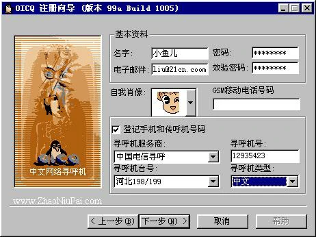

---
China's first professional anti-pornography software, "Five Elements Guardian," was officially launched in Beijing on April 8, 1999.

我国第一张专业扫黄软件“五行卫士”1999年4月8日正式在京推出。

---
On April 8, 1999, eight well-known Chinese internet sites — Sohu, Sina, ChinaByte, NetEase, Guozhong, Shanghai Hotline, InfoHighWay, and Youyou — held the inaugural meeting of the "China ICP Joint Development High-Level Conference" in Beijing. This marked the establishment of China’s first self-regulatory industry organization for the information industry.

1999年4月8日，国内8家知名中文互联网络站点———搜狐、新浪、ChinaByte、网易、国中网、上海热线、瀛海威、悠游，在京召开“中国ICP联合发展高层会议”成立大会暨首次会议。中国信息产业第一个行业自律性的组织由此产生。

---
On May 8, 1999, NATO, led by the United States, launched five missile strikes on the Chinese Embassy in the Federal Republic of Yugoslavia, triggering an unprecedented "online war" between Chinese and American netizens. In less than 10 days, Chinese hackers "hacked" into several major websites, including NATO's, the U.S. Navy Computer and Communications Washington Center, the U.S. Air Force's Thunderbirds flight team, the U.S. Embassy in China, the White House, the U.S. Department of the Interior, the Department of Energy, the Department of Agriculture, and several NATO sites. At the same time, American netizens launched counterattacks on a number of influential Chinese websites.

1999年5月8日，以美国为首的北约的五枚导弹袭击了中国驻南联盟大使馆，导致中美两国网民在互联网上展开一场空前的“网上战争”。北约网站、美国海军计算机与通讯华盛顿中心网站、美国空军王牌“雷鸟”飞行大队网站、美国驻华大使馆、美国白宫、美国内政部、能源部、农业部等网站及北约部分网站均在不到10天内被中国网客“黑”掉。同时，美国网客也对中国一批有影响的网站发动了反击。

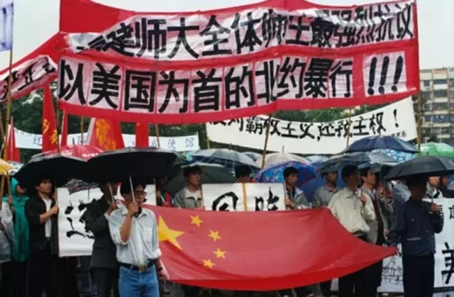

---
On June 1, 1999, China's first online TV station, China Hongqiao Network, officially launched its broadcast from 8:00 to 9:00 PM. The internet was referred to as the "fourth medium" after stage, print media, radio, and television. Looking at the global changes in the information industry, the most significant trend was the comprehensive cooperation between telecom networks and media, which gave rise to online television.

1999年6月1日，中国第一家网络电视台———中国虹桥网晚上8点至9点正式开通。网络被称为继舞台、书报、广播和电视之后的第四媒体。纵观全球信息产业格局的变化，最主要标志是电信网络与媒体的全方位合作，网络电视应运而生。

---
On June 28, 1999 – Alibaba is founded. A business-to-business e-commerce company that develops into a consumer and financial goliath.  
1999年6月28日 – 阿里巴巴成立。一家企业对企业的电子商务公司，发展成为消费者和金融巨头。

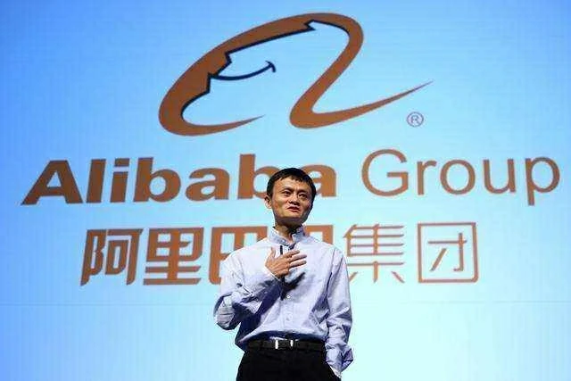