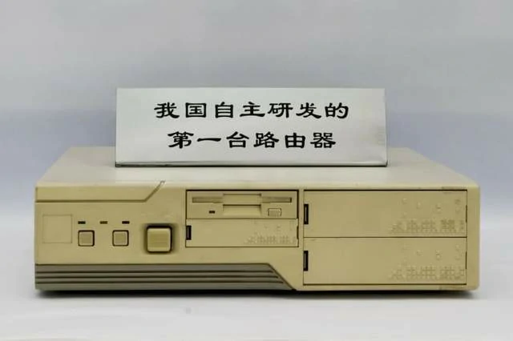
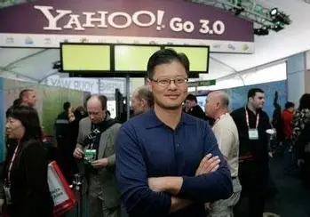
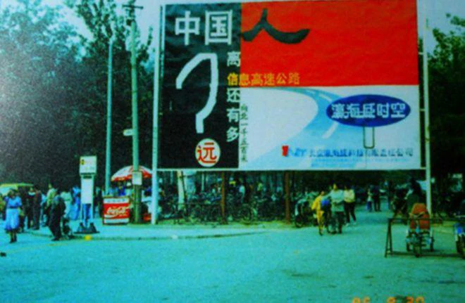
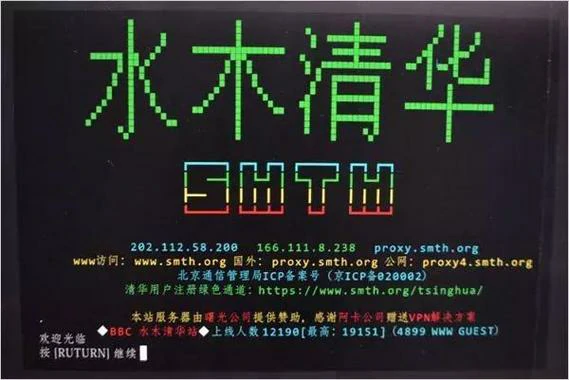
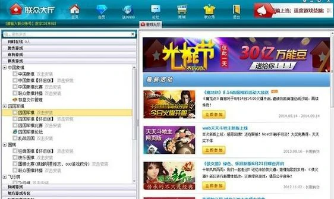
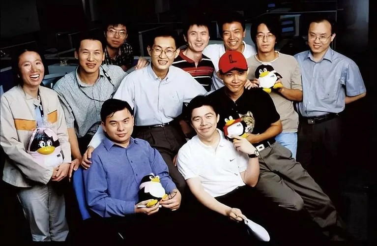
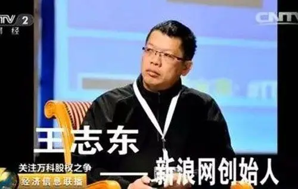
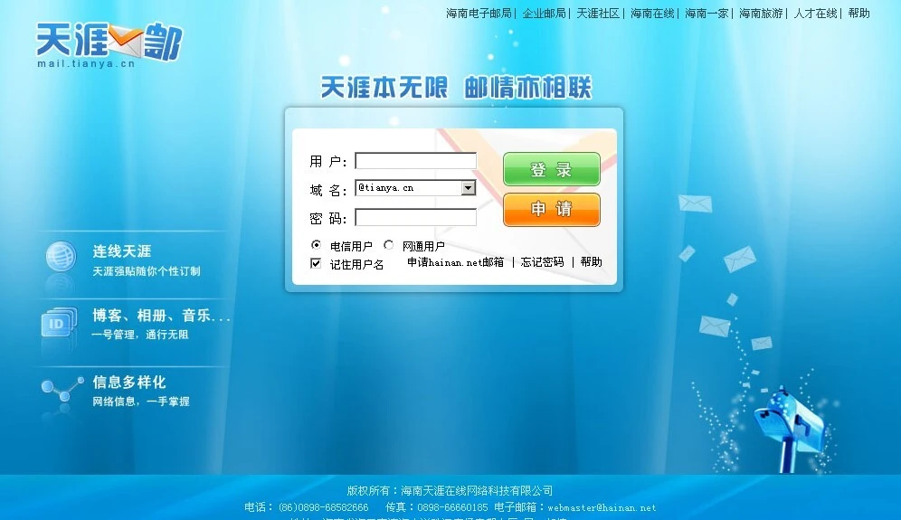
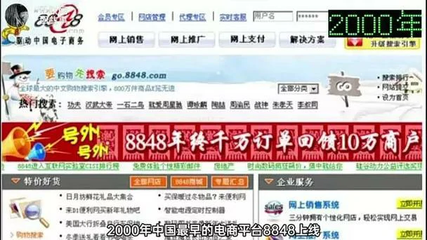
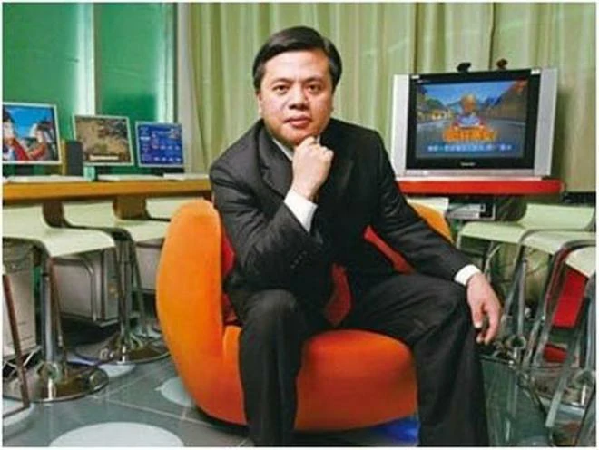

# 1987–1999: Beginnings and Exploration – The Dawn of the Internet in China

---
>## 1987-1993, International Research Promotion Period.During this period, international research forces provided a boost, and Chinese government departments took the lead. As a result, the internet evolved from information retrieval to full-function access, and then to commercial exploration.
1987年-1993年，国际科研助推期。在这一时期，国际科研力量助推，中国政府部门主推，于是互联网从信息检索，到全功能接入，再到商业化探索。

On September 20, 1987, Professor Werner Zorn from the University of Karlsruhe, Germany, sent China's first email from the Institute for Computer Application in Beijing to the University of Karlsruhe. The email's content was "Across the Great Wall, we can reach every corner in the world." This event is widely regarded as the prelude to China's internet era, marking the country's initial connection to the global network.

1987年9月20日，德国卡尔斯鲁厄大学的维纳·措恩教授在北京的计算机应用技术研究所，向卡尔斯鲁厄大学发出了中国的第一封电子邮件。邮件的内容是“越过长城，我们能到达世界的每一个角落”。这一事件被广泛认为是中国互联网时代的序幕，标志着中国与全球网络的首次连接。

---
In March 1988, the China Academic Network (CANET) project launched, initially connecting 28 scientific institutions. By early 1988, China established its first X.25 packet-switched network (CNPAC) covering nine major cities. The National Computing and Networking Facility of China (NCFC) received approval in October 1989 as a World Bank loan project, bringing together the Chinese Academy of Sciences, Peking University, and Tsinghua University.

1988年3月，中国学术网络（CANET）项目启动，最初连接了28个科研机构。1988年初，中国建成了首个X.25分组交换网络（CNPAC），覆盖九个主要城市。1989年10月，作为世界银行贷款项目的国家计算机与网络设施（NCFC）获得批准，汇聚了中国科学院、北京大学和清华大学三方力量。

---
A crucial milestone occurred on November 28, 1990, when the .CN country code top-level domain was officially registered with Qian Tianbai as administrative contact and Professor Wang Yunfeng working alongside Werner Zorn to facilitate the registration. The domain servers were initially hosted at the University of Karlsruhe in Germany until 1994.

1990年11月28日，一个关键里程碑事件发生——中国的.CN国家代码顶级域名正式完成注册，钱天白担任管理联系人，王运丰教授与维尔纳·佐恩共同推进了注册工作。域名服务器最初托管于德国卡尔斯鲁厄大学，直至1994年。

---
In 1991, at the U.S.–China High Energy Physics Annual Conference, the American representative White Torky first proposed a cooperation plan to include China in the interconnected network.

1991年， 在中美高能物理年会上，美方发言人怀特·托基首度提出把中国纳入互联网络的合作计划。

---
In June 1992, at the INET’92 Conference held in Kobe, Japan, Researcher Qian Hualin from the Chinese Academy of Sciences met with the head of the International Networking Division of the U.S. National Science Foundation. They held the first formal discussion on China’s connection to the Internet, but were informed that, since many U.S. government agencies were online, political obstacles hindered China’s Internet access.

1992年6月，在日本神户举行的INET’92年会上，中国科学院钱华林研究员约见美国国家科学基金会国际联网部负责人，第一次正式讨论中国连入Internet的问题，但被告知，由于网上有很多美国的政府机构，中国接入Internet有政治障碍。

---
In December 1992, Tsinghua University’s campus network (TUNET) was completed and put into operation. It became the first campus network in China to adopt the TCP/IP architecture. The backbone network successfully used FDDI technology for the first time, making it a domestic leader in terms of network scale, technological level, and applications. At the same time, the Chinese Academy of Sciences network (CASNET, connecting more than thirty institutes in the Zhongguancun area and the CAS headquarters in Sanlihe), the Tsinghua University campus network (TUNET), and the Peking University campus network (PUNET) were all completed.

1992年12月，清华大学校园网（TUNET）建成并投入使用，是中国第一个采用TCP/IP体系结构的校园网，主干网首次成功采用FDDI技术，在网络规模、技术水平以及网络应用等方面处于国内领先水平。中科院院网（CASNET，连接了中关村地区三十多个研究所及三里河中科院院部）、清华大学校园网（TUNET）和北京大学校园网（PUNET）全部完成建设。

---
On March 12, 1993, Vice Premier Zhu Rongji proposed the ambitious Golden Bridge Project, part of the "Three Golden Projects" that would form China's information infrastructure. Premier Li Peng approved $3 million in funding on August 27, 1993. The NCFC backbone network connecting major academic institutions was completed in December 1993 using high-speed optical cables and routers.

1993年3月12日，朱镕基副总理提出了雄心勃勃的"金桥工程"，这是构建中国信息基础设施的"三金工程"之一。李鹏总理于1993年8月27日批准了300万美元的资金支持。1993年12月，连接主要学术机构的国家计算机与网络设施（NCFC）骨干网络建设完成，采用了高速光纤电缆和路由器技术。

---
In April 1993, the Computer Network Information Center of the Chinese Academy of Sciences gathered several network experts in Beijing to investigate the domain name systems of various countries, and subsequently proposed and established China’s domain name system.

1993年4月，中国科学院计算机网络信息中心召集在京部分网络专家调查了各国的域名体系，提出并确定了中国的域名体系。

---
In June 1993, NCFC experts reiterated China’s demand to connect to the Internet during the INET’93 conference, seizing every opportunity to negotiate with international Internet specialists. After INET’93, Researcher Qian Hualin attended the CCIRN (Coordinating Committee for Intercontinental Research Networking) meeting, where one agenda item was devoted specifically to the issue of China’s Internet connection, gaining broad support from most participants. This meeting greatly promoted China’s eventual full integration into the Internet.

1993年6月，NCFC专家们在INET’93会议上利用各种机会重申了中国连入Internet的要求，且就此问题与国际Internet界人士进行商议。INET’93会议后，钱华林研究员参加了CCIRN(Coordinating Committee for Intercontinental Research Networking)会议，其中一项议程专门讨论中国连入Internet的问题，获得大部分到会人员的支持。这次会议对中国能够最终真正连入Internet起到了很大的推动作用。

---
In August 1993, Premier Li Peng approved the allocation of 3 million USD from the Premier’s contingency fund to support the initiation of the Golden Bridge Project’s preliminary construction.

1993年8月，李鹏总理批准使用300万美元总理预备费支持启动金桥前期工程建设。

---
In December 1993, the State Council approved the establishment of the National Joint Conference on Economic Informatization, chaired by Vice Premier Zou Jiahua.

1993年12月，国务院批准成立国家经济信息化联席会议，国务院副总理邹家华任主席。

---
In December 1993, the NCFC backbone network project was completed, interconnecting three university networks with high-speed optical cables and routers.

1993年12月，NCFC主干网工程完工，采用高速光缆和路由器将三个院校网互连。

---
>## 1994-1999, Prophet Exploration Growth Period.During this period, public awareness and acceptance of the internet gradually increased, and steady growth occurred. The earliest pioneers established internet companies one after another, full of enthusiasm, singing high praises, undeterred by the challenges posed by the internet bubble period, and striving to explore the business models of the internet.
1994年-2000年，先知探索成长期。逐步建立普通大众对互联网的认知度和接受度，稳步成长。在这一期间，最早一批先知先觉者相继成立互联网公司，热情高涨，一路高歌，不畏互联网泡沫期带来的考验，努力探索互联网的商业模式

---
In January 1994, Jerry Yang and David Filo founded Yahoo, a well-known Internet portal in the United States and one of the creators of the Internet miracle at the end of the 20th century. Its services included a search engine, email, news, and more, with operations spanning 24 countries and regions, providing diversified online services to over 500 million unique users worldwide.

1994年1月，杨致远、大卫·费罗创立雅虎，Yahoo是美国著名的互联网门户网站，也是20世纪末互联网奇迹的创造者之一。其服务包括搜索引擎、电邮、新闻等，业务遍及24个国家和地区，为全球超过5亿的独立用户提供多元化的网络服务。

---
The historic breakthrough came on April 20, 1994, when NCFC's 64K international special line via Sprint achieved full TCP/IP connection to the Internet, making China the 77th country with full functional Internet access. This date is now celebrated as the beginning of China's Internet era.

历史性突破发生在1994年4月20日，当时NCFC通过Sprint的64K国际专线实现了与互联网的完整TCP/IP连接，使中国成为第77个拥有全功能互联网接入的国家。这一日期现被公认为中国互联网时代的开端。

---
On May 15, 1994, the Institute of High Energy Physics, Chinese Academy of Sciences, established the first domestic Web server and launched China's first website, aimed at introducing advancements in high technology. One section of the site also provided information on economics, culture, and commerce. It was later renamed "China Window" and became one of the main channels for China to release information via the global Internet.

1994年5月15日，中科院高能物理研究所，建立了国内第一个Web服务器， 推出中国首套网页，用于介绍高科技发展情况， 其中一个栏目还提供包括经济、文化、商贸等方面的信息，后更名为“中国之窗”，成为中国利用国际互联网发布信息的主要渠道之一。

---
On May 21, 1994, China established its CN domain server domestically, ending foreign hosting of Chinese domains.

1994年5月21日，中国在国内建立了CN域名服务器，结束了中国域名的外部托管。

---
July 19, 1994 saw the formation of China Unicom, the first competitor to challenge the telecommunications monopoly, with initial capital of 1.34 billion RMB from the Ministry of Electronics Industry, Ministry of Electric Power, Ministry of Railways, and other stakeholders.

1994年7月19日，中国联通成立，成为首家挑战电信垄断的竞争者，初始资本为13.4亿元人民币，由电子工业部、电力工业部、铁道部等多方共同出资。

---
January 1995 marked the launch of ChinaNet by China Telecom, with commercial services beginning in January 1996. The network, nicknamed "163" after its dial-up access number, initially connected to the US via 64K Sprint lines in Beijing and Shanghai.

1995年1月，中国电信推出了ChinaNet，并于1996年1月开始提供商业服务。这个网络因为其拨号接入号码而被昵称为“163”，最初在北京和上海通过64K的Sprint线路连接美国。

---
In May 1995, Zhang Shuxin founded China’s first Internet service provider, Infohighway, marking the public’s entry into the Internet. At that time, computers accessed the Internet via “dial-up,” where the Internet connection and the telephone shared the same line, making it impossible to use the phone and the Internet simultaneously—an incoming call would disconnect the network.

1995年5月，张树新创立首家互联网服务供应商瀛海威，老百姓进入互联网。电脑上网是“拨号上网”，网线和电话共用一个线路，不能同时用网络电话，有电话进来就断了网。

---
In August 1995, a Tsinghua University user with the screen name ACE installed a BBS software package on his laboratory computer and named the site “Shuimu Tsinghua.” Shuimu Tsinghua BBS became the first “large-scale” website in mainland China to have more than 100 users online simultaneously, heralding the rise of the BBS forum era that later gave birth to successors such as Xici, Mop, and Tianya.

1995年8月，清华大学一位网名ACE的用户，在自己实验室的电脑上装了套BBS软件，把站点起名“水木清华”。水木清华BBS是中国大陆第一个同时在线超过100人的“大型”网站，拉开了风靡一时的BBS论坛时代。后来的西祠、猫扑、天涯等都是晚辈。

---
In 1995, the first internet cafe in China, Shanghai 3C+T Internet Cafe, was established, charging 10-15 RMB per hour. This marked the first peak in the development of the internet cafe industry. The primary function of internet cafes gradually shifted from browsing websites to gaming, with popular games such as Age of Empires, Red Alert, StarCraft, Counter-Strike, and Prince of Persia taking center stage.

1995年，中国首家网吧——上海3C+T网吧诞生，收费标准为每小时10-15元人民币。这标志着网吧行业迎来第一个发展高峰。网吧的主要功能逐渐从浏览网页转向游戏，《帝国时代》《红色警戒》《星际争霸》《反恐精英》《波斯王子》等热门游戏成为主流。

---
Mid-1995 – There are 40,000 internet users in China, up from only 3,000 earlier that year.  
1995年年中 ——中国有 40,000 名互联网用户，而当年早些时候只有 3,000 名。

---
On October 20, 1995, *China Trade News* went online, becoming the first media outlet in China to join the Internet. To date, unofficial statistics show that over a hundred media outlets have launched electronic versions.

1995年10月20日，《中国贸易报》上线，成为中国首家登陆互联网的媒体。截至目前，据非官方统计，已有百余家媒体推出了电子版。

---
The regulatory framework began taking shape with the State Council passing the "Temporary Regulation for Management of Computer Information Network International Connection" on January 23, 1996. This established that ISPs must be licensed and internet traffic must route through approved backbone networks.

1996年1月23日，国务院通过了《计算机信息网络国际联网管理暂行规定》，监管框架开始成形。该规定明确要求互联网服务提供商（ISP）必须获得许可，互联网流量必须通过经批准的骨干网络进行路由。

---
Starting from the second half of 1996, 20 students from Fudan University in Shanghai became the first beneficiaries of the domestic remote teaching experiment, with online classes marking a first in China. All the students needed was a PC, a modem, and a telephone line, without the need to attend physical classes. The course content was systematically uploaded to the Fudan University campus network, and the subject being taught was computer networks, truly using the network to learn about the "network".

自1996年下半年起，上海复旦大学的20名学生成为国内首次远程教学实验的受益者，网络授课在中国尚属首次。学生只需一台个人电脑、一个调制解调器和一条电话线，无需到教室上课。课程内容系统地上传至复旦大学校园网络，授课科目恰好是计算机网络，真正实现了用网络学习"网络"。

---
In November 1996, the Sparkice Internet Cafe opened at the west gate of the Beijing Capital Indoor Stadium, becoming the first internet cafe in China. The internet cafe combined the global information network system of the Internet with coffee and dining culture, offering both leisure and entertainment functions. This made "hanging out at an internet cafe" a trendy activity.

1996年11月，实华开网络咖啡屋在北京首都体育馆西门开业，成为中国第一家网络咖啡屋。这家网络咖啡屋将互联网的全球信息网络系统与咖啡餐饮文化相结合，兼具休闲与娱乐功能，使"泡网吧"成为一种时尚活动。

---
In January 1997, the magazine *Online Life* (English name: *Internet & Intranet*) was launched, becoming China's first magazine dedicated to the Internet. It was a monthly publication, sponsored by the former Computer and Microelectronics Development Research Center of the Ministry of Electronics Industry.

1997年1月，《网上生活》杂志（英文名：Internet & Intranet）创刊，成为中国第一本专注于互联网的杂志。该刊为月刊，由原电子部计算机与微电子发展研究中心主办。

---
In June 1997, NetEase is founded. One of China’s foundational internet companies, it provides games, news, communications, and a good old-fashioned internet portal.  
1997年6月，网易成立。作为中国基础性互联网公司之一，它提供游戏、新闻、通讯服务以及传统的互联网门户。

---
In November 1997, the China Internet Network Information Center (CNNIC) released the first *Statistical Report on the Development of the Internet in China*. The report indicated that as of October 31, 1997, there were 299,000 computers connected to the Internet in China, 620,000 Internet users, 4,066 domain names registered under “.cn,” 1,500 websites, and an international bandwidth of 18.64 Mbps.

1997年11月，中国互联网络信息中心发布了第一次《中国Internet发展状况统计报告》。报告中指出：截止到1997年10月31日，我国共有上网计算机29.9万台，上网用户62万人，CN下注册的域名4066个，WWW站点1500个，国际出口带宽18.64Mbps。

---
In early 1998, the 43-episode series *Water Margin* was broadcast during prime time on China Central Television and also made available on the Internet, setting a trend in China's film and television industry. It was met with enthusiastic reception from online users.

1998年初，43集电视剧《水浒传》在中央电视台黄金时段播出，并同步上网，开创了中国影视界的先河，受到网民的热烈欢迎。

---
On February 15, 1998, 34-year-old Charles Zhang launched Sohu (Sohoo), the first fully Chinese-language and most popular online search engine in China. By October 5, 1998, just seven months later, Zhang Chaoyang was named one of *Time* magazine's 50 "Digital Heroes."

1998年2月15日，34岁的张朝阳推出了搜狐（Sohoo），这是中国第一个全中文且最受欢迎的在线搜索引擎。仅仅七个月后的1998年10月5日，张朝阳就入选美国《时代》周刊50位"数字英雄"。

---
In March 1998, Ourgame, the pioneer of online gaming in China, was founded. Five years later, it had grown into the world’s largest online gaming website at the time, with 80 million registered users, 1 million paying members, and a peak of 400,000 concurrent online users.

1998年3月，中国网络游戏的鼻祖联众成立。5年之后成为当时世界最大的网络游戏娱乐网站：注册用户达8000万，其中会员100万，高峰同时在线人数40万人。

---
On April 16, 1998, Mr. Peng, a resident of Nantou, Shenzhen, purchased a batch of VCDs worth 300 yuan from Xianke Entertainment Communication Co., Ltd. over the Internet using the “All-in-One Net” online payment system of China Merchants Bank. The success of this transaction marked the official launch of the first domestic electronic payment system that enabled online shopping payments through bank cards.

1998年4月16日，家住深圳南头的彭先生通过招商银行“一网通”网上支付系统，在INTERNET网上向先科娱乐传播有限公司购买了一批价值300元的VCD光碟，这一交易的成功标志着国内首家使用银行卡进行网上购物付款结算的电子支付系统正式开通。

---
In June 1998, during the "World Cup", major Chinese internet companies seized the opportunity to launch their first large-scale online business initiatives. *Stone Richsight* was the most active Chinese website, specifically organizing a "translation" team that utilized network reporters from around the world to quickly send back reports.

1998年6月"世界杯"期间，中国各大互联网公司抓住契机，发起首次大规模网络商业行动。"四通利方"是最为活跃的中文网站，专门组建了"翻译"团队，利用世界各地的网络记者以最快速度回传报道。

---
On June 16, 1998, during a routine check, staff members of an information network in Shanghai discovered that the network had been attacked by an unauthorized intruder. On July 13, the suspect, Yang, was arrested. This was the first case of computer hacking in China.

1998年6月16日，上海某信息网络的工作人员在例行检查时发现网络遭到非法入侵者的攻击。7月13日，犯罪嫌疑人杨某被逮捕。这是中国第一起计算机黑客案件。

---
On June 26, 1998, Zhang Shuxin, the general manager of *InfoHighWay*, resigned, shocking the industry. Following this, Chief Engineer Jiang Zuoxian and Vice President Zhang Pu also left the company. On November 26, 1998, 15 senior executives of *InfoHighWay* resigned collectively, causing a significant "shockwave" in the industry.*InfoHighWay* was a well-known large private ISP company in China, and the changes in its senior leadership and its future direction became a hot topic in both the industry and the media.

1998年6月26日，"瀛海威"总经理张树新辞职，震惊业界。随后，总工程师姜作贤和副总裁张朴也离开公司。1998年11月26日，"瀛海威"15位高级管理人员集体辞职，在业界引发重大"地震"。"瀛海威"公司是中国知名的大型民营ISP公司，其高层领导更迭及未来走向成为业界和媒体的热门话题。

---
In the second half of 1998, Zhongxi Company pioneered the introduction of Chinese-language domain name registration. On the Internet, domain names typically required registration in English. The launch of Chinese domain name registration by Zhongxi Company marked a significant step forward in the localization of the Internet. Zhongxi decided to offer free Chinese domain names to 10 government agencies and 10 enterprises among the first batch of applicants.

1998年下半年，中西公司率先推出中文域名注册服务。在互联网上，域名注册通常需要使用英文。中西公司推出中文域名注册，标志着互联网本地化进程向前迈出了重要一步。中西公司决定在首批申请单位中为10家政府机构和10家企业提供免费中文域名。

---
On November 6, 1998, China's first online university, the Multimedia Information Education College of Hunan University, opened its doors. Over 1,000 students at 15 remote teaching sites across 14 cities and regions in the province began their first lesson via the public multimedia network. This marked the official launch of multimedia distance education in China.

1998年11月6日，中国第一所网上大学———湖南大学多媒体信息教育学院开学，分布在全省14个地、州、市的15个远程教学点的1000余名学生，通过公众多媒体网开始了第一堂课的学习。这标志着中国多媒体远程教育已正式启动。

---
On November 7, 1998, Tencent was founded by Ma Huateng, Zhang Zhidong, and three other co-founders. Today, Tencent’s products have become as indispensable as water and electricity on the Internet. As the king of Hong Kong stocks, Tencent has seen its value soar more than a thousand-fold since its listing in 2004, reaching a market capitalization of 3 trillion RMB!

1998年11月7日，由马化腾、张志东等五位创始人创立腾讯。如今腾讯的产品成为了互联网上的水和电，成为港股股王，腾讯自2004年上市以来，最高涨幅超过千倍，市值高达3万亿人民币！

---
On December 1, 1998, Stone Richsight and the Chinese-language Huayuan Network in North America merged to form Sina.com. This event introduced the wave of mergers and acquisitions to China’s Internet industry. However, Wang Zhidong, a technical expert and one of the key founders, was not well-versed in capital operations. His shares were diluted from 20% to 13%, then to 6%, ultimately losing control of the company, and he was eventually ousted.

1998年12月1日，四通利方和北美华人网华渊网合并，成立新浪网。给中国产业带来了并购，技术大牛的王志东不太懂资本套路，持有的股份从20%，稀释到13%，然后是6%，彻底丧失掉了公司的控制权，最后被踢出公司。

---
On December 16, 1998, the Beijing municipal government’s "Capital Window" work meeting revealed that the "Capital Window" website had been launched, becoming China's first large-scale "government network". People could directly communicate with the mayor through online channels such as the Mayor's Mailbox, providing the public with a new avenue to understand government policies — the internet. Beijing planned to have all city government agencies (including the municipal party committee, people’s congress, and political consultative committee) online by the end of September 1999. By the end of November 1998, national information departments announced the nationwide launch of the "Government Online Project." The relevant authorities set 1999 as the "Government Online Year" and aimed to have 80% of national ministries and multiple levels of government establish websites on China’s public multimedia communication network (163/169 network) by the year 2000.

1998年12月16日，北京市政府"首都之窗"工作会议透露，"首都之窗"网站已经开通，成为中国第一个大规模"政府网络"。市民可以通过网上市长信箱等在线渠道直接与市长沟通，为公众了解政府方针政策提供了新途径——互联网。北京计划在1999年9月底前基本实现市级国家机关（包括市委、人大、政协）全部上网。1998年11月底，国家信息部门宣布在全国范围内启动"政府上网工程"。相关部门将1999年定为"政府上网年"，并计划到2000年，80%的国家部委和多级政府在中国公众多媒体通信网（163/169网）上建立网站。

---
On January 1, 1999, Chinese netizens participated in their first online boycott, initiated by Huang Zhenqiang, a 1996 economics student from Nanjing University. The reason for the boycott was dissatisfaction with high local telephone and internet charges, which made internet access a "luxury activity". Ordinary users could not afford monthly internet fees of 250 to 350 yuan. On January 10 and 17, two more internet boycotts occurred. In April, China Telecom adjusted its internet fees. Subsequently, 263 Network capped the internet fee for individual users at 198 yuan.

1999年1月1日，中国网民进行了首次网络罢网活动，发起人为南京大学经济系1996级学生黄振强。罢网原因是对过高的市内电话费和其他上网费用的不满，这使得上网成为"贵族运动"，普通网民无法承受每月250-350元的上网费用。1月10日和17日又发生了两次罢网事件。4月，中国电信调整了网络费用。随后，263网络将个人用户的上网费用上限设定为198元。

---
In Feb 1999, Tencent QQ is released. A simple, lightweight chat app adopted widely by individuals and businesses. Users are identified by simple numbers that are still widely used in advertisements.

1999年2月，腾讯 QQ 发布。这是一款简洁、轻量级的聊天应用程序，被个人和企业广泛采用。用户通过简单的数字进行识别，这些数字在广告中仍被广泛使用。

  

---
In March 1999, the Tianya virtual community was launched, offering forums such as Stock Forum, Tianya Zatan, Computer Technology, Emotional World, Literary Essays (later renamed “Wu Wen Nong Mo”), News Commentary, Sports Focus, Bookworm Teahouse (later renamed “Xianxian Shuhua”), Travel & Leisure, Hainan Development, and Tianya Mutual Help.

1999年3月，天涯虚拟社区诞生。开办了股票论坛、天涯杂谈，电脑技术、情感天地、艺文漫笔（后改名为舞文弄墨）、新闻众评、体育聚焦、书虫茶社（后改名为闲闲书话）、旅游休闲、海南发展、天涯互助等栏目。

---
China's first professional anti-pornography software, "Five Elements Guardian," was officially launched in Beijing on April 8, 1999.

1999年4月8日，中国首款专业反色情软件"五行卫士"在北京正式推出。

---
On April 8, 1999, eight well-known Chinese internet sites — Sohu, Sina, ChinaByte, NetEase, Guozhong, Shanghai Hotline, InfoHighWay, and Youyou — held the inaugural meeting of the "China ICP Joint Development High-Level Conference" in Beijing. This marked the establishment of China’s first self-regulatory industry organization for the information industry.

1999年4月8日，国内8家知名中文互联网络站点———搜狐、新浪、ChinaByte、网易、国中网、上海热线、瀛海威、悠游，在京召开“中国ICP联合发展高层会议”成立大会暨首次会议。中国信息产业第一个行业自律性的组织由此产生。

---
On May 8, 1999, NATO, led by the United States, launched five missile strikes on the Chinese Embassy in the Federal Republic of Yugoslavia, triggering an unprecedented "online war" between Chinese and American netizens. In less than 10 days, Chinese hackers "hacked" into several major websites, including NATO's, the U.S. Navy Computer and Communications Washington Center, the U.S. Air Force's Thunderbirds flight team, the U.S. Embassy in China, the White House, the U.S. Department of the Interior, the Department of Energy, the Department of Agriculture, and several NATO sites. At the same time, American netizens launched counterattacks on a number of influential Chinese websites.

1999年5月8日，以美国为首的北约对中国驻南斯拉夫联盟共和国大使馆发动五枚导弹袭击，引发中美两国网民在互联网上展开一场空前的"网络战争"。在不到10天的时间内，中国黑客"攻破"了包括北约网站、美国海军计算机与通信华盛顿中心网站、美国空军王牌"雷鸟"飞行大队网站、美国驻华大使馆、美国白宫、美国内政部、能源部、农业部等网站以及北约部分网站。与此同时，美国网民也对中国一批有影响力的网站发动了反击。

---
In May 1999, Liang Jianzhang, Fan Min, Shen Nanpeng, and Ji Qi founded Ctrip in Shanghai, later known as the “Four Gentlemen of Ctrip.”

1999年5月，梁建章、范敏、沈南鹏、季琦等人在上海成立携程公司，后被称为“携程四君子”。

---
In May 1999, China’s first e-commerce website, 8848, was established. However, during the collapse of the dot-com bubble, its highly fragmented shareholding structure left the company without strong leadership at a critical moment, leading to its eventual downfall.

1999年5月，我国的第一个电子商务网站是8848成立。在整个互联网泡沫崩溃的时候，股权比例极其分散，导致在企业最关键的时候没人能站出来控制局面，最终尘归尘土归土！
1999年7月，中华网作为第一只“中国概念股”在美国纳斯达克上市。

---
On June 1, 1999, China's first online TV station, China Hongqiao Network, officially launched its broadcast from 8:00 to 9:00 PM. The internet was referred to as the "fourth medium" after stage, print media, radio, and television. Looking at the global changes in the information industry, the most significant trend was the comprehensive cooperation between telecom networks and media, which gave rise to online television.

1999年6月1日，中国第一家网络电视台———中国虹桥网晚上8点至9点正式开通。网络被称为继舞台、书报、广播和电视之后的第四媒体。纵观全球信息产业格局的变化，最主要标志是电信网络与媒体的全方位合作，网络电视应运而生。

---
In July 1999, China.com became the first “China concept stock” to be listed on NASDAQ in the United States.

1999年7月，中华网作为第一只“中国概念股”在美国纳斯达克上市。

---
In August 1999, Hongxiu Tianxiang was founded, later becoming one of the world’s leading digital copyright operators for women’s literature and the top brand in Chinese women’s reading, before eventually being acquired by Tencent.

1999年8月，红袖添香网创立，后成为全球领先的女性文学数字版权运营商之一，中文女性阅读第一品牌，后被腾讯收购。

---

On September 9, 1999, Jack Ma and 17 co-founders formally established Alibaba in an apartment in Hangzhou. The company’s first website was the English-language global wholesale marketplace Alibaba.com. In the same year, Alibaba Group launched the China marketplace (now known as “1688”), focusing on domestic wholesale trade. Many of the founders had prior experience at the Ministry of Foreign Trade and Economic Cooperation’s China International Electronic Commerce Center, which likely gave Alibaba a natural advantage in e-commerce.

1999年9月9日，马云带领下的18位创始人在杭州的公寓中正式成立了阿里巴巴，公司的首个网站是英文全球批发贸易市场阿里巴巴。同年阿里巴巴集团推出专注于国内批发贸易的中国交易市场（现称“1688”）。创始人中多位有在外经贸部中国国际电子商务中心相关工作经验，可能这一原因是阿里做电子商务的先天优势。

---
In November 1999, Dangdang B2C was established, initially focusing on selling books as a standardized product with a low average transaction value, perfect for its early-stage growth. In the same year, Alibaba B2B was founded, focusing on Yellow Pages services and helping Chinese small commodity manufacturers export to international markets.

1999年11月，当当B2C成立，标品卖书，客单价也低，正好做启蒙。1999年，阿里巴巴B2B也成立了，搞黄页，帮助中国小商品制造出口走向国际。

---
In November 1999, 26-year-old Chen Tianqiao, along with his wife Luo Qianqian and his younger brother Chen Danian, jointly raised 500,000 yuan in startup capital to establish SNDA Networks in a three-bedroom apartment in the Experts Building in the Pudong New Area of Shanghai. By the age of 31, Chen became China’s richest person.

1999年11月，26岁的陈天桥与妻子雒芊芊、胞弟陈大年共同筹集50万元启动资金，在上海浦东新区科学院专家楼的一套三居室里，开启了盛大网络的创业之路，31岁成为中国首富。

---
In 1999, Hong Kong entrepreneur Zhen Ronghui founded 51job, kicking off the online job search wave. Around 2001, 51job emerged as a dominant player in the online recruitment sector.

1999年香港人甄荣辉创立51job，网上找工作浪潮开启，2001年前后前程无忧一枝独秀。

---