# 1986–1999: Beginnings and Exploration – The Dawn of the Internet in China

---
>## 1986-1993, International Research Promotion Period.During this period, international research forces provided a boost, and Chinese government departments took the lead. As a result, the internet evolved from information retrieval to full-function access, and then to commercial exploration.
1987年-1993年，国际科研助推期。在这一时期，国际科研力量助推，中国政府部门主推，于是互联网从信息检索，到全功能接入，再到商业化探索。

At 4:11:24 of Geneva time (11:11:24 of Beijing time) on August 25, 1986, Wu Weimin from Institute of High Energy Physics of Chinese Academy of Sciences used a IBM-PC at Beijing Information Control Institute (No.710 Institute) to remotely log into the account of Wang Shuqin on a machine VXCRNA located in CERN of Geneva via the satellite link, and sent an email to Steinberger located in Geneva.

1986 年 8 月 25 日，北京时间 11 时 11 分 24 秒，中国科学院高能物理研究所的吴伟明使用北京信息控制研究所（710 研究所）的 IBM-PC，通过卫星链路远程登录位于日内瓦欧洲核子研究中心的 VXCRNA 机器上的王淑琴账户，并向位于日内瓦的 Steinberger 发送了一封电子邮件。

---
In September 1987, with the help of the research group led by Professor Werner Zorn from Karlsruhe University of Germany, Professor Wang Yunfeng and Doctor Li Chengjiong, etc., set up an email node at Institute of Computer Application (ICA) in Beijing, and successfully sent an email to Germany on September 20. The content of this email was "Across the Great Wall we can reach every corner in the world".

1987 年 9 月，在德国卡尔斯鲁厄大学 Werner Zorn 教授研究小组的帮助下，王云峰教授、李承景博士等在北京计算机应用研究所（ICA）设立了一个电子邮件节点，并于 9 月 20 日成功向德国发送了一封电子邮件。这封电子邮件的内容是“越过长城，我们可以与世界每个角落联系”。

---
From November 9 to 11 in 1987, the Chinese delegation was invited to attend the sixth session of International Academic Networkshop held in Princeton, USA. During the meeting, National Science Foundation (NSF) welcomed the extension of BITNET and CSNET's emails to China, and delivered a welcome letter to Yang Chuquan, the Chinese representative.

1987 年 11 月 9 日至 11 日，中国代表团受邀参加在美国普林斯顿举行的第六届国际学术网络研讨会。会议期间，美国国家科学基金会（NSF）欢迎 BITNET 和 CSNET 的电子邮件扩展到中国，并向中国代表杨楚权递交了一封欢迎信。

---
In the beginning of 1988, CNPAC, the first X.25 packet switched network in China, covering such cities as Beijing, Shanghai, Guangzhou, Shenyang, Xi'an, Wuhan, Chengdu, Nanjing and Shenzhen, was set up.

1988 年初，中国首个 X.25 分组交换网 CNPAC 建立，覆盖了北京、上海、广州、沈阳、西安、武汉、成都、南京和深圳等城市。

---
In March 1988, the China Academic Net (CANET) project was launched with a view to connecting the computers at the numerous universities and research institutions in China with the computer network in the world.

1988 年 3 月，中国学术网（CANET）项目启动，旨在将中国众多大学和研究机构中的计算机与世界计算机网络连接起来。

---
In July 1988, Institute of High Energy Physics of Chinese Academy of Sciences turned a VAX785 machine into a subnode of European Organisation for Nuclear Research (CERN) in Geneva, Switzerland via the satellite link of Austria Radio Company by adopting the X.25 protocol.

1988 年 7 月，中国科学院高能物理研究所通过奥地利广播公司的卫星链路，采用 X.25 协议，将一台 VAX785 机器转为欧洲核子研究组织（CERN）位于瑞士日内瓦的子节点。

---
In December 1988, the campus network of Tsinghua University used the email software package which adopted the X400 protocol and which was introduced from University of British Columbia (UBC) in Canada by Professor Hu Daoyuan, to connect with UBC via the X.25 network, and thus started the application of emails.

1988 年 12 月，清华大学校园网使用由加拿大不列颠哥伦比亚大学（UBC）教授胡道元从该校引进、采用 X.400 协议的电子邮件软件包，通过 X.25 网络与 UBC 连接，从而开始了电子邮件的应用。

---
In May 1989, China Research Network (CRN) realized the interconnection with Germany Research Network (DFN) via the X.25 experimental network (CNPAC) of the then Ministry of Post & Telecommunications. The members of CRN included: No. 15 Institute of the Ministry of Electronics and the Electronic Science Academy of the Ministry of Electronics in Beijing, No. 30 Institute of the Ministry of Electronics in Chengdu, No. 54 Institute of the Ministry of Electronics in Shijiazhuang, Fudan University and Shanghai Jiaotong University in Shanghai, and Southeast University in Nanjing. CRN provided emails that met the X.400 (MHS) standard, file transfer that met the FTAM standard, directory services that met the X.500 standard and other functions, and could communicate with Internet via the gateway of DFN in Germany.

1989 年 5 月，中国研究网络（CRN）通过原邮电部下属的 X.25 实验网络（CNPAC）实现了与德国研究网络（DFN）的互联。CRN 的成员包括：北京电子工业部第 15 研究所和电子科学学院、成都电子工业部第 30 研究所、石家庄电子工业部第 54 研究所、上海的复旦大学和交通大学，以及南京的东南大学。CRN 提供符合 X.400（MHS）标准的电子邮件、符合 FTAM 标准的文件传输、符合 X.500 标准的目录服务以及其他功能，并且可以通过德国 DFN 的网关与互联网进行通信。

---
In October 1989, the key discipline project for which the State Development Planning Commission utilized the loan of World Bank, i.e. Education and Scientific Research Demonstration Network in Zhongguancun District, which was also named as National Computing and Networking Facility of China ("NCFC") by World Bank, was officially approved. In November, this project was officially launched. NCFC was a high-tech information infrastructure project among the "key discipline development projects" using the loan of World Bank, and was co-invested and supported by State Development Planning Commission, Chinese Academy of Sciences, National Natural Science Foundation of China and State Education Commission. The project was in the charge of Chinese Academy of Sciences, and was jointly implemented by Peking University and Tsinghua University. The primary objective of setting up the project then was to build up the backbone network and three academic networks of NCFC through the cooperation among Peking University, Tsinghua University and Chinese Academy of Sciences.

1989 年 10 月，国家计委利用世界银行贷款支持的关键学科项目——中关村教育科研示范网络，该网络也由世界银行命名为“中国国家计算与网络设施”（NCFC），正式获得批准。同年 11 月，该项目正式启动。NCFC 是利用世界银行贷款的“重点学科发展项目”中的一项高科技信息基础设施项目，由国家计委、中国科学院、国家自然科学基金委员会和国家教育委员会共同投资支持。该项目由中国科学院负责，北京大学和清华大学共同实施。当时设立该项目的首要目标是，通过北京大学、清华大学和中国科学院的合作，建立起 NCFC 的主干网络和三个学术网络。

---
On November 28, 1990, with the efforts of Professor Wang Yunfeng and Professor Werner Zorn, the registration of the top level domain .CN was completed, and Qian Tianbai acted as the administrative liaison officer. From then on, China had its own identity on the Internet. Because China had not realized the full function connection with the internet then, China's CN top level domain server was temporarily set up at University of Karlsruhe in Germany.

1990 年 11 月 28 日，在王云峰教授和 Werner Zorn 教授的努力下，CN 顶级域的注册工作完成，钱天白担任行政联络员。从此，中国有了自己的互联网身份。由于当时中国尚未实现与互联网的完全连接，中国的 CN 顶级域服务器暂时设在德国卡尔斯鲁厄大学。

---
In March 1991, the computer network between Institute of High Energy Physics of Chinese Academy of Sciences and Stanford Linear Accelerator Center (SLAC) of Stanford University in the U.S. was successfully connected.

1991 年 3 月，中国科学院高能物理研究所与美国斯坦福大学的斯坦福直线加速器中心（SLAC）之间的计算机网络成功连接。

---
At the INET'92 annual conference held in Kobe, Japan in June 1992, Researcher Qian Hualin from Chinese Academy of Sciences met with the person in charge of International Network Department of National Science Foundation of the U.S., and for the first time officially discussed the issue of China's access to the Internet. However, he was told that there was political barrier for China's access to the Internet because there were many American government organs online.

1992 年 6 月，在日本神户举行的 INET'92 年度会议上，中国科学院研究员钱华林与美国国家科学基金会国际网络部门负责人会面，首次正式讨论了中国接入互联网的问题。然而，他被告知中国接入互联网存在政治障碍，因为许多美国政府机构已上网。

---
In December 1992, Tsinghua University’s campus network (TUNET) was completed and put into operation. It became the first campus network in China to adopt the TCP/IP architecture. The backbone network successfully used FDDI technology for the first time, making it a domestic leader in terms of network scale, technological level, and applications. At the same time, the Chinese Academy of Sciences network (CASNET, connecting more than thirty institutes in the Zhongguancun area and the CAS headquarters in Sanlihe), the Tsinghua University campus network (TUNET), and the Peking University campus network (PUNET) were all completed.

1992年12月，清华大学校园网（TUNET）建成并投入使用，是中国第一个采用TCP/IP体系结构的校园网，主干网首次成功采用FDDI技术，在网络规模、技术水平以及网络应用等方面处于国内领先水平。中科院院网（CASNET，连接了中关村地区三十多个研究所及三里河中科院院部）、清华大学校园网（TUNET）和北京大学校园网（PUNET）全部完成建设。

---
On March 2, 1993, the 64KDECnet special line, where Institute of High Energy Physics of Chinese Academy of Sciences hired the international satellite channel of AT & T Company to access Stanford Linear Accelerator Center (SLAC) of Stanford University of the U.S., was officially put into operation. After this, with the strong support of National Natural Science Foundation of China, the persons in charge of the important projects of many disciplines were able to dial and access this special line of Institute of High Energy Physics of Chinese Academy of Sciences, and a few hundred scientists were able to use emails in China.

1993 年 3 月 2 日，中国科学院高能物理研究所租用美国 AT&T 公司的国际卫星频道接入斯坦福大学的斯坦福线性加速器中心（SLAC）的 64KDECnet 专线正式开通。此后，在中国国家自然科学基金的强有力支持下，许多学科的重要项目负责人能够拨号接入中国科学院高能物理研究所的这条专线，几百名科学家能够使用中国的电子邮件。

---
On March 12, 1993, Vice Premier Zhu Rongji proposed the ambitious Golden Bridge Project, part of the "Three Golden Projects" that would form China's information infrastructure. Premier Li Peng approved $3 million in funding on August 27, 1993. The NCFC backbone network connecting major academic institutions was completed in December 1993 using high-speed optical cables and routers.

1993年3月12日，朱镕基副总理提出了雄心勃勃的"金桥工程"，这是构建中国信息基础设施的"三金工程"之一。李鹏总理于1993年8月27日批准了300万美元的资金支持。1993年12月，连接主要学术机构的国家计算机与网络设施（NCFC）骨干网络建设完成，采用了高速光纤电缆和路由器技术。

---
In April 1993, the Computer Network Information Center of the Chinese Academy of Sciences gathered several network experts in Beijing to investigate the domain name systems of various countries, and subsequently proposed and established China’s domain name system.

1993年4月，中国科学院计算机网络信息中心召集在京部分网络专家调查了各国的域名体系，提出并确定了中国的域名体系。

---
In June 1993, NCFC experts reiterated China’s demand to connect to the Internet during the INET’93 conference, seizing every opportunity to negotiate with international Internet specialists. After INET’93, Researcher Qian Hualin attended the CCIRN (Coordinating Committee for Intercontinental Research Networking) meeting, where one agenda item was devoted specifically to the issue of China’s Internet connection, gaining broad support from most participants. This meeting greatly promoted China’s eventual full integration into the Internet.

1993年6月，NCFC专家们在INET’93会议上利用各种机会重申了中国连入Internet的要求，且就此问题与国际Internet界人士进行商议。INET’93会议后，钱华林研究员参加了CCIRN(Coordinating Committee for Intercontinental Research Networking)会议，其中一项议程专门讨论中国连入Internet的问题，获得大部分到会人员的支持。这次会议对中国能够最终真正连入Internet起到了很大的推动作用。

---
In August 1993, Premier Li Peng approved the allocation of 3 million USD from the Premier’s contingency fund to support the initiation of the Golden Bridge Project’s preliminary construction.

1993年8月，李鹏总理批准使用300万美元总理预备费支持启动金桥前期工程建设。

---
In December 1993, the State Council approved the establishment of the National Joint Conference on Economic Informatization, chaired by Vice Premier Zou Jiahua.

1993年12月，国务院批准成立国家经济信息化联席会议，国务院副总理邹家华任主席。

---
In December 1993, the NCFC backbone network project was completed, interconnecting three university networks with high-speed optical cables and routers.

1993年12月，NCFC主干网工程完工，采用高速光缆和路由器将三个院校网互连。

---
>## 1994-1999, Prophet Exploration Growth Period.During this period, public awareness and acceptance of the internet gradually increased, and steady growth occurred. The earliest pioneers established internet companies one after another, full of enthusiasm, singing high praises, undeterred by the challenges posed by the internet bubble period, and striving to explore the business models of the internet.
1994年-2000年，先知探索成长期。逐步建立普通大众对互联网的认知度和接受度，稳步成长。在这一期间，最早一批先知先觉者相继成立互联网公司，热情高涨，一路高歌，不畏互联网泡沫期带来的考验，努力探索互联网的商业模式

---
In January 1994, Jerry Yang and David Filo founded Yahoo, a well-known Internet portal in the United States and one of the creators of the Internet miracle at the end of the 20th century. Its services included a search engine, email, news, and more, with operations spanning 24 countries and regions, providing diversified online services to over 500 million unique users worldwide.

1994年1月，杨致远、大卫·费罗创立雅虎，Yahoo是美国著名的互联网门户网站，也是20世纪末互联网奇迹的创造者之一。其服务包括搜索引擎、电邮、新闻等，业务遍及24个国家和地区，为全球超过5亿的独立用户提供多元化的网络服务。

---
Early in April 1994, Sino-US Science and Technology Cooperation Joint Committee Conference was held in Washington, USA. Before the conference, Hu Qiheng, Vice Director of Chinese Academy of Sciences, restated China's request to access the Internet on behalf of China to National Science Foundation (NSF), and gained recognition.

1994 年 4 月初，中美科技合作联合委员会会议在美国华盛顿举行。会议前，中国科学院副院长胡启恒代表中国向美国国家科学基金会（NSF）重申了接入互联网的请求，并获得了认可。

---
On April 20, 1994, NCFC's 64K international special line that accessed the Internet via Sprint, an American company, was put into operation, which meant that the global function connection with the Internet had been realized. From then on, China was officially and internationally recognized as a country that really had the access to the global function Internet. This event was rated by the press in China as one of the top ten technology news stories in China in 1994, and was listed by National Statistical Bulletin as one of the most important technology achievements in China in 1994.

1994 年 4 月 20 日，NCFC 通过美国公司 Sprint 接入国际互联网的 64K 国际专线正式开通，这意味着中国实现了与全球功能互联网的连接。从此，中国被正式和国际上承认为一个真正能够接入全球功能互联网的国家。这一事件被中国媒体评为 1994 年中国十大科技新闻之一，并由《国家统计公报》列为 1994 年中国最重要的科技成就之一。

---
On May 15, 1994, the Institute of High Energy Physics, Chinese Academy of Sciences, established the first domestic Web server and launched China's first website, aimed at introducing advancements in high technology. One section of the site also provided information on economics, culture, and commerce. It was later renamed "China Window" and became one of the main channels for China to release information via the global Internet.

1994年5月15日，中科院高能物理研究所，建立了国内第一个Web服务器， 推出中国首套网页，用于介绍高科技发展情况， 其中一个栏目还提供包括经济、文化、商贸等方面的信息，后更名为“中国之窗”，成为中国利用国际互联网发布信息的主要渠道之一。

---
On May 21, 1994, with the assistance of Professor Qian Tianbai and University of Karlsruhe, Computer Network Information Center of Chinese Academy of Sciences completed the setting of the national top level domain (CN) server in China, and changed the history when the CN top level domain server of China had been placed in foreign countries. Qian Tianbai and Qian Hualin acted as the administrative liaison officer and technical liaison officer respectively for the CN domain name of China.

1994 年 5 月 21 日，在中国科学院计算机网络信息中心与钱天白教授及卡尔斯鲁厄大学的协助下，中国完成了国家顶级域名（CN）服务器的设置，并将 CN 顶级域名服务器从国外迁回国内，改写了历史。钱天白和钱华林分别担任中国 CN 域名的行政联络员和技术联络员。

---
In May 1994, National Crime Research Center for Intelligent Computing Systems put Shuguang BBS into operation. This was the first BBS in Chinese Mainland.

1994 年 5 月，智能计算系统国家犯罪研究中心启用了曙光 BBS。这是中国大陆的第一个 BBS。

---
On June 8, 1994, General Office of the State Council sent a specific telegram titled Notice of General Office of the State Council Concerning Issues of "Three-Golden Projects" (G B F M D <1994> No.18) to each ministry and commission and each provincial and municipal government. The "Three-Golden Projects" referred to the Golden Bridge, Golden Gateway and Golden Card projects. From then on, the construction of the advance works of Golden Bridge Project was carried in an all-round way.

1994 年 6 月 8 日，国务院办公厅向各部委和各省、市人民政府发出题为《国务院办公厅关于“三金工程”问题的通知》（国办发〔1994〕18 号）的特急电报。“三金工程”指的是金桥工程、金关工程和金卡工程。从那时起，金桥工程的前期工作全面展开。

---
On June 28, 1994, with the strong support of Tokyo University of Science， Beijing University of Chemical Technology put into operation the trial-run special line that connected with the Internet.

1994 年 6 月 28 日，在东京大学的强有力支持下，北京化工大学启动了连接互联网的试验性专线。

---
Early in July 1994, the experimental network of China Education and Research Network constructed by six colleges and universities, including Tsinghua University, was put into operation. Connecting five cities, i.e. Beijing, Shanghai, Guangzhou, Nanjing and Xi' an, this network adopted the IP/x.25 technology and, interconnected with the Internet via the international gateway of NCFC. It was a network that adopted the TCP/IP protocol.

1994 年 7 月初，由清华大学等六所高校共同构建的中国教育和科研计算机网实验网投入运行。该网络连接了北京、上海、广州、南京和西安五个城市，采用 IP/x.25 技术，并通过 NCFC 的国际网关与互联网相连。它是一个采用 TCP/IP 协议的网络。

---
In August 1994, China Education and Research Network (CERNET), which was invested by State Development Planning Commission and administrated by State Education Commission, was officially approved. The objective of this project was to realize the inter-campus computer networking and the information and resource sharing, to interconnect with international academic computer networks and to establish the network management system with complete functions by utilizing advanced and practical computer technology and network communication technology.

1994 年 8 月，由国家发展计划委员会投资、国家教育委员会管理的中国教育和科研计算机网（CERNET）正式获准建设。该项目的目标是实现校园间计算机联网和信息资源共享，与国际学术计算机网互联，并利用先进的实用计算机技术和网络通信技术建立功能完善的网络管理系统。

---
In September 1994, General Administration of Telecommunications of the Ministry of Post & Telecommunications signed the Sino-U.S. agreement with the Commerce Department of the U.S. on the Internet. The agreement prescribed that General Administration of Telecommunications would put into operation two 64K special lines via Sprint Company (one in Beijing, and the other in Shanghai). The construction of CHINANET began.

1994 年 9 月，邮电部电信管理局与美国商务部签署了关于互联网的协议。该协议规定电信管理局通过斯普林特公司（北京和上海各一条）开通两条 64K 速率的特殊线路。中国公用计算机互联网（CHINANET）的建设开始启动。

---
In November 1994, the annual conference of Asia Pacific Network Working Group (APNG) sponsored by Management Committee of NCFC and co-sponsored by Chinese Academy of Sciences, Peking University and Tsinghua University was held at Tsinghua University. This was the first annual conference in the Asia Pacific region held by the Internet circle.

1994 年 11 月，由 NCFC 管理委员会主办、中国科学院、北京大学和清华大学联合承办的亚太网络工作组（APNG）年度会议在清华大学举行。这是亚太地区互联网界首次举办的年度会议。

---
January 1995 marked the launch of ChinaNet by China Telecom, with commercial services beginning in January 1996. The network, nicknamed "163" after its dial-up access number, initially connected to the US via 64K Sprint lines in Beijing and Shanghai.

1995年1月，中国电信推出了ChinaNet，并于1996年1月开始提供商业服务。这个网络因为其拨号接入号码而被昵称为“163”，最初在北京和上海通过64K的Sprint线路连接美国。

---
In January 1995, the magazine China Scholars Abroad administrated and sponsored by State Education Commission was connected to the Internet via China Education and Research Network (CERNET) to provide those who studied abroad with news and information in a timely manner, and became the first Chinese E-journal in China.

1995 年 1 月，由国家教育委员会主管、主办的《海外学者》杂志通过中国教育和科研计算机网（CERNET）接入互联网，及时为出国留学人员提供新闻和信息，成为中国首家中文电子期刊。

---
In March 1995, Chinese Academy of Sciences completed the remote connection with its branches in Shanghai, Hefei, Wuhan and Nanjing (using IP/X.25 technology), and took the first step of spreading the Internet to the entire country.

1995 年 3 月，中国科学院完成了与上海、合肥、武汉和南京分支机构的远程连接（使用 IP/X.25 技术），迈出了将互联网推广到全国的第一步。

---
In March 1995, Professor Li Xing from Tsinghua University was elected for the first time the member of the Executive Committee of Asia Pacific Network Information Center (APNIC).

1995 年 3 月，清华大学李兴教授首次当选亚洲太平洋网络信息中心（APNIC）执行委员会委员。

---
In April 1995, Chinese Academy of Sciences launched the networking project for units outside Beijing ("One Hundred Unit Networking" Project). The objective of this project was to expand the network to 24 cities nationwide based on the networking of more than 30 institutes in Beijing, and to realize the computer interconnection and the Internet access among the academic institutions in China. Based on this, the network kept expanding, gradually connected some scientific research institutes besides Chinese Academy of Sciences, became a nationwide network that served the technology users, technology administration authorities and government departments related to technologies, and was renamed as "CSTNet".

1995 年 4 月，中国科学院启动了面向北京以外单位的联网项目（“百单位联网”项目）。该项目的目标是基于北京 30 多个研究机构的联网，将网络扩展到全国 24 个城市，实现中国各学术机构的计算机互联和互联网接入。在此基础上，网络不断扩展，逐渐连接了中国科学院以外的部分科研机构，成为服务于科技用户、科技管理机构和相关政府部门的国家级网络，并更名为“中国科技网”。

---
In May 1995, China Telecom began to make preparations for the construction of the nationwide backbone network for CHINANET.

1995 年 5 月，中国电信开始为建设全国性 CHINANET 骨干网做准备。

---
In May 1995, Zhang Shuxin founded China’s first Internet service provider, Infohighway, marking the public’s entry into the Internet. At that time, computers accessed the Internet via “dial-up,” where the Internet connection and the telephone shared the same line, making it impossible to use the phone and the Internet simultaneously—an incoming call would disconnect the network.

1995年5月，张树新创立首家互联网服务供应商瀛海威，老百姓进入互联网。电脑上网是“拨号上网”，网线和电话共用一个线路，不能同时用网络电话，有电话进来就断了网。

---
In July 1995, the first 128K international special line of China Education and Research Network (CERNET) that connected to the U.S. was put into operation, and the DDN channel of the CERNET backbone network that connected to Beijing, Shanghai, Guangzhou, Nanjing, Shenyang, Xi'an, Wuhan and Chengdu was put into operation simultaneously. The speed at that time was 64Kbps, and the interconnection with NCFC was realized.

1995 年 7 月，连接美国的第一个 128K 中国教育和科研计算机网（CERNET）国际专线投入运行，同时连接北京、上海、广州、南京、沈阳、西安、武汉和成都的 CERNET 骨干网 DDN 信道也投入运行。当时的速度为 64Kbps，实现了与 NCFC 的互联。

---
In August 1995, the Golden Bridge Project was preliminarily completed. Networking (satellite network) was realized in 24 provinces and cities, and interconnection with the international network was realized.

1995 年 8 月，金桥工程初步建成。实现了 24 个省市联网（卫星网络），并与国际网络实现互联。

---
In August 1995, a Tsinghua University user with the screen name ACE installed a BBS software package on his laboratory computer and named the site “Shuimu Tsinghua.” Shuimu Tsinghua BBS became the first “large-scale” website in mainland China to have more than 100 users online simultaneously, heralding the rise of the BBS forum era that later gave birth to successors such as Xici, Mop, and Tianya.

1995年8月，清华大学一位网名ACE的用户，在自己实验室的电脑上装了套BBS软件，把站点起名“水木清华”。水木清华BBS是中国大陆第一个同时在线超过100人的“大型”网站，拉开了风靡一时的BBS论坛时代。后来的西祠、猫扑、天涯等都是晚辈。

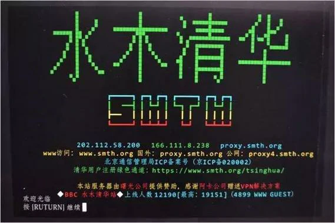

---
In 1995, the first internet cafe in China, Shanghai 3C+T Internet Cafe, was established, charging 10-15 RMB per hour. This marked the first peak in the development of the internet cafe industry. The primary function of internet cafes gradually shifted from browsing websites to gaming, with popular games such as Age of Empires, Red Alert, StarCraft, Counter-Strike, and Prince of Persia taking center stage.

1995年，中国首家网吧——上海3C+T网吧诞生，收费标准为每小时10-15元人民币。这标志着网吧行业迎来第一个发展高峰。网吧的主要功能逐渐从浏览网页转向游戏，《帝国时代》《红色警戒》《星际争霸》《反恐精英》《波斯王子》等热门游戏成为主流。

---
Mid-1995 – There are 40,000 internet users in China, up from only 3,000 earlier that year.  
1995年年中 ——中国有 40,000 名互联网用户，而当年早些时候只有 3,000 名。

---
On October 20, 1995, *China Trade News* went online, becoming the first media outlet in China to join the Internet. To date, unofficial statistics show that over a hundred media outlets have launched electronic versions.

1995年10月20日，《中国贸易报》上线，成为中国首家登陆互联网的媒体。截至目前，据非官方统计，已有百余家媒体推出了电子版。

---
In December 1995, the One Hundred Unit Networking Project of Chinese Academy of Sciences was completed.

1995 年 12 月，中国科学院的一百单位联网工程完成。

---
In December 1995, the Demonstration Project of China Education and Research Network (CERNET) was completed. This project was designed and constructed by China independently.

1995 年 12 月，中国教育和科研计算机网（CERNET）示范工程完成。该项目由中国独立设计和建设。

---
On January 13, 1996, Information Work Leading Group of the State Council and its office were set up, and Vice Premier Zou Jiahua acted as the group leader. The former Office of State Economic Informationization Joint Meeting was renamed as Office of Information Work Leading Group of the State Council.

1996 年 1 月 13 日，国务院信息工作领导小组及其办公室成立，朱镕基副总理担任领导小组组长。原国家经济信息化联席会议办公室更名为国务院信息工作领导小组办公室。

---
In January 1996, the nationwide backbone network of CHINANET was completed and officially put into operation, and the nationwide internet began to provide services.

1996 年 1 月，中国电信全国骨干网建成并正式开通，全国互联网开始提供服务。

---
The regulatory framework began taking shape with the State Council passing the "Temporary Regulation for Management of Computer Information Network International Connection" on January 23, 1996. This established that ISPs must be licensed and internet traffic must route through approved backbone networks.

1996年1月23日，国务院通过了《计算机信息网络国际联网管理暂行规定》，监管框架开始成形。该规定明确要求互联网服务提供商（ISP）必须获得许可，互联网流量必须通过经批准的骨干网络进行路由。

---
On February 27, 1996, China International Electronic Commerce Center of the Ministry of Foreign Trade and Economic Cooperation was officially established.

1996 年 2 月 27 日，对外贸易经济合作部中国国际电子商务中心正式成立。

---
In March 1996, the uniform transmission standard for Chinese characters, which was submitted by Tsinghua University and which was adapted to the Chinese character codes in different countries and regions, was adopted by IETF as RFC1922, becoming the first submitted protocol that was recognized as the RFC file in China.

1996 年 3 月，清华大学提交的适用于不同国家和地区汉字编码的统一传输标准被 IETF 采纳为 RFC1922，成为中国首个被认可为 RFC 文件的提交协议。

---
On April 9, 1996, the Ministry of Post & Telecommunications issued Administrative Measures of CHINANET on International Networking which was implemented from the date of issuance.

1996 年 4 月 9 日，邮电部发布《中国公用计算机互联网国际联网管理暂行规定》，自发布之日起施行。

---
On June 3, 1996, the Ministry of Electronics Industry issued Relevant Decisions on Management of International Networking of Computer Information Networks, renamed "Gbnet" as "China Golden Bridge NET". It authorized Jitong Communication Co., Ltd to act as the interconnected unit of China Golden Bridge NET, to manage the networking of Internet subscribers and users and to provide them with services.

1996 年 6 月 3 日，电子工业部发布了《计算机信息网络国际联网管理暂行规定》，将“金桥网”更名为“中国金桥信息网”。该规定授权吉通通信有限公司作为中国金桥信息网的互联单位，负责管理互联网用户和用户的联网，并提供相关服务。

---
In July 1996, the State Council Informatization Office organized a number of experts from relevant departments to conduct an investigation over the technology facilities and management conditions of the four major networks and about 30 ISP, which had facilitated the standardization of the network management.

1996 年 7 月，国务院信息化办公室组织了来自相关部门的数十名专家，对四大网络和约 30 家互联网服务提供商的技术设施和管理状况进行调查，这促进了网络管理的标准化。

---
On September 6, 1996, the 256K special line of CHINAGBN that accessed the U.S. was officially put into operation. CHINAGBN declared that it began to provide the Internet services, that is, the access for special line group users and the single-point access for individual users.

1996 年 9 月 6 日，连接美国的 CHINAGBN 256K 专线正式开通。CHINAGBN 宣布开始提供互联网服务，即专线用户群组接入和个人单点接入。

---
On September 22, 1996, Shanghai Hotline, the first metropolitan area network in China, was officially put into trial operation, indicating that the public information network in Shanghai which acted as the main work of the information port of Shanghai had been officially built up.

1996 年 9 月 22 日，中国首个都市圈网络——上海热线正式投入试运行，标志着作为上海信息港主要工作的上海公共信息网络已正式建成。

---
53.　 In September 1996, State Development Planning Commission officially approved the first-stage construction of the Golden Bridge Project.

53.　1996 年 9 月，国家发展计划委员会正式批准了金桥工程的第一阶段建设。

---
Starting from the second half of 1996, 20 students from Fudan University in Shanghai became the first beneficiaries of the domestic remote teaching experiment, with online classes marking a first in China. All the students needed was a PC, a modem, and a telephone line, without the need to attend physical classes. The course content was systematically uploaded to the Fudan University campus network, and the subject being taught was computer networks, truly using the network to learn about the "network".

自1996年下半年起，上海复旦大学的20名学生成为国内首次远程教学实验的受益者，网络授课在中国尚属首次。学生只需一台个人电脑、一个调制解调器和一条电话线，无需到教室上课。课程内容系统地上传至复旦大学校园网络，授课科目恰好是计算机网络，真正实现了用网络学习"网络"。

---
In November 1996, the Sparkice Internet Cafe opened at the west gate of the Beijing Capital Indoor Stadium, becoming the first internet cafe in China. The internet cafe combined the global information network system of the Internet with coffee and dining culture, offering both leisure and entertainment functions. This made "hanging out at an internet cafe" a trendy activity.

1996年11月，实华开网络咖啡屋在北京首都体育馆西门开业，成为中国第一家网络咖啡屋。这家网络咖啡屋将互联网的全球信息网络系统与咖啡餐饮文化相结合，兼具休闲与娱乐功能，使"泡网吧"成为一种时尚活动。

---
In November 1996, CERNET opened the 2M international line that connected to the U.S.. In the same month，during the German President's visit to China, CERNET- DFN, a Sino-Germany academic network interconnection line, was put into operation, which meant that the first Internet connection between the Chinese Mainland and Europe was established.

1996 年 11 月，中国教育科研网（CERNET）开通了连接美国的 2 兆国际线路。同年，在德国总统访华期间，中德学术网络互联线路 CERNET-DFN 投入运行，这意味着中国大陆与欧洲之间的第一条互联网连接得以建立。

---
In December 1996, CNINFO (169 net) was launched in an all-round way, and Gnet, Sichuan Tianfu Hotline and Shanghai Hotline were officially put into operation as the first websites.

1996 年 12 月，CNINFO（169 网）全面启动，Gnet、四川天府热线和上海热线正式作为首批网站投入运营。

---
On January 1, 1997, people.com.cn sponsored by People's Daily joined the Internet. This was the first key news propaganda website of the central government opened in China.

1997 年 1 月 1 日，人民日报社主办的人民网加入了互联网。这是中国政府开设的第一个主要新闻宣传网站。

---
In January 1997, the magazine *Online Life* (English name: *Internet & Intranet*) was launched, becoming China's first magazine dedicated to the Internet. It was a monthly publication, sponsored by the former Computer and Microelectronics Development Research Center of the Ministry of Electronics Industry.

1997年1月，《网上生活》杂志（英文名：Internet & Intranet）创刊，成为中国第一本专注于互联网的杂志。该刊为月刊，由原电子部计算机与微电子发展研究中心主办。

---
In February 1997, IHW Nationwide Network was put into operation, covered Beijing, Shanghai, Guangzhou, Fuzhou, Shenzhen, Xi'an, Shenyang and Harbin within 3 months, and became the earliest and largest privately operated ISP and ICP in China.

1997 年 2 月，IHW 全国网络投入运营，3 个月内覆盖了北京、上海、广州、福州、深圳、西安、沈阳和哈尔滨，成为中国最早也是最大的民营 ISP 和 ICP。

---
From April 18 to 21, 1997, the national informatization working conference was held in Shenzhen City. In the meeting attendees determined the definition, elements, guidelines, working principles, objectives and primary missions of the national informatization system, adopted "The Ninth Five-year Plan for National Informatization and Perspective in 2000", determined to include China's Internet into the national information infrastructure construction, and proposed the establishment of the national Internet information center and Internet exchange center.

1997 年 4 月 18 日至 21 日，全国信息化工作会议在深圳举行。会议期间，与会者确定了国家信息化体系的定义、要素、指导方针、工作原则、目标和主要任务，通过了《国家信息化“九五”计划和 2000 年展望》，决定将中国互联网纳入国家信息基础设施建设，并提出建立国家互联网信息中心和互联网交换中心。

---
On May 20, 1997, the State Council issued Decision of the State Council on Amendment of Interim Regulations of the People's Republic of China on the Management of International Networking of Computer Information to amend Interim Regulations of the People's Republic of China on the Management of International Networking of Computer Information.

1997 年 5 月 20 日，国务院发布《国务院关于修改〈中华人民共和国计算机信息网络国际联网管理暂行规定〉的决定》，修改《中华人民共和国计算机信息网络国际联网管理暂行规定》。

---
On May 30, 1997, the Information Work Leading Group Office of the State Council issued Interim Provisions for Administration of Domain Name Registration of Internet in China, authorized Chinese Academy of Sciences to set up and manage China Internet Network Information Center (CNNIC), and authorized Network Center of China Education and Research Network to sign a contract with CNNIC and to manage the second-level domain .edu.cn.

1997 年 5 月 30 日，国务院信息工作领导小组办公室发布《中国互联网域名注册暂行管理办法》，授权中国科学院建立并管理中国互联网络信息中心（CNNIC），授权中国教育和科研计算机网网络中心与中国互联网络信息中心签订合同，管理.edu.cn 二级域名。

---
On May 31, 1997, Beijing University of Chemical Technology cut off the satellite special line and connected to China Education and Research Network (CERNET).

1997 年 5 月 31 日，北京化工大学切断了卫星专线，并连接到了中国教育和科研网（CERNET）。

---
In June 1997, NetEase is founded. One of China’s foundational internet companies, it provides games, news, communications, and a good old-fashioned internet portal.  
1997年6月，网易成立。作为中国基础性互联网公司之一，它提供游戏、新闻、通讯服务以及传统的互联网门户。

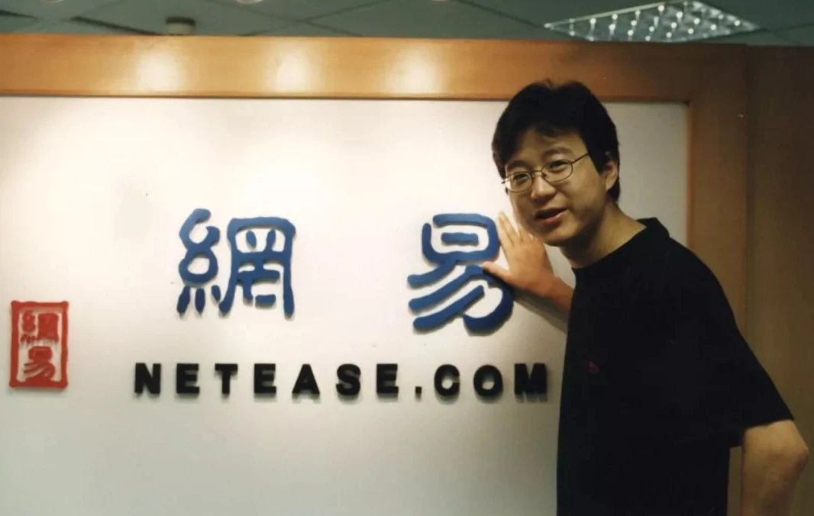

---
On June 3, 1997, under the authorization of the Information Work Leading Group Office of the State Council, Chinese Academy of Sciences set up China Internet Network Information Center (CNNIC) at Computer Network Information Center of Chinese Academy of Sciences to perform the duty of National Internet Information Center. On the same day，the Information Work Leading Group Office of the State Council declared the establishment of Working Committee of China Internet Network Information Center (CNNIC).

1997 年 6 月 3 日，在国务院信息工作领导小组办公室的授权下，中国科学院在中国科学院计算机网络信息中心设立了中华人民共和国互联网信息中心（CNNIC），承担国家互联网信息中心的职责。同日，国务院信息工作领导小组办公室宣布成立中华人民共和国互联网信息中心（CNNIC）工作委员会。

---
In October 1997, CHINANET realized the interconnection and intercommunication with the other three networks in China, i.e. CSTNET, CERNET and CHINAGBN.

1997 年 10 月，中国公用计算机互联网 CHINANET 实现了与中国其他三个网络的互联和互通，即中国科技网 CSTNET、中国教育科研网 CERNET 和中国金桥信息网 CHINAGBN。

---
In November 1997, China Internet Network Information Center (CNNIC) issued the first Statistical Report on Internet Development in China: By October 31, 1997, there were 299,000 computers in total which had access to the Internet in China. There were 620,000 Internet subscribers, 4066 domain names registered under CN, and about 1500 WWW websites. The international bandwidth was 25.408M.

1997 年 11 月，中国互联网络信息中心（CNNIC）发布了首份《中国互联网发展统计报告》：截至 1997 年 10 月 31 日，中国共有 299,000 台计算机接入互联网。互联网用户数为 620,000，注册 CN 域名的域名数量为 4066 个，约有 1500 个 WWW 网站。国际带宽为 25.408 兆。

---
On December 30, 1997, the Ministry of Public Security issued Measures for Security Protection Administration of the International Networking of Computer Information Networks which was approved by the State Council.

1997 年 12 月 30 日，公安部发布了经国务院批准的《计算机信息网络国际联网安全保护管理办法》。

---
In early 1998, the 43-episode series *Water Margin* was broadcast during prime time on China Central Television and also made available on the Internet, setting a trend in China's film and television industry. It was met with enthusiastic reception from online users.

1998年初，43集电视剧《水浒传》在中央电视台黄金时段播出，并同步上网，开创了中国影视界的先河，受到网民的热烈欢迎。

---
On February 15, 1998, 34-year-old Charles Zhang launched Sohu (Sohoo), the first fully Chinese-language and most popular online search engine in China. By October 5, 1998, just seven months later, Zhang Chaoyang was named one of *Time* magazine's 50 "Digital Heroes."

1998年2月15日，34岁的张朝阳推出了搜狐（Sohoo），这是中国第一个全中文且最受欢迎的在线搜索引擎。仅仅七个月后的1998年10月5日，张朝阳就入选美国《时代》周刊50位"数字英雄"。

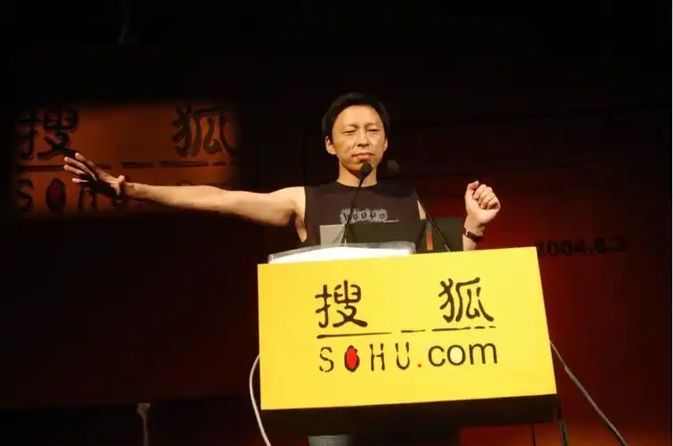

---
In March 1998, Ourgame, the pioneer of online gaming in China, was founded. Five years later, it had grown into the world’s largest online gaming website at the time, with 80 million registered users, 1 million paying members, and a peak of 400,000 concurrent online users.

1998年3月，中国网络游戏的鼻祖联众成立。5年之后成为当时世界最大的网络游戏娱乐网站：注册用户达8000万，其中会员100万，高峰同时在线人数40万人。

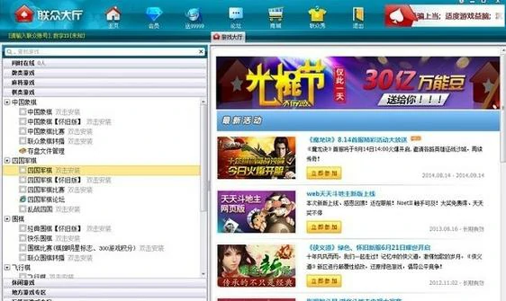

---
On March 6, 1998, the Information Work Leading Group Office of the State Council issued Implementation Rules for Interim Regulations of the People's Republic of China on the Management of International Networking of Computer Information which was put in force from the date of issuance.

1998 年 3 月 6 日，国务院信息工作领导小组办公室发布了《中华人民共和国计算机信息网络国际联网管理暂行规定实施办法》，该办法自发布之日起施行。

---
In March 1998, the First Session of the Ninth National People's Congress approved the establishment of the Ministry of Information Industry which was in charge of the manufacturing industry for electronic information products, communication industry and software industry to promote informatization of the national economy and social services.

1998 年 3 月，第九届全国人民代表大会第一次会议批准设立信息产业部，负责电子信息产品制造业、通信业和软件业，以促进国民经济和社会服务的信息化。

---
On April 16, 1998, Mr. Peng, a resident of Nantou, Shenzhen, purchased a batch of VCDs worth 300 yuan from Xianke Entertainment Communication Co., Ltd. over the Internet using the “All-in-One Net” online payment system of China Merchants Bank. The success of this transaction marked the official launch of the first domestic electronic payment system that enabled online shopping payments through bank cards.

1998年4月16日，家住深圳南头的彭先生通过招商银行“一网通”网上支付系统，在互联网上向先科娱乐传播有限公司购买了一批价值300元的VCD光碟，这一交易的成功标志着国内首家使用银行卡进行网上购物付款结算的电子支付系统正式开通。

---
In May 1998, the State approved the construction of CGWNET.

1998 年 5 月，国家批准了 CGWNET 的建设。

---
In June 1998, CERNET officially joined 6BONE, the experimental network for the next-generation IP protocol (IPv6).

1998 年 6 月，中国教育科研网正式加入 6BONE，下一代 IP 协议（IPv6）的实验性网络。

---
In June 1998, during the "World Cup", major Chinese internet companies seized the opportunity to launch their first large-scale online business initiatives. *Stone Richsight* was the most active Chinese website, specifically organizing a "translation" team that utilized network reporters from around the world to quickly send back reports.

1998年6月"世界杯"期间，中国各大互联网公司抓住契机，发起首次大规模网络商业行动。"四通利方"是最为活跃的中文网站，专门组建了"翻译"团队，利用世界各地的网络记者以最快速度回传报道。

---
On June 16, 1998, during a routine check, staff members of an information network in Shanghai discovered that the network had been attacked by an unauthorized intruder. On July 13, the suspect, Yang, was arrested. This was the first case of computer hacking in China.

1998年6月16日，上海某信息网络的工作人员在例行检查时发现网络遭到非法入侵者的攻击。7月13日，犯罪嫌疑人杨某被逮捕。这是中国第一起计算机黑客案件。

---
On June 26, 1998, Zhang Shuxin, the general manager of *InfoHighWay*, resigned, shocking the industry. Following this, Chief Engineer Jiang Zuoxian and Vice President Zhang Pu also left the company. On November 26, 1998, 15 senior executives of *InfoHighWay* resigned collectively, causing a significant "shockwave" in the industry.*InfoHighWay* was a well-known large private ISP company in China, and the changes in its senior leadership and its future direction became a hot topic in both the industry and the media.

1998年6月26日，"瀛海威"总经理张树新辞职，震惊业界。随后，总工程师姜作贤和副总裁张朴也离开公司。1998年11月26日，"瀛海威"15位高级管理人员集体辞职，在业界引发重大"地震"。"瀛海威"公司是中国知名的大型民营ISP公司，其高层领导更迭及未来走向成为业界和媒体的热门话题。

---
In the second half of 1998, Zhongxi Company pioneered the introduction of Chinese-language domain name registration. On the Internet, domain names typically required registration in English. The launch of Chinese domain name registration by Zhongxi Company marked a significant step forward in the localization of the Internet. Zhongxi decided to offer free Chinese domain names to 10 government agencies and 10 enterprises among the first batch of applicants.

1998年下半年，中西公司率先推出中文域名注册服务。在互联网上，域名注册通常需要使用英文。中西公司推出中文域名注册，标志着互联网本地化进程向前迈出了重要一步。中西公司决定在首批申请单位中为10家政府机构和10家企业提供免费中文域名。

---
In July 1998, Product Evaluation and Attestation Center for Internet Security in China was accepted by the Information Work Leading Group Office of the State Council, and began its pilot running.

1998 年 7 月，中国互联网安全产品测评认证中心被国务院信息工作领导小组办公室批准，开始试点运行。

---
In July 1998, the second-stage works of the backbone network project of CHINANET began. The second-stage works would expand the backbone bandwidth among the eight major sections to 155M, and replace the node routers of the eight major sections with the kilomegabit routers.

1998 年 7 月，中国公用计算机互联网工程骨干网项目第二阶段工程开始实施。第二阶段工程将扩展八大节点间的骨干带宽至 155M，并更换八大节点的节点路由器为千兆路由器。

---
In August 1998, the Ministry of Public Security officially set up Public Information Network Security Monitoring Bureau which was responsible for maintaining the computer network security, cracking down online crime, supervising and managing the security protection for the computer information systems.

1998 年 8 月，公安部正式设立公共信息网络安全监察局，负责维护计算机网络安全，打击网络犯罪，监督和管理计算机信息系统安全保护工作。

---
On November 6, 1998, China's first online university, the Multimedia Information Education College of Hunan University, opened its doors. Over 1,000 students at 15 remote teaching sites across 14 cities and regions in the province began their first lesson via the public multimedia network. This marked the official launch of multimedia distance education in China.

1998年11月6日，中国第一所网上大学———湖南大学多媒体信息教育学院开学，分布在全省14个地、州、市的15个远程教学点的1000余名学生，通过公众多媒体网开始了第一堂课的学习。这标志着中国多媒体远程教育已正式启动。

---
On November 7, 1998, Tencent was founded by Ma Huateng, Zhang Zhidong, and three other co-founders. Today, Tencent’s products have become as indispensable as water and electricity on the Internet. As the king of Hong Kong stocks, Tencent has seen its value soar more than a thousand-fold since its listing in 2004, reaching a market capitalization of 3 trillion RMB!

1998年11月7日，由马化腾、张志东等五位创始人创立腾讯。如今腾讯的产品成为了互联网上的水和电，成为港股股王，腾讯自2004年上市以来，最高涨幅超过千倍，市值高达3万亿人民币！

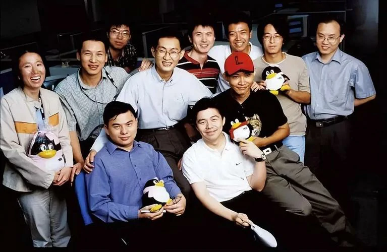

---
On December 1, 1998, Stone Richsight and the Chinese-language Huayuan Network in North America merged to form Sina.com. This event introduced the wave of mergers and acquisitions to China’s Internet industry. However, Wang Zhidong, a technical expert and one of the key founders, was not well-versed in capital operations. His shares were diluted from 20% to 13%, then to 6%, ultimately losing control of the company, and he was eventually ousted.

1998年12月1日，四通利方和北美华人网华渊网合并，成立新浪网。给中国产业带来了并购，技术大牛的王志东不太懂资本套路，持有的股份从20%，稀释到13%，然后是6%，彻底丧失掉了公司的控制权，最后被踢出公司。

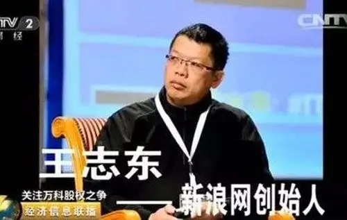

---
On December 16, 1998, the Beijing municipal government’s "Capital Window" work meeting revealed that the "Capital Window" website had been launched, becoming China's first large-scale "government network". People could directly communicate with the mayor through online channels such as the Mayor's Mailbox, providing the public with a new avenue to understand government policies — the internet. Beijing planned to have all city government agencies (including the municipal party committee, people’s congress, and political consultative committee) online by the end of September 1999. By the end of November 1998, national information departments announced the nationwide launch of the "Government Online Project." The relevant authorities set 1999 as the "Government Online Year" and aimed to have 80% of national ministries and multiple levels of government establish websites on China’s public multimedia communication network (163/169 network) by the year 2000.

1998年12月16日，北京市政府"首都之窗"工作会议透露，"首都之窗"网站已经开通，成为中国第一个大规模"政府网络"。市民可以通过网上市长信箱等在线渠道直接与市长沟通，为公众了解政府方针政策提供了新途径——互联网。北京计划在1999年9月底前基本实现市级国家机关（包括市委、人大、政协）全部上网。1998年11月底，国家信息部门宣布在全国范围内启动"政府上网工程"。相关部门将1999年定为"政府上网年"，并计划到2000年，80%的国家部委和多级政府在中国公众多媒体通信网（163/169网）上建立网站。

---
On January 1, 1999, Chinese netizens participated in their first online boycott, initiated by Huang Zhenqiang, a 1996 economics student from Nanjing University. The reason for the boycott was dissatisfaction with high local telephone and internet charges, which made internet access a "luxury activity". Ordinary users could not afford monthly internet fees of 250 to 350 yuan. On January 10 and 17, two more internet boycotts occurred. In April, China Telecom adjusted its internet fees. Subsequently, 263 Network capped the internet fee for individual users at 198 yuan.

1999年1月1日，中国网民进行了首次网络罢网活动，发起人为南京大学经济系1996级学生黄振强。罢网原因是对过高的市内电话费和其他上网费用的不满，这使得上网成为"贵族运动"，普通网民无法承受每月250-350元的上网费用。1月10日和17日又发生了两次罢网事件。4月，中国电信调整了网络费用。随后，263网络将个人用户的上网费用上限设定为198元。

---
On January 22, 1999, Launching Conference for Government Online Project was jointly held in Beijing by more than forty information administration departments from a number of ministries and commissions (offices and bureaus), with China Telecom and State Economic and Trade Commission taking the lead. The conference proposed the launch of the Government Online Project, and the home site www.gov.cn was put into trial operation.

1999 年 1 月 22 日，由多个部委（办公室和局）的四十多个信息管理部门联合在北京举办政府上网工程启动大会，中国电信和国家经济贸易委员会牵头。大会提出启动政府上网工程，并试运行了政府网站 www.gov.cn。

---
In January 1999, China Internet Network Information Center (CNNIC) issued the third Statistical Report on Internet Development in China: By December 31, 1998, there were 747,000 computers in total which had access to the Internet in China. There were 2,100,000 Internet subscribers, 18396 domain names registered under CN, and about 5300 WWW websites. The international bandwidth was 143M256K.

1999 年 1 月，中国互联网络信息中心（CNNIC）发布了第三份《中国互联网发展统计报告》：截至 1998 年 12 月 31 日，中国共有 747,000 台计算机接入互联网。互联网用户数为 2,100,000，CN 域名注册数为 18,396 个，WWW 网站数量约为 5,300 个。国际带宽为 143M256K。

---
In January 1999, the satellite backbone network of China Education and Research Network (CERNET) was put into full operation, which had greatly improved the running speed of the network. In the same month，CSTNET put into operation two sets of satellite systems to completely replace IP/X.25, and used the high-speed satellite channel to connect with more than 40 cities nationwide.

1999 年 1 月，中国教育和科研计算机网（CERNET）的卫星骨干网全面投入运行，这极大地提高了网络的运行速度。同年 1 月，中国科技网（CSTNET）投入运行两套卫星系统，完全取代了 IP/X.25，并利用高速卫星信道连接了全国 40 多个城市。

---
On February 3, 1999, the security certification system for commercial electronic information of the "national science and technology key project" of the ninth Five-Year plan undertaken by China International Electronic Commerce Center passed the scientific and technological achievement appraisal of the State Encryption Management Commission of the Ministry of Science and Technology. It also obtained the sales permit for information security products granted by relevant administrative authority, became the first CA security certification system for e-business in China which was developed independently and had the independent copyright, and had been successfully applied to the management system for textile quota permits in China.

1999 年 2 月 3 日，中国国际电子商务中心承担的第九个五年计划“国家科技攻关重点项目”的商业电子信息安全认证系统通过了科技部国家密码管理局的科技成果鉴定，并获得了相关行政主管部门授予的信息安全产品销售许可证，成为中国首个自主开发、拥有自主版权的电子商务 CA 安全认证系统，并已成功应用于中国纺织品配额许可证管理系统。

---
In February 1999, China Information Technology Security Evaluation Center (CNISTEC) began its official operation.

1999 年 2 月，中国信息技术安全评测中心（CNISTEC）开始正式运行。

---
In Feb 1999, Tencent QQ is released. A simple, lightweight chat app adopted widely by individuals and businesses. Users are identified by simple numbers that are still widely used in advertisements.

1999年2月，腾讯 QQ 发布。这是一款简洁、轻量级的聊天应用程序，被个人和企业广泛采用。用户通过简单的数字进行识别，这些数字在广告中仍被广泛使用。

  

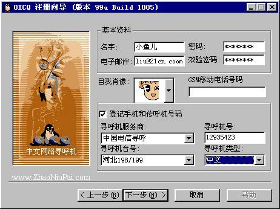

---
In March 1999, the Tianya virtual community was launched, offering forums such as Stock Forum, Tianya Zatan, Computer Technology, Emotional World, Literary Essays (later renamed “Wu Wen Nong Mo”), News Commentary, Sports Focus, Bookworm Teahouse (later renamed “Xianxian Shuhua”), Travel & Leisure, Hainan Development, and Tianya Mutual Help.

1999年3月，天涯虚拟社区诞生。开办了股票论坛、天涯杂谈，电脑技术、情感天地、艺文漫笔（后改名为舞文弄墨）、新闻众评、体育聚焦、书虫茶社（后改名为闲闲书话）、旅游休闲、海南发展、天涯互助等栏目。

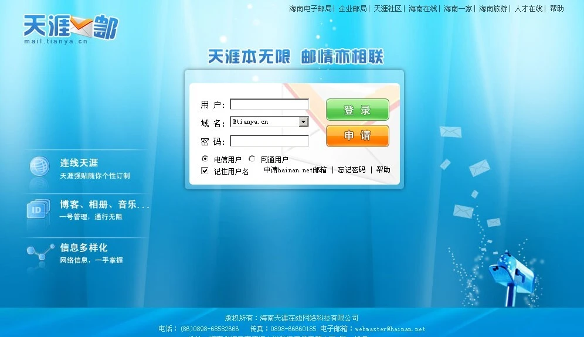

---
China's first professional anti-pornography software, "Five Elements Guardian," was officially launched in Beijing on April 8, 1999.

1999年4月8日，中国首款专业反色情软件"五行卫士"在北京正式推出。

---
On April 8, 1999, eight well-known Chinese internet sites — Sohu, Sina, ChinaByte, NetEase, Guozhong, Shanghai Hotline, InfoHighWay, and Youyou — held the inaugural meeting of the "China ICP Joint Development High-Level Conference" in Beijing. This marked the establishment of China’s first self-regulatory industry organization for the information industry.

1999年4月8日，国内8家知名中文互联网络站点———搜狐、新浪、ChinaByte、网易、国中网、上海热线、瀛海威、悠游，在京召开“中国ICP联合发展高层会议”成立大会暨首次会议。中国信息产业第一个行业自律性的组织由此产生。

---
On April 15, 1999, 23 influential network media in China got together for the first time to discuss the development of network media in China, and adopted Convention of Chinese Press on Network Media in principle to call for the attention of the society and the protection of the online information property.

1999 年 4 月 15 日，中国 23 家具有影响力的网络媒体首次聚会，讨论中国网络媒体的发展，并原则上通过了《中国网络媒体公约》，呼吁社会关注和保护网络信息产权。

---
In May 1999, Network Engineering Research Center of Tsinghua University set up CCERT (CERNET Computer Emergency Response Team), the first emergency response organization for security incidents in China.

1999 年 5 月，清华大学网络工程研究中心成立了 CCERT（中国教育和科研计算机网计算机应急响应小组），这是中国首个针对安全事件设立的应急响应组织。

---
On May 8, 1999, NATO, led by the United States, launched five missile strikes on the Chinese Embassy in the Federal Republic of Yugoslavia, triggering an unprecedented "online war" between Chinese and American netizens. In less than 10 days, Chinese hackers "hacked" into several major websites, including NATO's, the U.S. Navy Computer and Communications Washington Center, the U.S. Air Force's Thunderbirds flight team, the U.S. Embassy in China, the White House, the U.S. Department of the Interior, the Department of Energy, the Department of Agriculture, and several NATO sites. At the same time, American netizens launched counterattacks on a number of influential Chinese websites.

1999年5月8日，以美国为首的北约对中国驻南斯拉夫联盟共和国大使馆发动五枚导弹袭击，引发中美两国网民在互联网上展开一场空前的"网络战争"。在不到10天的时间内，中国黑客"攻破"了包括北约网站、美国海军计算机与通信华盛顿中心网站、美国空军王牌"雷鸟"飞行大队网站、美国驻华大使馆、美国白宫、美国内政部、能源部、农业部等网站以及北约部分网站。与此同时，美国网民也对中国一批有影响力的网站发动了反击。

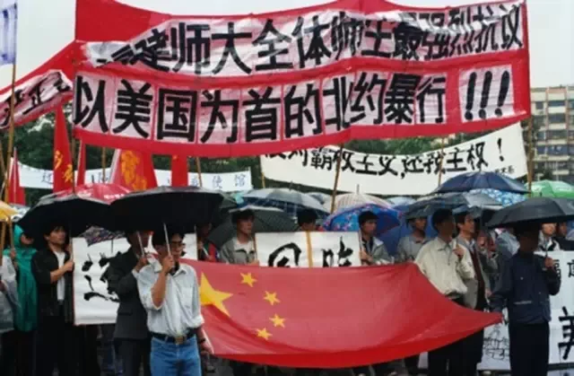

---
In May 1999, Liang Jianzhang, Fan Min, Shen Nanpeng, and Ji Qi founded Ctrip in Shanghai, later known as the “Four Gentlemen of Ctrip.”

1999年5月，梁建章、范敏、沈南鹏、季琦等人在上海成立携程公司，后被称为“携程四君子”。

---
In May 1999, China’s first e-commerce website, 8848, was established. However, during the collapse of the dot-com bubble, its highly fragmented shareholding structure left the company without strong leadership at a critical moment, leading to its eventual downfall.

1999年5月，我国的第一个电子商务网站是8848成立。在整个互联网泡沫崩溃的时候，股权比例极其分散，导致在企业最关键的时候没人能站出来控制局面，最终尘归尘土归土！
1999年7月，中华网作为第一只“中国概念股”在美国纳斯达克上市。

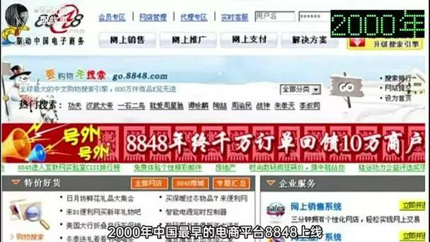

---
On June 1, 1999, China's first online TV station, China Hongqiao Network, officially launched its broadcast from 8:00 to 9:00 PM. The internet was referred to as the "fourth medium" after stage, print media, radio, and television. Looking at the global changes in the information industry, the most significant trend was the comprehensive cooperation between telecom networks and media, which gave rise to online television.

1999年6月1日，中国第一家网络电视台———中国虹桥网晚上8点至9点正式开通。网络被称为继舞台、书报、广播和电视之后的第四媒体。纵观全球信息产业格局的变化，最主要标志是电信网络与媒体的全方位合作，网络电视应运而生。

---
On July 12, 1999, China. com launched its initial public offer on NASDAQ. This was the first concept stock of a Chinese network company listed on NASDAQ in America.

1999 年 7 月 12 日，中国.com 在纳斯达克交易所启动首次公开募股。这是首家在美国纳斯达克上市的中国网络概念股。

---
In August 1999, Hongxiu Tianxiang was founded, later becoming one of the world’s leading digital copyright operators for women’s literature and the top brand in Chinese women’s reading, before eventually being acquired by Tencent.

1999年8月，红袖添香网创立，后成为全球领先的女性文学数字版权运营商之一，中文女性阅读第一品牌，后被腾讯收购。

---
In August 1999, more than two hundred colleges and universities from six provinces and cities used the "Enrollment System for Colleges and Universities Nationwide" on CERNET for the first time for student recruitment, and successfully recruited students online for colleges and universities.

1999 年 8 月，来自六个省市的二百多所高等院校首次在 CERNET 上使用“全国高校招生系统”进行招生，并成功在线为高校招录学生。

---
On September 6, 1999, E-Commerce Expo was held in Beijing. The expo was sponsored by the Ministry of Foreign Trade and Economic Cooperation and the Ministry of Information Industry, and was the first e-business application expo held by the Chinese government, as well as the large-scale seminar on the e-business technology and application achievements launched by China for the first time.

1999 年 9 月 6 日，在北京举行了电子商务博览会。该博览会由对外贸易经济合作部和信息产业部联合主办，是中国政府首次举办的电子商务应用博览会，也是中国首次发起的大型电子商务技术与应用成果研讨会。

---
In September 1999, China Merchants Bank took the lead to provide the “All in One Net” online banking service in an all-round way in China, established the online banking service system with the online corporate banking, online individual banking, online payment, online securities and online shops as the core, acted as the first bank to offer the online individual banking services in China with the approval of the People's Bank of China, and became the first commercial bank that had realized the "online banking" interconnected nationwide in China.

1999 年 9 月，招商银行率先在中国全面推出“一网通”网上银行服务，建立了以网上企业银行、网上个人银行、网上支付、网上证券和网上商店为核心服务的网上银行服务体系，成为中国首家获得中国人民银行批准提供网上个人银行服务的银行，并成为国内首家实现“网上银行”全国互联的商业银行。

---
On September 9, 1999, Jack Ma and 17 co-founders formally established Alibaba in an apartment in Hangzhou. The company’s first website was the English-language global wholesale marketplace Alibaba.com. In the same year, Alibaba Group launched the China marketplace (now known as “1688”), focusing on domestic wholesale trade. Many of the founders had prior experience at the Ministry of Foreign Trade and Economic Cooperation’s China International Electronic Commerce Center, which likely gave Alibaba a natural advantage in e-commerce.

1999年9月9日，马云带领下的18位创始人在杭州的公寓中正式成立了阿里巴巴，公司的首个网站是英文全球批发贸易市场阿里巴巴。同年阿里巴巴集团推出专注于国内批发贸易的中国交易市场（现称“1688”）。创始人中多位有在外经贸部中国国际电子商务中心相关工作经验，可能这一原因是阿里做电子商务的先天优势。

---
In October 1999, Professor Wu Jianping from Tsinghua University was elected the member of Address Committee of Address Supporting Organization (ASO) of Internet Corporation for Assigned Names and Numbers (ICANN).

1999 年 10 月，清华大学吴建平教授当选为互联网名称与数字地址分配机构（ICANN）地址支持组织（ASO）地址委员会成员。

---
In November 1999, Dangdang B2C was established, initially focusing on selling books as a standardized product with a low average transaction value, perfect for its early-stage growth. In the same year, Alibaba B2B was founded, focusing on Yellow Pages services and helping Chinese small commodity manufacturers export to international markets.

1999年11月，当当B2C成立，标品卖书，客单价也低，正好做启蒙。1999年，阿里巴巴B2B也成立了，搞黄页，帮助中国小商品制造出口走向国际。

---
In November 1999, 26-year-old Chen Tianqiao, along with his wife Luo Qianqian and his younger brother Chen Danian, jointly raised 500,000 yuan in startup capital to establish SNDA Networks in a three-bedroom apartment in the Experts Building in the Pudong New Area of Shanghai. By the age of 31, Chen became China’s richest person.

1999年11月，26岁的陈天桥与妻子雒芊芊、胞弟陈大年共同筹集50万元启动资金，在上海浦东新区科学院专家楼的一套三居室里，开启了盛大网络的创业之路，31岁成为中国首富。

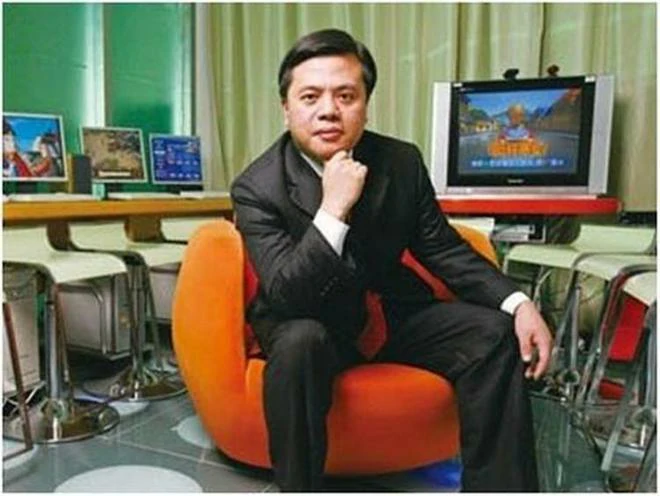

---
On November 2, 1999, Chen Yin, deputy director of Telecommunication Administration Bureau of the Ministry of Information Industry, attended the ICANN Governmental Advisory Committee conference on behalf of China.

1999 年 11 月 2 日，信息产业部电信管理局副局长陈寅代表中国出席了 ICANN 政府咨询委员会会议。

---
On December 23, 1999, the Information Work Leading Group of the State Council was established, and Vice Premier Wu Bangguo acted as the group leader. Meanwhile, National Informatization Office was renamed as National Informatization Promotion Office.

1999 年 12 月 23 日，国务院信息工作领导小组成立，副总理吴邦国担任组长。同时，国家信息化办公室更名为国家信息化推进办公室。

---
In 1999, Hong Kong entrepreneur Zhen Ronghui founded 51job, kicking off the online job search wave. Around 2001, 51job emerged as a dominant player in the online recruitment sector.

1999年香港人甄荣辉创立51job，网上找工作浪潮开启，2001年前后前程无忧一枝独秀。

---