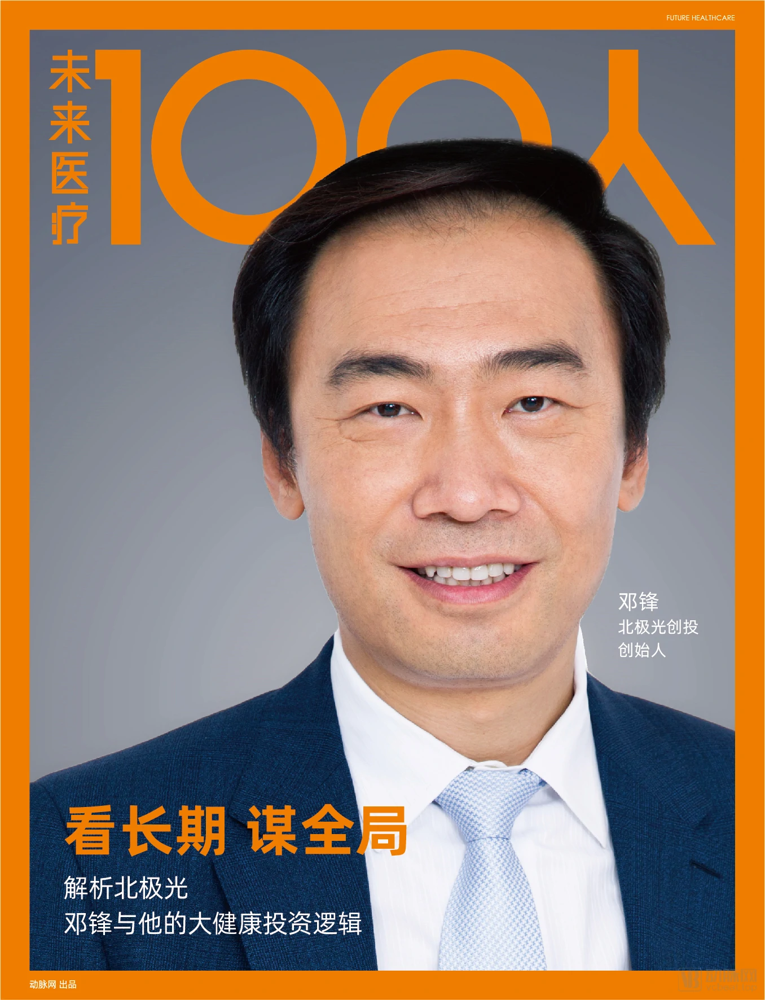
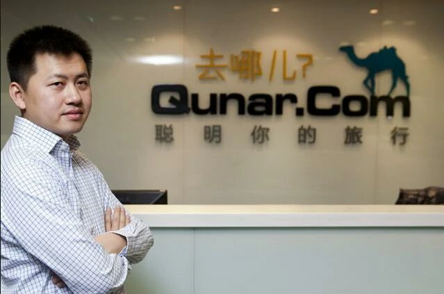
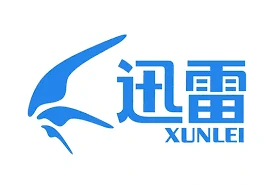
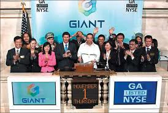

# 2000–2007: Popularization and Portals – The Internet Enters Every Household

---
In the early 2000s, Chinese tech companies, especially Alibaba, lay the foundations for the pervasive urban e-commerce environment that would emerge fifteen years later. They’re waiting for one thing: scale. State control is relatively light and lags innovation, although online monitoring and censorship are already underway.

2000年代初期，中国科技公司，尤其是阿里巴巴，为15年后出现的普遍城市电子商务环境奠定了基础。他们等待的是一件事：规模。国家控制相对较轻，落后于创新，尽管在线监控和审查制度已经在进行中。

---
January 2000 – Baidu is founded. China’s top search engine, and now a company with great AI ambitions.

2000 年 1 月 ——百度成立。中国顶级搜索引擎，现在是一家拥有巨大人工智能野心的公司。

---
March 2000 – Bill Clinton thinks trying to crack down on the internet is like “trying to nail Jell-O to the wall.” But the internet in China develops within the context of a political regime finding mechanisms to ensure continued control—not a government sleepwalking into a digitally driven revolution.

2000 年 3 月 – 比尔·克林顿 （Bill Clinton） 认为试图打击互联网就像“试图将果冻钉在墙上”。但中国的互联网是在一个政治政权寻找确保持续控制的机制的背景下发展的，而不是一个政府梦游到一场数字驱动的革命中。

---
December 2000 – There are 22.5 million internet users in China.

2000 年 12 月 – 中国有 2250 万互联网用户。

---
>## In 2001, the China Internet Association was established, and Yao Jinbo founded Xueda and Chuangqi.
2001年，中国互联网协会成立、姚劲波创办学大、创奇。

---
In May 2001, the China Internet Association was established. This national non-profit organization, initiated by Chinese enterprises and institutions engaged in the internet industry and related sectors, marked the beginning of a new chapter in the self-management and self-service of China's internet industry.In the same year, Li Rubin, Jin Xin, and Yao Jinbo started with a tutoring agency and founded Xueda Education, becoming known as the "Three Gentlemen of Xueda." Nine years later, they successfully brought the company to the New York Stock Exchange.

2001年，5月，中国互联网协会成立。这家由中国从事互联网业及互联网相关产业的企事业单位和社会各界发起设立的全国非盈利性社会团体，标志着中国互联网的行业自我管理、自我服务揭开了新篇章。同年，李如彬、金鑫、姚劲波以家教中介起步，创立了学大教育，三人并称为“学大三君子”。9年之后，他们一起将公司送上了纽交所。

---
In November, SNDA's online game *mir2* was launched. This game was introduced by Chen Tianqiao, who secured exclusive distribution rights from the Korean Actoz company for \$300,000. At the time, SNDA's funds were only enough to purchase the *mir2* copyright, with no money left even for renting servers. *mir2* was a role-playing game, where players invested significant time and money, creating strong user engagement. Shengda earned substantial profits. Within a month, the number of simultaneous users of *mir2* quickly surpassed 400,000, and Shengda had recouped all its investment. In 2002, SNDA’s revenue and net profit reached 326 million yuan and 139 million yuan, respectively. In 2003, both revenue and net profit nearly doubled compared to the previous year, reaching 633 million yuan and 273 million yuan, respectively. At this time, SNDA had only about 100 employees, but *mir2* was generating over 1 million yuan in daily revenue. Chen Tianqiao was so excited that he sometimes woke up from his dreams.

11月，盛大网络游戏《传奇》上线。这是一款陈天桥从韩国Actoz公司引进，以30万美金获得独家代理权的游戏。当时盛大所有的资金只够用来购买传奇的版权，连租服务器的钱都没有。《传奇》是一种扮演类游戏，玩家花时间、金钱投入其中，用户黏性非常强，盛大也赚得盆满钵满。一个月后，《传奇》同时在线的人数迅速突破40万，盛大的投资全部收回。2002年，盛大收入和净利润达到3.26亿元和1.39亿元；2003年收入和净利润均较上年翻了近1倍，分别达6.33亿元和2.73亿元。此时盛大的员工只有100人左右，但《传奇》每天带来的收入已经突破100万元，陈天桥兴奋地有时会从梦中惊醒。

---
>## In 2002, Blogcn was founded, marking the rise of personal portals and the entry of internet portals into the Web 2.0 era.
2002年，博客网成立，个人门户兴起，互联网门户进入2.0时代。

---
In August 2002, Fang Xingdong founded the predecessor of Blogcn (later known as BlogChina). Within three years, the website consistently achieved over 30% monthly growth, and its global ranking soared to over 60th place. In 2004 and 2005, it raised millions of dollars, sparking a Web 2.0 investment boom in China. Subsequently, any VC active in China at the time who was unfamiliar with terms like Blog, Podcast, RSS, or P2P, or who ignored projects like blogs, podcasts, videos, and social networking, was considered outdated.Later, "Blog China" was rebranded as "Blog.cn," with the goal of becoming a blog-style portal, claiming to be the "world's largest Chinese blog site." However, the millions in funding were quickly squandered. This marked the beginning of a period of intense personnel upheaval at Blog.cn, with almost the entire senior management team leaving. Fang Xingdong's role as CEO was replaced by a decision-making group. By the end of 2006, Blog.cn's staff had been reduced to just over 40 people, a far cry from the number at the time of the initial investment. It was a tragic fall from being a Web 2.0 pioneer to becoming a forgotten entity.

2002年8月，方兴东创建博客网的前身(博客中国)，之后3年内网站始终保持每月超过30%的增长，全球排名一度飙升到60多位。并于2004年、2005年融资千万美元，并引发了中国Web2.0的投资热潮。其后活跃在中国的VC要是不知道Blog、Podcast、RSS、P2P等术语，不看博客、播客、视频、交友等项目就是落伍的标志。历史只不过在换一种方式重演，昨天的web2.0，今天的web3.0，明天的web4.0。风吹网面，雁过长空。随后，“博客中国”更名为“博客网”，并宣称要做博客式门户，号称“全球最大中文博客网站”，而后千万美元很快就被挥霍殆尽。博客网至此拉开了持续3年的人事剧烈动荡，高层几乎整体流失，而方兴东本人的CEO职务也被一个决策小组取代。到2006年年底，博客网的员工已经缩减恢复到融资当初的40多个人。从引领Web2.0的先驱成为无人问津的弃儿，可惜至极。

---
By the end of 2002, the number of online game users in China had reached 8.074 million, with 4.013 million paying users, accounting for approximately 50% of the total. The online gaming market size had reached 910 million RMB. By 2020, the number of online game users in China had reached 518 million, with mobile game users totaling 516 million, and the market size had grown to 278.69 billion RMB.

2002年底，我国网络游戏用户数已达807.4万，其中付费用户达401.3万，占到了总数的约50％。网络游戏市场规模达到9.1亿元人民币。到2020年，我国网络游戏用户规模达到5.18亿人，移动游戏用户规模为5.16亿人，市场规模达到2786.9亿元。

---
>## In 2003, Taobao and Alipay were launched, and Dianping was founded.
2003年，淘宝网+支付宝诞生、大众点评成立。

---
In April 2003, Dianping.com was established in Shanghai. Dianping.com is China’s leading local life consumption platform and one of the world’s earliest independent third-party consumer review websites. It provides merchant information, consumer discounts, and an interactive platform for posting consumer reviews across various sectors, including dining, shopping, leisure, entertainment, and life services. At the same time, it offers small and medium-sized businesses one-stop precision marketing solutions, including electronic coupons, keyword promotions, and group buying.

2003年4月大众点评网在上海成立。大众点评网是中国领先的本地生活消费平台、全球最早建立的独立第三方消费点评网站。大众点评网可提供餐饮、购物、休闲娱乐及生活服务等领域的商户信息、消费优惠以及发布消费评价的互动平台，同时，为中小商户提供一站式精准营销解决方案，包括电子优惠券、关键词推广、团购等。

---
May 2003 – Alibaba launches Taobao, bringing everyday online shopping to consumers and connecting small shops to a broader market. Alibaba, with its intense focus on China’s specific needs, out-competes eBay, which eventually leaves the Chinese market.

2003 年 5 月 – 阿里巴巴推出淘宝，为消费者带来日常网上购物，并将小商店连接到更广阔的市场。阿里巴巴非常关注中国的具体需求，在竞争中击败了 eBay，最终离开了中国市场。

---

2003 – Severe acute respiratory syndrome (SARS) outbreak. The spread of SARS news online, combined with the government’s efforts to cover up the severity of the outbreak, demonstrated the ability of internet and mobile phone networks to break the propaganda authorities’ hold on a major story.

2003 年 – 严重急性呼吸系统综合症 （SARS） 爆发。SARS 新闻在网上的传播，加上政府掩盖疫情严重性的努力，表明互联网和移动电话网络有能力打破宣传当局对重大新闻的控制。

---
>## In 2004, JD.com transformed into an e-commerce platform, and Wang Xiaochuan founded Sogou.
2004年，京东转型电商、王小川创办搜狗。

---
In January, “JD Multimedia Network,” founded by Richard Liu, was officially launched.

1月 ，刘强东创立的“京东多媒体网”正式上线。

---
2004 – Alipay launches, facilitating online payments. By holding payment in escrow until a buyer is satisfied with the product, Alipay gives buyers confidence in online platforms.

2004 年 – 支付宝推出，促进在线支付。通过将付款托管到买家对产品满意为止，支付宝让买家对在线平台充满信心。

---
In August, Wang Xiaochuan, an employee of Sohu, founded Sogou. Sohu launched Sogou with the goal of enhancing the search capabilities of Sohu.com. In 2010, Sogou was spun off and became an independent company.

8月，搜狐员工王小川创办搜狗，搜狐推出搜狗，目的是增强搜狐网的搜索技能，2010年搜狗分拆成立独立公司。

---
In the same year, Li Zhiguo, the 46th employee of Alibaba, founded Koubei, which was later acquired by Alibaba.

同年，阿里第46号员工李治国创办口碑网，后被阿里收购。

---
2004 – Journalist Shi Tao is arrested for leaking state secrets after Yahoo gives data to Chinese authorities that link him to an email account.

2004 年 – 记者石涛因泄露国家机密而被捕，此前雅虎向中国当局提供了将他与电子邮件帐户联系起来的数据。

---
In the late 2000s, China’s online censorship apparatus becomes more sophisticated. Censors suppress search results, block entire websites or specific pages within them, or give users a “connection reset” error when a restricted keyword appears in a URL.

2000 年代后期，中国的网络审查机构变得更加复杂。审查者会抑制搜索结果，阻止整个网站或其中的特定页面，或者在 URL 中出现受限关键字时给用户带来“连接重置”错误。

---
At the same time, patriotic fervor around the Olympics and related controversies in 2008, as well as a thriving culture of euphemisms and ironic references, signal the explosion of China’s digital public sphere. It appears that, just maybe, the scale and dynamism of the internet could prove too hard for the government to control.

与此同时，围绕 2008 年奥运会和相关争议的爱国热情，以及委婉语和讽刺语的蓬勃发展，标志着中国数字公共领域的爆炸式增长。看来，也许互联网的规模和活力对政府来说可能太难控制了。

---
>## In 2005, the internet experienced a boom, with venture capital and internet companies rushing into the market.
2005年互联网大爆发，创投、互联网公司跑步进入市场。

---
2005 — Yahoo China turns over control of its services to Alibaba after middling market performance and high political costs abroad after the Shi Tao case in 2004.

2005 年 — 雅虎中国在 2004 年石涛案后，在市场表现中等且国外政治成本高昂后，将其服务控制权移交给阿里巴巴。

---
In January 2005, Northern Light Venture Capital was established. In September, Sequoia Capital China, led by Shen Nanpeng, was founded. In September, Today Capital was also established.

2005年1月，北极光创投成立。9月，沈南鹏红杉资本成立。9月，今日资本成立。

---
In February 2005, Zhuang Chenchao founded Qunar.

2005年2月，庄辰超创办去哪儿旅行。

---
In March 2005, Ganji.com was established, and Wang Xing founded Xiaonei.com.

2005年3月，赶集网成立，王兴创办校内网。

---
In March 2005, Douban was founded.

2005年3月，豆瓣成立。

---
In March 2005, Pony Ma acquired Foxmail from Allen Zhang.

2005年3月，马化腾收购张小龙的Foxmail。

---
In April 2005, Tudou was founded, becoming one of the earliest video-sharing websites globally. It later merged with Youku to form the Youku Tudou Group, which was eventually acquired by Alibaba.

2005年4月土豆网成立，全球最早上线的视频网站之一，后合并为优酷土豆集团，最后优酷土豆被阿里巴巴收购。

---
In May 2005, Xunlei was founded.

2005年5月，迅雷成立。

---
In May 2005, PPTV was founded.

2005年5月，PPTV成立。

---
In June 2005, eMule was established.

2005年6月，电驴成立。

---
In June 2005, Autohome was founded.

2005年6月，汽车之家成立。

---
In August 2005, Baidu went public.

2005年8月，百度上市。

---
In August 2005, Yahoo invested 1 billion USD in Alibaba, which enabled Taobao to defeat eBay in the Chinese market.

2005年8月，雅虎注资10亿美金给阿里巴巴，淘宝战胜ebay。

---
In September 2005, Zhou Hongyi founded 360.

2005年9月，周鸿祎创办360。

---
December 2005 —  There are 111 million internet users in China.

2005 年 12 月 —— 中国有 1.11 亿互联网用户。

---
In December 2005, Yao Jinbo founded 58.com.

2005年12月，姚劲波创立58同城

---
>## In 2006, DJI drones, Ku6, and Youku were founded.
2006年，大疆无人机、酷6优酷成立

---
In March 2006, Frank Wang, along with two classmates and 200,000 yuan funded by his family, moved to Shenzhen and founded DJI in a 20-square-meter warehouse at his uncle's magazine office.

2006年3月，汪滔带着家里资助的20万和2个同学一起来到了深圳，在舅舅杂志社20平米的库房成立了大疆。

---
In June 2006, Ku6 and Youku were founded one after another.

2006年6月，酷6网、优酷网相继成立。

---
In December 2006, a computer worm virus named "Worm.WhBoy.cw" infected millions of computers. All ".exe" executable files in the infected systems were changed to resemble a panda holding incense. Subsequently, more than 30 variants of this virus emerged, severely threatening the security of internet users' systems and creating a strong demand for antivirus solutions. In 2007, the creators and major distributors of the "Worm.WhBoy.cw" virus, including Li Jun, were sentenced to prison terms ranging from one to four years for damaging computer information systems. In 2014, Zhang Shun and Li Jun were sentenced to five and three years in prison, respectively, for operating a gambling business and fined 200,000 yuan and 80,000 yuan, respectively.

2006年12月，一种名为“熊猫烧香”的计算机蠕虫病毒感染数百万台计算机，被感染者系统中所有的“.exe”可执行文件全部被改成熊猫举着香火的模样。此后这一病毒的变种数量累计超过30种，互联网用户系统的安全性受到极大威胁，防毒需求强烈。2007年，“熊猫烧香”计算机病毒制造者及主要传播者李俊等4人，被以破坏计算机信息系统罪判处李俊有期徒刑一到四年不等，2014年，张顺、李俊被法院以开设赌场罪分别判处有期徒刑五年和三年，并分别处罚金20万元和8万元。

---
>## In 2007, Lei Jun led Kingsoft to go public, and Giant Interactive was listed.
2007年，雷军带领金山上市、巨人上市。

---
In June 2007, China Mobile launched Fetion.

2007年6月，中移动推出飞信。

---
In June 2007, the country released the "11th Five-Year Plan for the Development of E-Commerce." This first national e-commerce development plan is an important part of the "11th Five-Year Plan for National Economic and Social Development Informatization," which identifies the e-commerce service industry as a significant emerging sector in the country.

2007年6月，国家发布《电子商务发展“十一五”规划》，这一中国首部电子商务发展规划是《国民经济和社会发展信息化“十一五”规划》的重要组成部分，它将电子商务服务业确定为国家重要的新兴产业。

---
In July 2007, Perfect World Co.,Ltd went public on NASDAQ.

2007年7月，完美时空登陆纳斯达克。

---
In October 2007, the software company Kingsoft was listed on the Hong Kong Stock Exchange.

2007年10月，软件企业金山在香港联交所挂牌。

---
In November 2007, Giant Network was listed on the New York Stock Exchange.

2007年11月，巨人网络在纽约证券交易所挂牌。

---
In November 2007, NetDragon was listed in Hong Kong. In 2007, four online gaming companies went public, and with the addition of previously listed companies such as China.com, SNDA, Jiufang, and NetEase, the total number of online gaming concept companies listed in Hong Kong and the United States reached eight, with a total market value of up to 15 billion USD.

2007年11月，网龙在香港上市。2007年有4家网络游戏公司上市，算上之前已经上市的中华网、盛大、九发、网易，中国在中国香港和美国上市的网络游戏概念公司已经多达8家，总市值高达 150亿美元。

---
In November 2007, Alibaba was listed on the Hong Kong Stock Exchange, with an opening price of HKD 30. The final closing price was HKD 39.5, a 192% increase from the issue price of HKD 13.5, making it the top-performing IPO on the Hong Kong stock market that year.

2007年11月，阿里巴巴在香港联交所挂牌，开盘价格高达30港元，最终收盘价格为39.5港元，较发行价13.5港元大涨192%，成为当年年港股新股王。

---
The market value of Sina was 2.683 billion USD, Sohu's was 1.454 billion USD, and NetEase's was 2.113 billion USD. The combined market value of the three major portals was less than 10 billion USD. A new landscape led by Tencent, Baidu, and Alibaba was beginning to replace the three major portals. The total market value of listed internet companies in China was also pushed to nearly 70 billion USD.

新浪的市值在26.83亿美元，搜狐是14.54亿美元，网易是21.13亿美元，三大门户市值总和不到100亿美元。以腾讯、百度、阿里巴巴为代表的新三大巨头格局正在取代三大门户而形成。中国互联网上市公司的总市值也被推升至近700亿美元。

