# 2008–2013: Mobile and Social – The Turning Point of the Internet's Form

# 2008–2013：移动与社交——互联网形态的转折

---
In 2008, Apple launched the iPhone 3G and announced the opening of the App Store. Google released the Android operating system. The number of mobile phone users in China reached 608 million, while the number of mobile internet users was less than 15% of that, indicating a huge market potential. The shift from search engines to various apps began, marking the beginning of another groundbreaking era in Chinese internet history – the so-called "Mobile Internet Era."

2008年，苹果发布iPhone3G、宣布开放App store。Google发布Android操作系统。我国手机用户数达到6.08亿，而手机上网人数不到其15%，市场潜力巨大。入口从搜索到各种各样app分流，中国互联网开启了又一个波澜壮阔的时代——所谓的“移动互联网时代”。

---
In March 2008, the government established the Ministry of Industry and Information Technology, which became the regulatory body for China's internet industry.

2008年3月，国家设立工业和信息化部，工信部成为我国互联网的行业主管部门。

---
March 2008, Kaixin launched.

2008年3月，开心网上线。

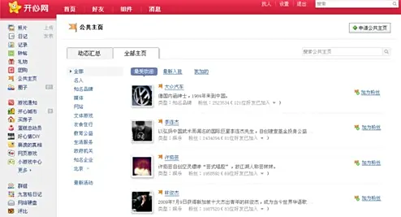

---
In July 2008, a report released by CNNIC showed that by the end of June of that year, the number of internet users in China had reached 253 million, surpassing the United States for the first time to rank first in the world. The number of CN domain registrations reached 12.188 million, making it the largest national top-level domain in the world for the first time.

2008年7月，CNNIC发布报告显示，中国网民数量到当年6月底为止，达2.53亿人，首次超过美国排在世界第一位。 CN域名注册量以1218.8万个首次成为全球第一大国家顶级域名。

---
2008 —  Major international platforms, especially YouTube, are blocked for a few hours or days at a time, and then unblocked. The government shuts down access when it deems necessary—but not permanently.

2008 年 —  主要国际平台，尤其是 YouTube，一次被屏蔽几个小时或几天，然后被解封。政府会在认为必要时关闭访问，但不是永久关闭。

---
On August 8, 2008, the Olympic Games opened in Beijing, the capital of China. The Beijing Olympics set 43 new world records and 132 new Olympic records. A total of 87 countries and regions won medals, with China leading the gold medal count with 51, making it the first Asian country to top the gold medal standings in Olympic history. The Olympic Games entered the "blogging era." During the 2008 Beijing Olympics, athletes and officials participating in the games were allowed to create personal blogs, and blogs by famous athletes and coaches became highly popular. Nine internet companies, including CCTV, Sohu, Sina, and Youku, which had the rights to broadcast and offer on-demand Olympic videos, reported using a "network video + network text" method. Leveraging major events like the Olympics, online video became part of mainstream new media and gained wider attention.

2008年8月8日，奥运会在中国首都北京开幕。北京奥运会共创造43项新世界纪录及132项新奥运纪录，共有87个国家和地区在赛事中取得奖牌，中国以51枚金牌居金牌榜首名，是奥运历史上首个登上金牌榜首的亚洲国家。奥运会进入“博客时代”。在2008年北京奥运会期间，参加赛事的运动员和官员可以开设个人博客，知名运动员、教练的博客受热捧。央视网、搜狐、新浪、悠视网等9家拥有奥运视频直播和点播权的互联网企业都采取“网络视频+网络图文”的方式进行了报道。以奥运等重大事件为契机，网络视频步入了主流新媒体行列，受到了更广泛的关注。

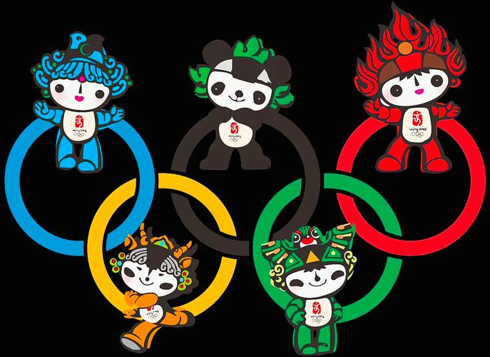

---
In October 2008, the PC version of Meitu was launched. In 2011, the iOS version of Meitu was released. To date, it has accumulated over 1 billion users worldwide. It went public in 2016.

2008年10月，美图秀秀PC版上线。2011年，美图秀秀iOS版本上线。至今全球累计超10亿用户。2016年上市。

---
In December 2008, Vipshop was launched. It went public in 2012.

2008年12月，唯品会上线。2012年上市。

---
In January 2009, the Ministry of Industry and Information Technology issued 3G licenses to China Mobile, China Unicom, and China Telecom, marking the arrival of the 3G era. In 2013, 4G licenses were issued. By 2019, the Ministry had issued four 5G licenses.

2009年1月，工信部向移动、联通、电信发送3G牌照，3G时代到来。2013年发放4G牌照。到了2019年，工信部已发放4张5G牌照。

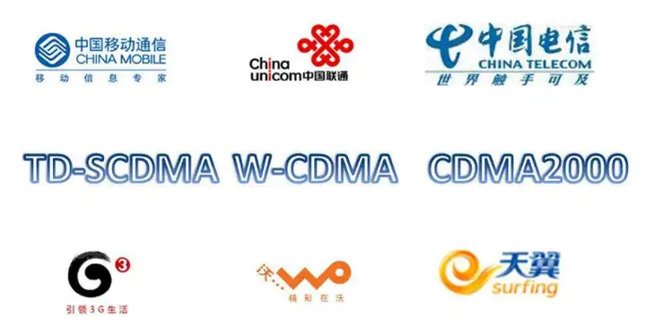

---
In February 2009, William Lei Ding revealed at the Guangdong Provincial People's Congress that NetEase would invest in establishing a pig farming operation and also planned to launch a website dedicated to pig farming. The site would publicly share all information and the entire process of pig farming online. As a result, William Lei Ding became the first person in China's IT industry to venture into pig farming.

2009年2月，丁磊在广东省两会上透露，网易将投资创办生猪养殖场，同时还计划创办一个养猪网，将有关生猪养殖的信息及养猪过程在网上全程公开，由此，丁磊成为中国IT养猪第一人。

---
In June 2009, founder Xu Yi created his own bullet screen website, MikuFans, inspired by Acfun. In 2010, MikuFans officially changed its name to Bilibili.

2009年6月，创始人徐逸仿照Acfun创办了自己的弹幕网站MikuFans，2010年，Mikufans正式更名Bilibili。

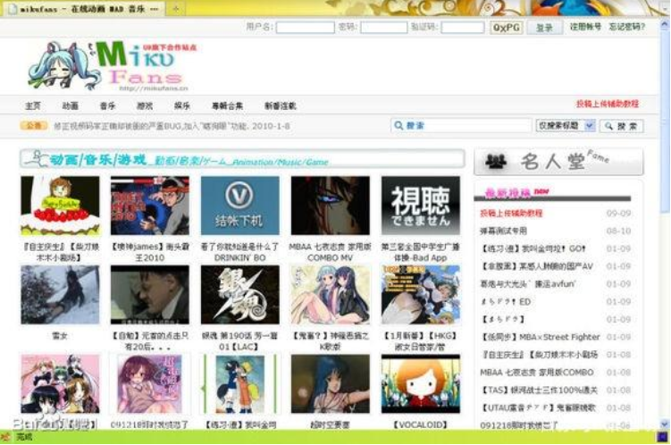

---
July 2009 – Internet access is shut down in Xinjiang for months following violence in the region.

2009 年 7 月 ——新疆发生暴力事件后，互联网接入被关闭数月。

---
In August 2009, Sina launched the internal beta version of "Sina Weibo," becoming the first portal website to offer microblogging services.A microblog, or "Weibo," is a newly emerging type of open internet social service. The most well-known microblogging platform internationally is Twitter, which has become one of the most talked-about internet sensations. Many international celebrities and organizations, including U.S. President Obama, the White House, the FBI, Google, HTC, DELL, Forbes, General Motors, and others, use Twitter for marketing and user interaction. Sina, Sohu, NetEase, People’s Daily, and other portal websites have all launched or are testing microblogging features. Microblogging has attracted social celebrities, entertainment stars, businesses, and many netizens, becoming one of the most popular internet applications of 2009.

2009年8月，新浪推出“新浪微博”内测版，成为门户网站中第一家提供微博服务的网站。微博即微博客，是新兴起的一类开放互联网社交服务，国际上最知名的微博网站是 Twitter，目前Twitter已经是最炙手可热的互联网新贵，美国总统奥巴马、美国白宫、FBI、Google、HTC、DELL、福布斯、通用汽车等很多国际知名个人和组织在twitter上进行营销和与用户交互。新浪网、搜狐网、网易网、人民网等门户网站纷纷开启或测试微博功能。微博客吸引了社会名人、娱乐明星、企业机构和众多网民加入，成为2009年热点互联网应用之一。

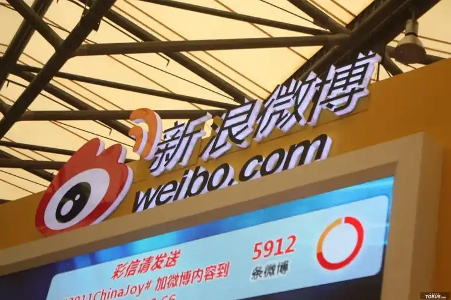

---
In September 2009, Tencent's market value surpassed 30 billion USD, making it the third-largest internet company in the world by market value.

2009年9月，腾讯公司市值突破300亿美元，成为全球第三大市值的互联网公司。

---
In December 2009, the State Administration of Radio, Film, and Television, during a crackdown on illegal and violating audio-visual websites, shut down more than 530 BT (BitTorrent) websites, including BT China Alliance.

2009年12月，广播电影电视总局在清理整顿违法、违规视听节目网站的过程中，关闭包括BT中国联盟在内的530多家BT（BitTorrent）网站。

---
January 2010 – Google shuts down its mainland China search engine, which had controversially implemented Chinese government censorship orders. Google’s market share was never large, but its products had a devoted following.

2010 年 1 月 – 谷歌关闭了其中国大陆搜索引擎，该搜索引擎曾有争议地实施了中国政府的审查令。谷歌的市场份额从来都不大，但其产品却拥有忠实的追随者。  

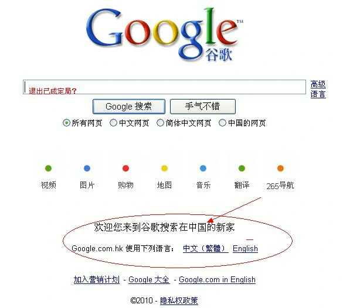

---
In March 2010, the predecessor of Jumei Youpin, Tuanmei, was launched. It went public in 2014.

2010年3月，聚美优品前身团美网上线。2014年上市。

---
In March 2010, Wang Xing founded Meituan.

2010年3月，王兴创办美团。

---
Since the launch of China's first group-buying website in early 2010, the number of group-buying websites in the country had exceeded 5,000 by August 2011. Platform-based internet companies like Sina, Tencent, Kaixin, and Renren also entered the group-buying field, making group-buying almost a standard feature for internet companies.

自2010年初我国第一家团购网站上线以来，到2011年8月，我国团购网站的数量已经超过了5000家。新浪、腾讯、开心网、人人网等平台型互联网公司也先后进入到团购领域，团购几乎已成为互联网公司的标配功能。

---
In April 2010, Lei Jun founded Xiaomi.

2010年4月，雷军创办小米。

---
In April 2010, Gong Yu founded iQIYI, and later, Baidu became its largest shareholder.

2010年4月，龚宇创办爱奇艺，而后百度成为其最大股东。

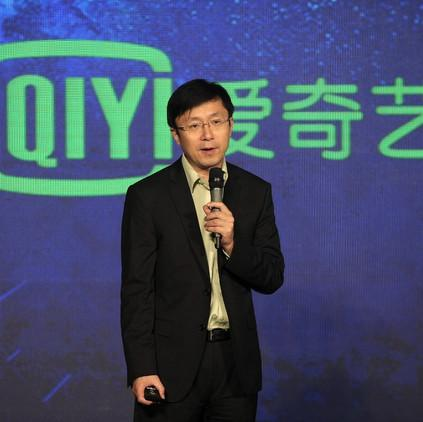

---
In September 2010, 360 released its newly developed "Privacy Protector," specifically designed to monitor whether QQ software violated user privacy. In response, QQ immediately pointed out that the 360 browser was suspected of promoting through adult websites. In November, Tencent announced that QQ software would stop running on computers with 360 software installed, and users would have to uninstall 360 software to log into QQ, forcing users to "choose one." From 2010 to 2014, the two companies staged a series of internet battles for their own interests, known as the "3Q War."

2010年9月，360发布其新开发的“隐私保护器”，专门搜集QQ软件是否侵犯用户隐私。随后，QQ立即指出360浏览器涉嫌借黄色网站推广。11月，腾讯宣布在装有360软件的电脑上停止运行QQ软件，用户必须卸载360软件才可登录QQ，强迫用户“二选一”。双方为了各自的利益，从2010年到2014年，两家公司上演了一系列互联网之战，号称3Q大战。

---
In January 2011, WeChat was released.

2011年1月，微信发布。

---
In March 2011, the National Mobile Internet Innovation Center was established.

2011年3月，国家级移动互联网创新中心成立。

---
From March 2011 onwards, Baidu Wenku, Baidu MP3, and other products were successively accused of copyright infringement by representatives from the literary, publishing, and music industries, as well as audio-visual associations.

2011年3月起，百度文库、百度MP3等产品相继受到作家、出版业、音乐界代表及音像协会的侵权指控。

---
In April 2011, the Global Mobile Internet Conference was held in Beijing.

2011年4月，全球移动互联网大会在北京召开。

---
In May 2011, Link Motion Inc went public.

2011年5月，网秦上市。

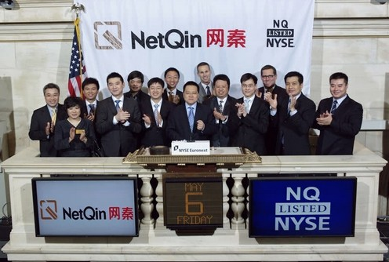

---
In May 2011, the People's Bank of China officially issued the first batch of "Payment Business Licenses," with 27 third-party payment companies, including Alipay, Tenpay, KuaiQian, Huitian, and UnionPay Business, among the first to receive licenses.

2011年5月，央行正式签发了首批《支付业务许可证》，第一批27家第三方支付公司获得了牌照，包括支付宝、财付通、快钱、汇付天下、银联商务等在内。

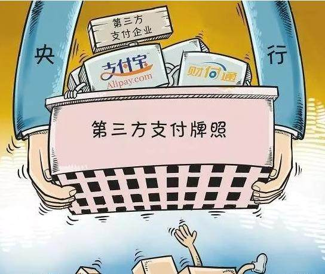

---
In August 2011, Xiaomi launched its first smartphone.

2011年8月，小米发布首款手机。

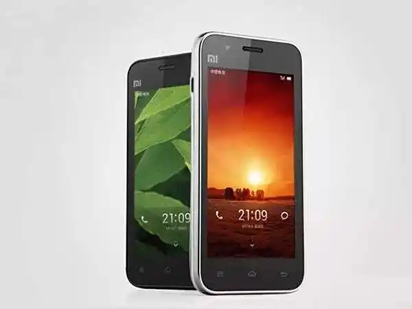

---
In September 2011, China Mobile introduced FeiLiao.

2011年9月，中移动推出飞聊。

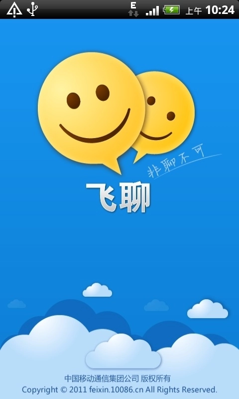

---
In October 2011, China Telecom launched Wing.

2011年10月，电信推出翼聊。

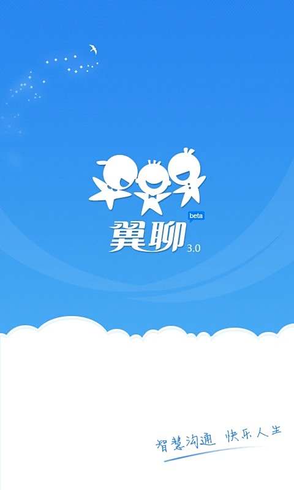

---
In October 2011, Yin Qi, Tang Wenbin, and Yang Mu founded Megvii Technology.

2011年10月，印奇、唐文斌、杨沐创立旷视科技。

---
In December 2011, the Zhihu website was launched. Zhihu previously used an invitation-based registration system.

2011年12月，知乎网站开放。知乎过去采用邀请制注册方式。

---
In March 2012, Youku and Tudou announced their merger.

2012年3月，优酷和土豆宣布合并。

---
In March 2012, Toutiao launched.

2012年3月，今日头条上线。

---
In May 2012, Gome fully acquired coo8.com on its own platform.

2012年5月，国美在自身平台的基础上完整收购库巴网。

---
In June 2012, Shanda released the Bambook smartphone, with internet companies focusing on mobile terminals, offering services rather than hardware.

2012年6月，盛大发布Bambook智能手机，互联网公司发力移动终端不卖硬件卖服务。

---
In August 2012, Qihoo 360 quietly launched its own search engine, marking the beginning of the 3B battle.

2012年8月，奇虎360低调推出自有搜索，3B大战开始拉开帷幕。

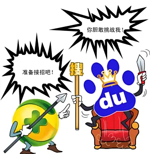

---
In October 2012, JOYY successfully went public, with products including YY Voice, Duowan Gaming Network, and YY Games. In 2020, it merged with Douyu, with Tencent becoming its largest shareholder.

2012年10月，欢聚时代成功上市，旗下产品包括YY语音、多玩游戏网、YY游戏。2020年与斗鱼合并，腾讯为其最大股东。

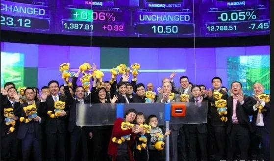

---
In October 2012, Shanda was delisted.

2012年10月，盛大退市。

---
In November 2012, Baiya founded the predecessor of China Youzan, Koudaitong.

2012年11月，白鸦创立中国有赞的前身-口袋通。

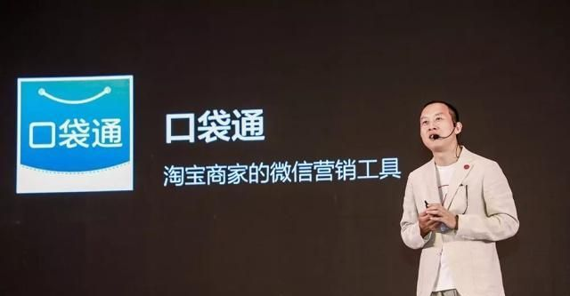

---
In November 2012, "Double 11" set a record on Tmall and Taobao, with e-commerce experiencing a boom. During "Double 11," the total sales on Alipay for Tmall and Taobao reached 19.1 billion yuan, more than triple that of the previous year. Tmall alone achieved 13.2 billion yuan, while Taobao reached 5.9 billion yuan. The total sales of Tmall and Taobao for "Double 11" reached 19.1 billion yuan.

2012年11月，“双11”天猫淘宝创记录，电商2012年呈现井喷 。“双11”时天猫和淘宝的支付宝总销售额达到191亿元，是去年的三倍多，其中仅天猫就完成了132亿元，淘宝则完成了59亿元。双11阿里天猫与淘宝的总销售额达到191亿。

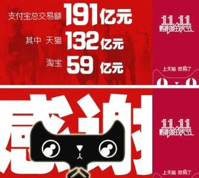

---

