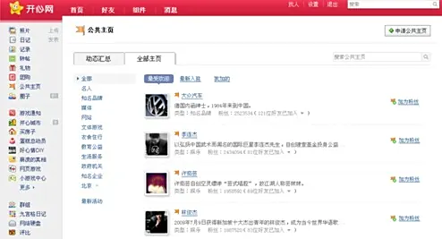
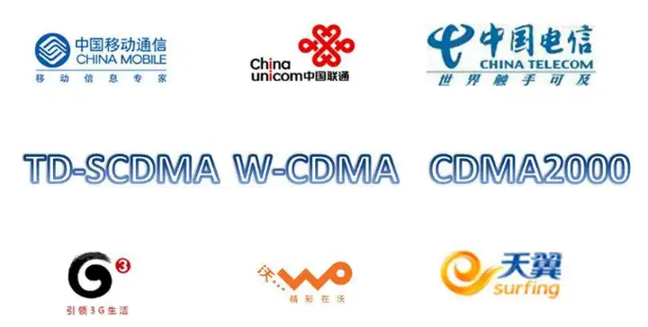
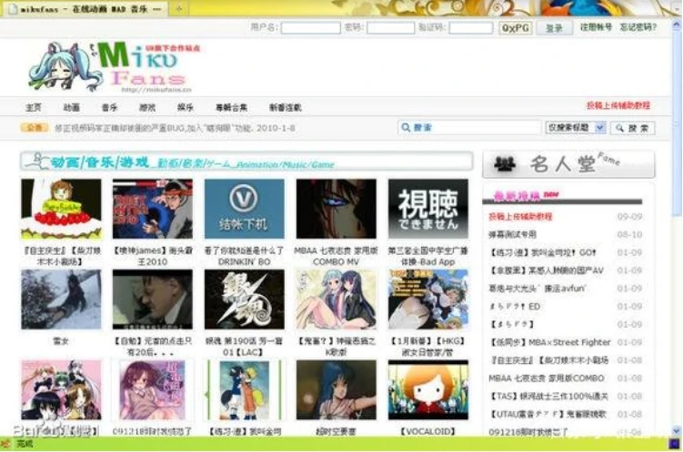
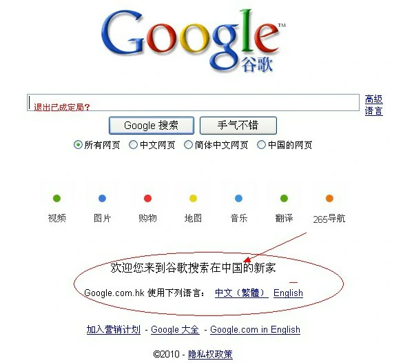
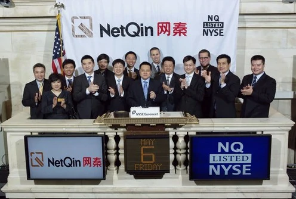
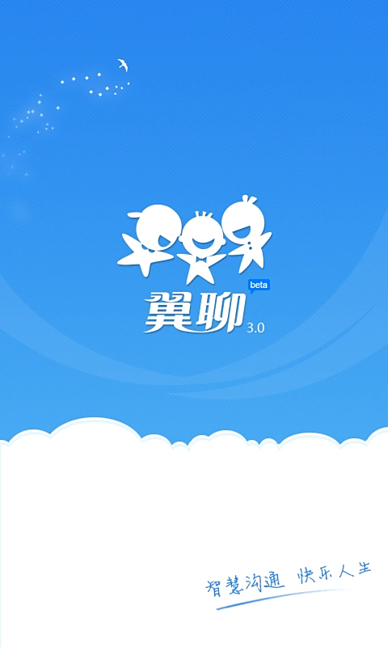
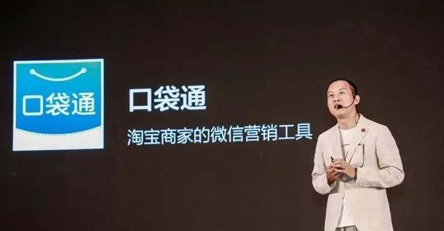
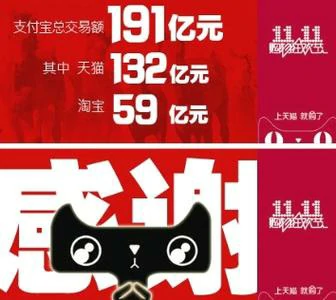

># 2008–2012: Mobile and Social – The Turning Point of the Internet's Form

---
In 2008, Apple launched the iPhone 3G and announced the opening of the App Store. Google released the Android operating system. The number of mobile phone users in China reached 608 million, while the number of mobile internet users was less than 15% of that, indicating a huge market potential. The shift from search engines to various apps began, marking the beginning of another groundbreaking era in Chinese internet history – the so-called "Mobile Internet Era."

2008年，苹果发布iPhone3G、宣布开放App store。Google发布Android操作系统。我国手机用户数达到6.08亿，而手机上网人数不到其15%，市场潜力巨大。入口从搜索到各种各样app分流，中国互联网开启了又一个波澜壮阔的时代——所谓的“移动互联网时代”。

---
>## In 2008, the Ministry of Industry and Information Technology was established, Kaixin.com was launched, the number of internet users in China exceeded 253 million, the Olympics boosted the development of online video, and Meitu Xiu Xiu and Vipshop went online.
2008年，工信部成立，开心网上线，中国网民数量超2.53亿，奥运会推动网络视频发展，美图秀秀和唯品会上线。

---
According to the statistics of China Internet Network Information Center (CNNIC), by December 31, 2007, the number of Internet users in China has reached up to 210 million, while the number of the broadband Internet users has reached 163 million, accounting for 77.6% of the total. There are totally 11,931,277 domain names in China with 9,001,993 CN names, about 1,503,800 websites, and international bandwidth about 368,927Mbps.

根据中国互联网络信息中心（CNNIC）的统计数据，截至 2007 年 12 月 31 日，中国互联网用户数量达到 2.1 亿，宽带互联网用户数量达到 1.63 亿，占总数的 77.6%。中国共有域名 11931277 个，其中 CN 域名 9001993 个，约 1503800 个网站，国际带宽约 368927Mbps。

---
February 25, 2008, eight ministries and administrative offices jointly issued the Opinions on Intensifying Supervision over Internet Maps and Geographic Information Service Websites, requiring further regulations on the Internet maps and geographic information service websites. These eight ministries and administrative offices are: the State Bureau of Surveying and Mapping, Ministry of Foreign Affairs, Ministry of Public Security, Ministry of Information Industry, the State Administration for Industry and Commerce, General Administration of Press and Publication, State Council Information Office, and Administration for the Protection of State Secrets.

2008 年 2 月 25 日，八个部委联合发布了《关于加强互联网地图和地理信息服务网站监管的意见》，要求对互联网地图和地理信息服务网站进行进一步规范。这八个部委包括：国家测绘局、外交部、公安部、信息产业部、国家工商行政管理总局、新闻出版总署、国务院新闻办公室和国家保密局。

---
March 11, 2008, in accordance with institutional reform of the State Council passed at the 1st Session of the 11th National People’s Congress, the Ministry of Industry and Information Technology was set up under the State Council. Responsibilities of the former Ministry of Information Industry and the former State Council Informatization Office have been transferred to the Ministry of Industry and Information Technology which now becomes the administrative authority of the Internet industry in China.

2008 年 3 月 11 日，根据国务院在第十一届全国人民代表大会第一次会议上通过的国家机构改革方案，工业和信息化部在国务院设立。原信息产业部的职责和原国务院信息化办公室的职责已转移至工业和信息化部，该部现成为中国互联网行业的行政管理机构。

---
April 28, 2008, commissioned by the Ministry of Industry and Information Technology, the Internet Society of China set up the “12321 Information Center of Indecent and Unsolicited Electronic Messages”, and the complaints and reports can be submitted via telephone calls, feedbacks on websites, e-mail messages, mobile phone texting and WAP.

2008 年 4 月 28 日，应工业和信息化部委托，中国互联网协会设立了“12321 不良与垃圾电子信息举报受理中心”，投诉和举报可通过电话、网站反馈、电子邮件、手机短信和 WAP 提交。

---
Since May 2008, with the rapid spreading of SNS (Social Networking Service) websites as Kaixin (“being happy”) and Xiaonei (“on the campus”), SNS has become one of the most popular Internet applications in 2008.

自 2008 年 5 月起，随着开心网（“快乐”）和校内网（“在校园”）等社交网站（SNS）的迅速传播，SNS 已成为 2008 年最受欢迎的互联网应用之一。

---
As for relief news after the earthquake on May the 12th, 2008, in SichuanProvince, people.com, xinhuanet.com, chinanews.com and cctv.com had released about 123,000 pieces of news on the earthquake relief (including pictures, texts, audios and videos) by May 23, 2008, and played a leading role in news releasing; sina.com, sohu.com, NetEase and Tencent jointly released 133,000 pieces of news. The above eight websites received 11.6 billion hits on news with up to 10.63 million follow-up replies. The Internet played an important role in news releasing about earthquake relief, helping people find their missing kin, delivering aids and soliciting donations. The development of China’s Internet media has come to a new stage.

关于 2008 年 5 月 12 日在四川省发生地震后的抗震救灾新闻，截至 2008 年 5 月 23 日，人民网、新华网、中国新闻网和央视网发布了约 12.3 万条抗震救灾新闻（包括图片、文字、音频和视频），在新闻发布中发挥了主导作用；新浪、搜狐、网易和腾讯联合发布了 13.3 万条新闻。上述八个网站新闻的点击量达到 116 亿次，后续回复高达 1063 万条。互联网在抗震救灾新闻发布中发挥了重要作用，帮助人们寻找失踪亲人、传递援助物资和募集捐款。中国互联网媒体的发展进入了一个新阶段。

---
June 20, 2008, President Hu Jintao communicated with the Internet users on line through the ChinaForce BBS on people.com. As a key channel for information exchange, the Internet has attracted more and more attention of the government.

2008 年 6 月 20 日，胡锦涛主席通过人民网的“强国论坛”与网民在线交流。作为信息交流的重要渠道，互联网越来越受到政府的关注。

---
In July 2008, a report released by CNNIC showed that by the end of June of that year, the number of internet users in China had reached 253 million, surpassing the United States for the first time to rank first in the world. The number of CN domain registrations reached 12.188 million, making it the largest national top-level domain in the world for the first time.

2008年7月，CNNIC发布报告显示，中国网民数量到当年6月底为止，达2.53亿人，首次超过美国排在世界第一位。 CN域名注册量以1218.8万个首次成为全球第一大国家顶级域名。

---
July 2, 2008, Beijing Administration for Industry and Commerce officially issued the Opinions on Strengthening Supervision and Administration over the Order of Electronic Commerce Market which provides that, from August 1, each profitable on-line shop must obtain a business license before business operation.

2008 年 7 月 2 日，北京市工商局正式发布《关于规范电子商务市场秩序的意见》，规定自 8 月 1 日起，所有盈利的网店必须取得营业执照后方可经营。

---
2008 —  Major international platforms, especially YouTube, are blocked for a few hours or days at a time, and then unblocked. The government shuts down access when it deems necessary—but not permanently.

2008 年 —  主要国际平台，尤其是 YouTube，一次被屏蔽几个小时或几天，然后被解封。政府会在认为必要时关闭访问，但不是永久关闭。

---
On August 8, 2008, the Olympic Games opened in Beijing, the capital of China. The Beijing Olympics set 43 new world records and 132 new Olympic records. A total of 87 countries and regions won medals, with China leading the gold medal count with 51, making it the first Asian country to top the gold medal standings in Olympic history. The Olympic Games entered the "blogging era." During the 2008 Beijing Olympics, athletes and officials participating in the games were allowed to create personal blogs, and blogs by famous athletes and coaches became highly popular. Nine internet companies, including CCTV, Sohu, Sina, and Youku, which had the rights to broadcast and offer on-demand Olympic videos, reported using a "network video + network text" method. Leveraging major events like the Olympics, online video became part of mainstream new media and gained wider attention.

2008年8月8日，奥运会在中国首都北京开幕。北京奥运会共创造43项新世界纪录及132项新奥运纪录，共有87个国家和地区在赛事中取得奖牌，中国以51枚金牌居金牌榜首名，是奥运历史上首个登上金牌榜首的亚洲国家。奥运会进入“博客时代”。在2008年北京奥运会期间，参加赛事的运动员和官员可以开设个人博客，知名运动员、教练的博客受热捧。央视网、搜狐、新浪、悠视网等9家拥有奥运视频直播和点播权的互联网企业都采取“网络视频+网络图文”的方式进行了报道。以奥运等重大事件为契机，网络视频步入了主流新媒体行列，受到了更广泛的关注。

---
September 17, 2008, Premier Wen Jiabao made comments on the “reporting letter posted on a blog about concealing of deaths in the landslide accident in Loufan County, Shanxi Province on August 1”, requiring relevant authorities to carry out careful inspection and verification of the major accident of burst of a dam at a refuse ore. The function of Internet as means of supervision by public opinions has caught further attention of the central government.

2008 年 9 月 17 日，温家宝总理就“8 月 1 日山西娄烦县发生山体滑坡事故中隐瞒死亡人数的博客举报信”作出批示，要求相关部门对废矿溃坝重大事故进行认真核查。互联网作为舆论监督工具的作用引起中央政府进一步关注。
 
---
September 28, 2008, according to the official reply to each local taxation bureau by the State Administration of Taxation, the incomes obtained by individuals purchasing virtual currency from Internet players and reselling to others with premiums should be subject to individual income tax, and a 20% individual income tax under the category of “income from transfer of property” should be levied.

2008 年 9 月 28 日，根据国家税务总局对各地税务局的官方答复，个人从互联网玩家处购买虚拟货币再以溢价转售给他人所获得的收入应缴纳个人所得税，并在“财产转让所得”类别下征收 20%的个人所得税。

---
In October 2008, the PC version of Meitu was launched. In 2011, the iOS version of Meitu was released. To date, it has accumulated over 1 billion users worldwide. It went public in 2016.

2008年10月，美图秀秀PC版上线。2011年，美图秀秀iOS版本上线。至今全球累计超10亿用户。2016年上市。

---
In December 2008, Vipshop was launched. It went public in 2012.

2008年12月，唯品会上线。2012年上市。

---
From November to December 2008, the CCTV exposed successively the defects of the business operational model of two major search engines – Baidu and Google. It has triggered a crisis of confidence of the Internet users in those search engines, and advantages or disadvantages of the pricing on ads based on hitting employed in search engines have also become a hot topic.

2008 年 11 月至 12 月，央视连续曝光了百度和谷歌两大搜索引擎业务运营模式的缺陷。这引发了互联网用户对这两大搜索引擎的信任危机，而搜索引擎广告基于点击计价的优劣势也成为热门话题。
 
---
December 22, 2008, sina.com announced an acquisition of the outdoor digital advertising business of Focus Media Group at a price of about 1.3 billion USD, which was so far the largest Internet purchase in China.

2008 年 12 月 22 日，新浪宣布以约 13 亿美元的价格收购焦点传媒集团户外数字广告业务，这是迄今为止中国最大的互联网收购案。
 
---
According to the statistics of China Internet Network Information Center (CNNIC), by December 31, 2008, the number of Internet users in China has reached up to 298 million with an Internet penetration rate of 22.6%. The number of the broadband Internet users has reached 270 million, accounting for 90.6% of the total. There are totally 16,826,198 domain names in China with 13,572,326 CN names, about 2,878,000 websites, and international bandwidth about 640,286.67Mbps.

根据中国互联网络信息中心（CNNIC）的统计，截至 2008 年 12 月 31 日，中国互联网用户数已达 2.98 亿，互联网普及率为 22.6%。宽带互联网用户数达到 2.7 亿，占总数的 90.6%。中国共有 16826198 个域名，其中 13572326 个 CN 域名，约 2878000 个网站，国际带宽约为 640286.67Mbps。

---
>## In 2009, the Ministry of Industry and Information Technology issued 3G licenses, and everyone began to weave their social networks.
2009年，工信部发放3G牌照，大家都来织围脖。
---
On January 5, 2009, a teleconference was held in Beijing by seven ministries or commissions including State Council Information Office, Ministry of Industry and Information Technology, Ministry of Public Security, Ministry of Culture, State Administration for Industry and Commence, State Administration of Radio, Film and Television and General Administration of Press and Publication of the People’s Republic of China with the aim of performing special actions on governance of vulgarity on the internet within the whole country.

2009 年 1 月 5 日，国务院信息办公室、工业和信息化部、公安部、文化部、国家工商行政管理总局、国家广播电影电视总局和中华人民共和国新闻出版总署等七个部委在北京召开电视会议，旨在在全国范围内开展治理网络低俗内容的专项行动。

---
On January 6th, 2009, the first Cultural Festival of China Net Citizens, hosted by China Internet Association, was officially initiated. It covers fields of technology, sports, fashion, culture, animation, etc. concerning internet. At this conference, the date of September 14th was elected to be Net Citizen Festival.

2009 年 1 月 6 日，中国互联网协会主办的中国网民文化节正式启动。该活动涵盖技术、体育、时尚、文化、动漫等与互联网相关的领域。在此次大会上，9 月 14 日被选定为网民节。

---
On January 7th, 2009, Ministry of Industry and Information issued three licenses of the third mobile communications (3G) to China Mobile Communications Corporation, China Telecommunications Corporation and China Unicom Network Communications Co., Ltd.

2009 年 1 月 7 日，工业和信息化部向中国移动通信集团公司、中国电信集团公司和中国联通网络通信有限公司发放了三张第三代移动通信（3G）牌照。

---
In February 2009, William Lei Ding revealed at the Guangdong Provincial People's Congress that NetEase would invest in establishing a pig farming operation and also planned to launch a website dedicated to pig farming. The site would publicly share all information and the entire process of pig farming online. As a result, William Lei Ding became the first person in China's IT industry to venture into pig farming.

2009年2月，丁磊在广东省两会上透露，网易将投资创办生猪养殖场，同时还计划创办一个养猪网，将有关生猪养殖的信息及养猪过程在网上全程公开，由此，丁磊成为中国IT养猪第一人。

---
On February 28th, 2009, Premier Wen Jiabao of the State Council exchanged with net citizens and accepted special visit from both Central People’s Government website and Xinhua website before the holding of the 2nd Session of the 11th National People’s Congress and the 2nd Session of the 11th National Political Consultative Conference.

2009 年 2 月 28 日，国务院总理温家宝在与网民交流并接受中央人民政府网站和新华网特别采访时，正值第十一届全国人民代表大会第二次会议和中国人民政治协商会议第十一届全国委员会第二次会议召开前夕。

---
On May 19th, 2009, Ministry of Industry and Information issued Notice to Preassembly of Filtering Software for Safe Surfing on the Computer.

2009 年 5 月 19 日，工业和信息化部发布通知，要求计算机安全上网过滤软件预装。

---
From 9:00 P.M., May 19th, 2009, the domain name resolution system of baofeng.com experienced network attack and failure. It caused recursive domain name resolution server of telecommunication enterprises to receive a lot of abnormal request and result in blockage, then services provided for six provinces including Jiangsu, Anhui, Guangxi, Hainan, Gansu and Zhejiang are affected. At 1:20 A.M., May 20th, internet services of the affected regions basically returned to normal.

2009 年 5 月 19 日晚 9 时起，百度域名解析系统遭遇网络攻击并出现故障。导致电信企业递归域名解析服务器收到大量异常请求，造成封锁，进而影响江苏、安徽、广西、海南、甘肃和浙江等六个省份的服务。5 月 20 日凌晨 1 时 20 分，受影响地区的互联网服务基本恢复正常。

---
In June 2009, founder Xu Yi created his own bullet screen website, MikuFans, inspired by Acfun. In 2010, MikuFans officially changed its name to Bilibili.

2009年6月，创始人徐逸仿照Acfun创办了自己的弹幕网站MikuFans，2010年，Mikufans正式更名Bilibili。

---
July 2009 – Internet access is shut down in Xinjiang for months following violence in the region.

2009 年 7 月 ——新疆发生暴力事件后，互联网接入被关闭数月。

---
On July 26th, 2009, Ministry of Culture and Ministry of Commerce jointly issued notice about Virtual Currency Transaction Management of Network, which regulated that the same enterprise shall not manage the issuing and transaction of virtual currency at the same time and the virtual currency shall not be used to purchase real objects.

2009 年 7 月 26 日，文化部和商务部联合发布《关于规范网络虚拟货币交易管理的通知》，规定同一企业不得同时经营虚拟货币的发行和交易，虚拟货币不得用于购买实物。

---
In August 2009, Sina launched the internal beta version of "Sina Weibo," becoming the first portal website to offer microblogging services.A microblog, or "Weibo," is a newly emerging type of open internet social service. The most well-known microblogging platform internationally is Twitter, which has become one of the most talked-about internet sensations. Many international celebrities and organizations, including U.S. President Obama, the White House, the FBI, Google, HTC, DELL, Forbes, General Motors, and others, use Twitter for marketing and user interaction. Sina, Sohu, NetEase, People’s Daily, and other portal websites have all launched or are testing microblogging features. Microblogging has attracted social celebrities, entertainment stars, businesses, and many netizens, becoming one of the most popular internet applications of 2009.

2009年8月，新浪推出“新浪微博”内测版，成为门户网站中第一家提供微博服务的网站。微博即微博客，是新兴起的一类开放互联网社交服务，国际上最知名的微博网站是 Twitter，目前Twitter已经是最炙手可热的互联网新贵，美国总统奥巴马、美国白宫、FBI、Google、HTC、DELL、福布斯、通用汽车等很多国际知名个人和组织在twitter上进行营销和与用户交互。新浪网、搜狐网、网易网、人民网等门户网站纷纷开启或测试微博功能。微博客吸引了社会名人、娱乐明星、企业机构和众多网民加入，成为2009年热点互联网应用之一。

---
On August 18th, 2009, Ministry of Culture issued Notice to Enhancement and Improvement of Web Music Examination, which regulated that the operational units shall report to Ministry of Culture for examination or records of information if they wish to operate on web music products.

2009 年 8 月 18 日，文化部发布《关于进一步加强和改进网络音乐考试工作的通知》，规定运营单位如需从事网络音乐产品经营活动，应向文化部报送考试或信息备案。

---
On August 26th, 2009, the 28th Asia Pacific Network Information Center (APNIC) Open Policy Meeting, which was hosted by China Internet Network Information Center (CNNIC), was held in Beijing. It was the first time for APNIC meeting to be held in China Mainland.

2009 年 8 月 26 日，由中国互联网络信息中心（CNNIC）主办的第 28 届亚太网络信息中心（APNIC）开放政策会议在北京举行。这是 APNIC 会议首次在中国大陆举办。

---
On September 7th, the State Commission Office for Public Sector Reform issued State Commission Office for Public Sector Reform’s Interpretation of Part of Articles about Comprehensive Law Enforcement on Animation, Web Games and Cultural Market in ‘Provisions on Agreeing to a Plan after Discussing Three Times’ issued by Ministry of Culture, State Administration of Radio, Film and Television and General Administration of Press and Publication , which said, “Ministry of Culture shall be responsible for industry planning, industry base, project construction, exhibition transaction and market supervision relating to animation and web games. State Administration of Radio, Film and Television shall be responsible for management of animation programs in movie animation as well as web audio and video. General Administration of Press and Publication shall be responsible for management of animation in the publication stage and carry out pre-examination on online publication and issuing of publications about games. ”

9 月 7 日，国家体制改革委员会办公室发布了《关于贯彻落实文化部、国家广播电影电视总局、国家新闻出版总署《关于同意实施〈三审三议后定稿〉规定的通知》中部分条款关于动画、网络游戏和文化市场综合执法的解读》，指出“文化部负责动画和网络游戏的产业规划、产业基地、项目建设、展览交易和市场监管。国家广播电影电视总局负责电影动画中的动画节目以及网络音频视频的管理。国家新闻出版总署负责出版物阶段的动画管理，并开展网络出版和游戏出版物发行的前期审查。”

---
On September 8th, 2009, Tecent Company owned market value of more than 30 billion dollars and became the third largest internet company in the globe.

2009 年 9 月 8 日，腾讯公司的市值超过 300 亿美元，成为全球第三大互联网公司。

---
On November 16th, 2009, Office of the National Campaign on Anti-prostitution and Anti-delinquency issued Emergency Notice to Strict Attack on Mobile Website Production and Spreading of Obscene and Pornographic Information. In December, nine ministries or commissions including International Communication Office of the CPC, Office of the National Campaign on Anti-prostitution and Anti-delinquency, Ministry of Industry and Information, Ministry of Public Security, Ministry of Culture, State-owned Assets Supervision and Administration Commission of the State Council jointly carried out special actions on deep governance of obscene, pornographic and vulgar information on the internet and mobile media within the whole country.

2009 年 11 月 16 日，国家扫黄打非工作小组办公室发布紧急通知，严厉打击制作和传播淫秽色情信息的手机网站。12 月，包括中共中央宣传部、国家扫黄打非工作小组办公室、工业和信息化部、公安部、文化部、国务院国有资产监督管理委员会在内的九个部委联合在全国范围内开展专项行动，深入治理互联网和移动媒体上的淫秽色情低俗信息。

---
In December 2009, the State Administration of Radio, Film, and Television, during a crackdown on illegal and violating audio-visual websites, shut down more than 530 BT (BitTorrent) websites, including BT China Alliance.

2009年12月，广播电影电视总局在清理整顿违法、违规视听节目网站的过程中，关闭包括BT中国联盟在内的530多家BT（BitTorrent）网站。

---
On December 26th, 2009, the 12th Session of the 11th National People’s Congress, Standing Committee Conference passed, by voting, Tort Law of the People’s Republic of China (executed as of July 1st, 2010), which regulated for the first time on network right infringement problems and their disposal principles.

2009 年 12 月 26 日，第十一届全国人大常委会第十二次会议经表决通过了《中华人民共和国侵权责任法》（自 2010 年 7 月 1 日起施行），首次对网络侵权问题及其处理原则作出了规定。

---
In 2009, the public supervision value of the internet became widely known. A series of incidents such as “Hide and Seek”, “Deng Yujiao”, “Cigarette with outrageous value”, “entrapment” became the top issue of the public because of network exposure.

2009 年，互联网的公共监督价值广为人知。“躲猫猫”、“邓玉娇”、“天价烟”、“诱捕”等一系列事件因网络曝光成为公众关注的焦点。

---
Until December 31st, 2009, it is shown according to the statistical data of China Internet Network Information Center (CNNIC), the net citizens in China has reached 384 million; the popularity of internet reached 28.9%; net citizens of wide band reached 346 million; users of web shopping reached 108 million and transaction of web shopping market reached 25 million yuan; mobile net citizens reached 233 million, with 120 million added in a year. There are 232 million IPv4 addresses, with 16.82 million domain names. There includes 13.46 million domain names and 3.23 million websites. And International band width has reached 866,367Mbps.

截至 2009 年 12 月 31 日，根据中国互联网络信息中心（CNNIC）的统计数据，中国网民数量达到 3.84 亿；互联网普及率达到 28.9%；宽带网民达到 3.46 亿；网络购物用户达到 1.08 亿，网络购物市场规模达到 2500 亿元；手机网民达到 2.33 亿，一年新增 1.2 亿。IPv4 地址数量为 2.32 亿个，域名数量为 1682 万个。其中包括域名 1346 万个，网站数量为 323 万个。国际带宽达到 866367Mbps。

---
>## In 2010, Wang Xing founded Meituan and Lei Jun founded Xiaomi, as the "Battle of a Thousand Groups" and the "3Q War" were in full swing.
2010年，王兴创办美团、雷军创办小米，千团大战、3Q大战激战正酣。

---
January 2010 – Google shuts down its mainland China search engine, which had controversially implemented Chinese government censorship orders. Google’s market share was never large, but its products had a devoted following.

2010 年 1 月 – 谷歌关闭了其中国大陆搜索引擎，该搜索引擎曾有争议地实施了中国政府的审查令。谷歌的市场份额从来都不大，但其产品却拥有忠实的追随者。  

---
In March 2010, the predecessor of Jumei Youpin, Tuanmei, was launched. It went public in 2014.

2010年3月，聚美优品前身团美网上线。2014年上市。

---
In March 2010, Wang Xing founded Meituan.

2010年3月，王兴创办美团。

---
Since the launch of China's first group-buying website in early 2010, the number of group-buying websites in the country had exceeded 5,000 by August 2011. Platform-based internet companies like Sina, Tencent, Kaixin, and Renren also entered the group-buying field, making group-buying almost a standard feature for internet companies.

自2010年初我国第一家团购网站上线以来，到2011年8月，我国团购网站的数量已经超过了5000家。新浪、腾讯、开心网、人人网等平台型互联网公司也先后进入到团购领域，团购几乎已成为互联网公司的标配功能。

---
In April 2010, Lei Jun founded Xiaomi.

2010年4月，雷军创办小米。

---
In April 2010, Gong Yu founded iQIYI, and later, Baidu became its largest shareholder.

2010年4月，龚宇创办爱奇艺，而后百度成为其最大股东。

---
On June 25, 2010, the ICANN 38th meeting passed a resolution that “.中国” domain name would be included in the global root domain name system of Internet. On July 10, “.中国” domain name were officially entered into the global root domain name system (DNS) of Internet.

2010 年 6 月 25 日，ICANN 第 38 次会议通过决议，“.中国”域名将纳入互联网全球根域名系统。7 月 10 日，“.中国”域名正式进入互联网全球根域名系统（DNS）。

---
In September 2010, 360 released its newly developed "Privacy Protector," specifically designed to monitor whether QQ software violated user privacy. In response, QQ immediately pointed out that the 360 browser was suspected of promoting through adult websites. In November, Tencent announced that QQ software would stop running on computers with 360 software installed, and users would have to uninstall 360 software to log into QQ, forcing users to "choose one." From 2010 to 2014, the two companies staged a series of internet battles for their own interests, known as the "3Q War."

2010年9月，360发布其新开发的“隐私保护器”，专门搜集QQ软件是否侵犯用户隐私。随后，QQ立即指出360浏览器涉嫌借黄色网站推广。11月，腾讯宣布在装有360软件的电脑上停止运行QQ软件，用户必须卸载360软件才可登录QQ，强迫用户“二选一”。双方为了各自的利益，从2010年到2014年，两家公司上演了一系列互联网之战，号称3Q大战。

---
From November 7 through 12, the 79th conference of the Internet Engineering Task Force (IETF) was held in Beijing. It was for the first time in the mainland of China that IETF conference was held.

从 11 月 7 日至 12 日，互联网工程任务组（IETF）第 79 届会议在北京举行。这是 IETF 会议首次在中国大陆举办。

---
It is revealed from the data of the CNNIC that by December 31, 2010, the amount of the netizens in China had reached 457 million, among which the mobile phone netizens had reached 303 million. The number of IPv4 addresses had reached 278 million. The total number of domain names had reached 8.66 million, among which the number of the domain “.CN” had reached 4.35 million, the number of the websites had reached 1.91 million, and the bandwidth of the international entrance had reached 1,098,957Mbps.

从 CNNIC 的数据中可以看出，截至 2010 年 12 月 31 日，中国网民数量达到 4.57 亿，其中手机网民达到 3.03 亿。IPv4 地址数量达到 2.78 亿。域名总数达到 866 万个，其中“.CN”域名数量达到 435 万个，网站数量达到 191 万个，国际出入口带宽达到 1,098,957Mbps。

---
>## In 2011, the issuance of third-party payment licenses and the IM (Instant Messaging) war took place.
2011年，第三方支付牌照发放、IM大战
---
In January 2011, WeChat was released.

2011年1月，微信发布。

---
In March 2011, the National Mobile Internet Innovation Center was established.

2011年3月，国家级移动互联网创新中心成立。

---
From March 2011 onwards, Baidu Wenku, Baidu MP3, and other products were successively accused of copyright infringement by representatives from the literary, publishing, and music industries, as well as audio-visual associations.

2011年3月起，百度文库、百度MP3等产品相继受到作家、出版业、音乐界代表及音像协会的侵权指控。

---
In April 2011, the Global Mobile Internet Conference was held in Beijing.

2011年4月，全球移动互联网大会在北京召开。

---
In May 2011, Link Motion Inc went public.

2011年5月，网秦上市。

---
In May 2011, the People's Bank of China officially issued the first batch of "Payment Business Licenses," with 27 third-party payment companies, including Alipay, Tenpay, KuaiQian, Huitian, and UnionPay Business, among the first to receive licenses.

2011年5月，央行正式签发了首批《支付业务许可证》，第一批27家第三方支付公司获得了牌照，包括支付宝、财付通、快钱、汇付天下、银联商务等在内。

---
In August 2011, Xiaomi launched its first smartphone.

2011年8月，小米发布首款手机。

---
In September 2011, China Mobile introduced FeiLiao.

2011年9月，中移动推出飞聊。

---
In October 2011, China Telecom launched Wing.

2011年10月，电信推出翼聊。

---
In October 2011, Yin Qi, Tang Wenbin, and Yang Mu founded Megvii Technology.

2011年10月，印奇、唐文斌、杨沐创立旷视科技。

---
In December 2011, the Zhihu website was launched. Zhihu previously used an invitation-based registration system.

2011年12月，知乎网站开放。知乎过去采用邀请制注册方式。

---
>## In 2012, Youku and Tudou merged, Toutiao was launched, the smart terminal war intensified, and Double Eleven reached its peak.
2012年 优酷土豆合并、头条上线、智能终端大战、双十一如日中天。

---
On January 18, 2012, TD-LTE, proposed by Datang Telecom Technology & Industry Group and developed by China in the main, was listed as one of the fourth-generation mobile communication technology standards by the International Telecommunication Union.

2012 年 1 月 18 日，大唐电信科技产业集团提出并由中国主导研发的 TD-LTE 被国际电信联盟列为第四代移动通信技术标准之一。

---
In March 2012, Youku and Tudou announced their merger.

2012年3月，优酷和土豆宣布合并。

---
In March 2012, Toutiao launched.

2012年3月，今日头条上线。

---
In May 2012, Gome fully acquired coo8.com on its own platform.

2012年5月，国美在自身平台的基础上完整收购库巴网。

---
In June 2012, Shanda released the Bambook smartphone, with internet companies focusing on mobile terminals, offering services rather than hardware.

2012年6月，盛大发布Bambook智能手机，互联网公司发力移动终端不卖硬件卖服务。

---
On June 19, 2012, at the International Multilingual-mail E-mail Conference, Qian Hualin with Chinese Academy of Sciences sent the first batch of International Multilingual e-mails via Qian Hualin@Chinese Academy of Sciences. China to other Internet experts across the world, including those from Beijing, Hong Kong, Macau, Taiwan, Singapore, Malaysia, Germany, Australia, Canada, the United States and etc.

2012 年 6 月 19 日，在国际多语言邮件会议上，钱华林与中国科学院通过钱 Hualin@Chinese 科学院发送了首批国际多语言电子邮件。中国向全球其他互联网专家介绍，包括北京、香港、澳门、台湾、新加坡、马来西亚、德国、澳大利亚、加拿大、美国等地的专家。

---
In August 2012, Qihoo 360 quietly launched its own search engine, marking the beginning of the 3B battle.

2012年8月，奇虎360低调推出自有搜索，3B大战开始拉开帷幕。

---
On August 16, 2012, Qihoo 360 launched a comprehensive online search service, triggering the battle between Baidu and 360. On November 1, 2012, Baidu, Qihoo 360 and another 10 search engine service enterprises signed The Internet Search Engine Services Self-discipline Convention at the coordination of the Internet Society of China, which promoted the standardization of Internet industry.

2012 年 8 月 16 日，奇虎 360 推出综合性网络搜索服务，引发百度与 360 的竞争。2012 年 11 月 1 日，在中国互联网协会的协调下，百度、奇虎 360 以及其他 10 家搜索引擎服务企业签署《互联网搜索引擎服务自律公约》，推动互联网行业标准化。

---
In October 2012, JOYY successfully went public, with products including YY Voice, Duowan Gaming Network, and YY Games. In 2020, it merged with Douyu, with Tencent becoming its largest shareholder.

2012年10月，欢聚时代成功上市，旗下产品包括YY语音、多玩游戏网、YY游戏。2020年与斗鱼合并，腾讯为其最大股东。

---
In October 2012, Shanda was delisted.

2012年10月，盛大退市。

---
In November 2012, Baiya founded the predecessor of China Youzan, Koudaitong.

2012年11月，白鸦创立中国有赞的前身-口袋通。

---
In November 2012, "Double 11" set a record on Tmall and Taobao, with e-commerce experiencing a boom. During "Double 11," the total sales on Alipay for Tmall and Taobao reached 19.1 billion yuan, more than triple that of the previous year. Tmall alone achieved 13.2 billion yuan, while Taobao reached 5.9 billion yuan. The total sales of Tmall and Taobao for "Double 11" reached 19.1 billion yuan.

2012年11月，“双11”天猫淘宝创记录，电商2012年呈现井喷 。“双11”时天猫和淘宝的支付宝总销售额达到191亿元，是去年的三倍多，其中仅天猫就完成了132亿元，淘宝则完成了59亿元。双11阿里天猫与淘宝的总销售额达到191亿。

---