># 2014–2020: Platforms and Ecosystems – The Formation of Internet Giants

---
By 2013, the number of internet users in China had reached 600 million, and the growth of both internet and mobile internet users began to slow significantly. One year later, China became the country with the largest number of internet users in the world, as well as the country with the most mobile internet users. The sheer scale of users triggered a transformative, qualitative shift. During this period, technology advanced rapidly toward greater sophistication, and artificial intelligence gradually became a foundational capability for companies such as ByteDance, Tencent, and Alibaba. AlphaGo’s decisive victory over the world’s top Go players shocked humanity. The keywords of this era were: artificial intelligence, Internet Plus, and connecting everything.

进入到2013年，中国互联网用户已达到6亿，互联网用户、移动互联网用户增速开始明显放缓。1年后，中国成为全球网民数量最多的国家，同时也是全球移动网民人数最多的国家。绝对多的用户数量，产生绝对质变的化学反应。期间科技也高速的向高精尖发展，人工智能逐渐成为字节跳动、腾讯、阿里巴巴等公司底层基础能力。AlphaGo完胜世界顶级围棋高手，震撼了全人类。这个时期关键词是：人工智能、互联网+、连接一切。

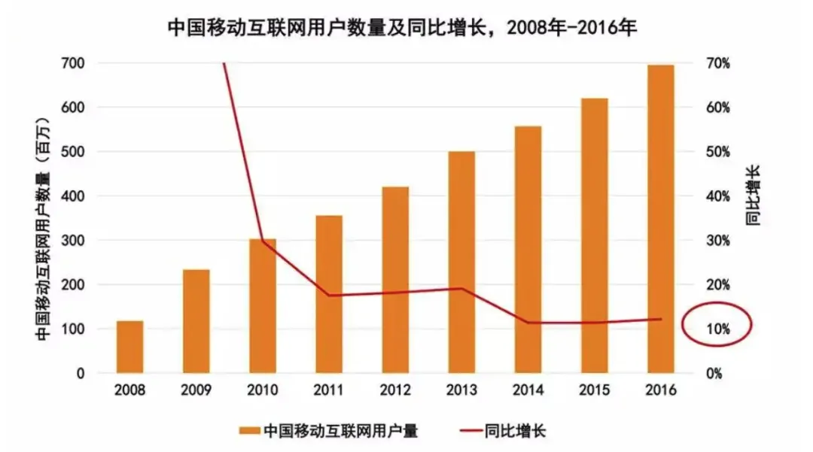

---
During this period, a new term emerged: “Internet Plus.” The “+” after “Internet” was connected to traditional industries such as telecommunications, media, entertainment, retail, finance, and transportation. This era also gave birth to outstanding companies such as WeChat, Dedao, Douyin, Kuaishou, Xiaohongshu, Ele.me, Ant Financial, and Didi Chuxing.

这期间诞生了新词汇：互联网+。“互联网+”的“+”后连接上了传统的各行各业——通信、媒体、娱乐、零售、金融、出行等领域。期间诞生了微信、得到、抖音、快手、小红书、饿了么、蚂蚁金服、滴滴打车等优秀公司。

The power of venture capital also continued to grow. The fierce capital battle over shared bicycles left a bold mark in history, while also revealing the greed and dark side of capital.

VC的力量也在持续成长，共享单车的资本大战，给历史留下浓墨重彩的一笔，也让人们认识到了资本的贪婪与邪恶。

---
>## In 2013, Yu’ebao, WeChat Pay, Kuaishou, Meituan Takeout, and Xiaohongshu were founded.
 2013年，余额宝、微信支付、快手、美团外卖、小红书诞生。

---
In June 2013, Yu’e Bao was launched. As of March 31, 2022, over the past nine years, Yu’e Bao had generated more than 300 billion yuan in returns for investors.

2013年6月，余额宝上线。截至2022年3月31日，过去9年间，余额宝累计为投资者赚取收益超3000亿元。

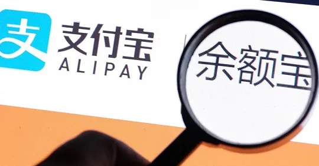

---
In June 2013, Xiaohongshu was founded in Shanghai; in December, Xiaohongshu launched an overseas shopping-sharing community.

2013年6月，小红书在上海成立 ；12月，小红书推出海外购物分享社区。

---
In August 2013, WeChat, in collaboration with Tenpay, officially launched WeChat Pay, which now has 900 million users.

2013年8月，微信与财付通合作，正式推出了微信支付，至今已有9亿用户。

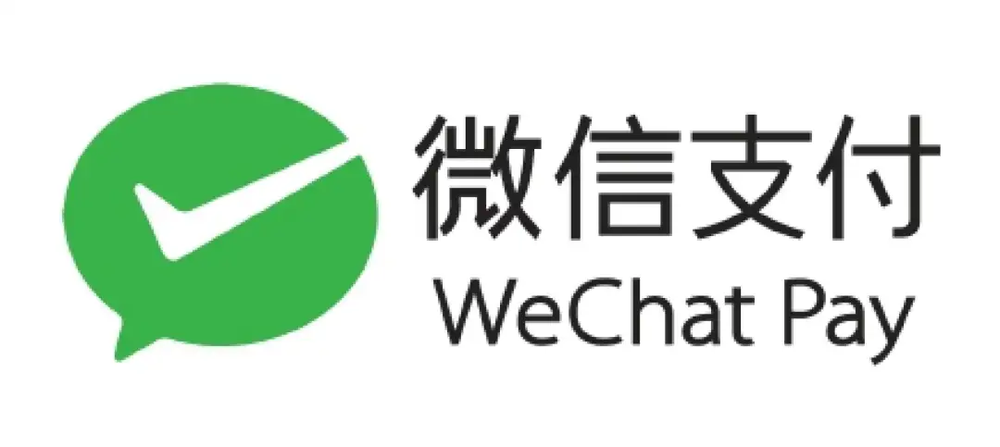

---
In October 2013, “GIF Kuaishou” transformed from a tool into a short video social platform. In November of the following year, it was renamed “Kuaishou.”

2013年10月，“GIF快手”从工具转型为短视频社交平台。次年11月，改名“快手”。

---
In November 2013, Meituan Takeout went online, becoming one of the two major food delivery giants alongside Ele.me.

2013年11月，美团外卖上线，与饿了么成为外卖双巨头。

---
>## 2014 was known as the year of “Internet Plus Mobility.”
2014年，互联网+出行之年

---
In May 2014, the Didi Dache product was renamed “Didi Chuxing.” A fierce subsidy war broke out among ride-hailing platforms such as Didi, Kuaidi, and Uber, making ride-hailing a mainstream mode of transportation. Eventually, the three consolidated into Didi, though Didi’s story is still being written.

2014年5月，嘀嘀打车产品更名为“滴滴打车”，滴滴、快的、优步等打车平台烧钱补贴大战，网约车开始成为主流出行方式。三国最终归一为滴滴，然而滴滴的篇章仍然在书写中。

---
In July 2014, 58 Daojia was established, becoming a leading domestic home services platform.

2014年7月，58到家成立，是国内领先的家庭服务平台。

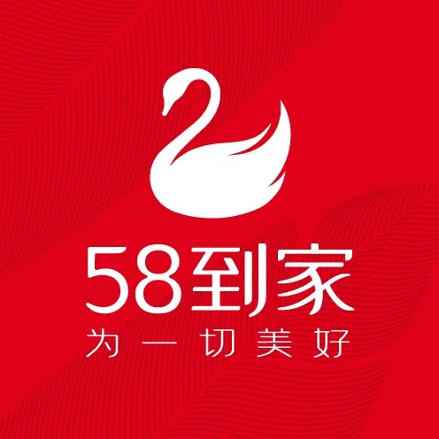

---
In July 2014, miHoYo was founded, with *Genshin Impact* becoming a money-printing phenomenon. On mobile platforms, *Genshin Impact* reached the milestone of 1 billion USD in revenue in 171 days. After 195 more days, its mobile revenue exceeded 2 billion USD, and another 185 days later, it surpassed 3 billion USD. This means that, as one of the most successful mobile games in history, *Genshin Impact* has averaged 1 billion USD in revenue every six months.

2014年7月，米哈游成立，原神成为超级印钞机。《原神》在移动平台花了 171 天达成营收 10 亿美元的里程碑。195 天后，该作手游版本收入超过 20 亿美元，而又过了 185 天后，《原神》移动端收入突破了 30 亿美元的大关。这意味着作为有史以来最成功的手游之一，《原神》平均每 6 个月的营收就达到了 10 亿美元。

---
In August 2014, Dai Wei and four partners founded ofo. Flooded with capital and ultimately unable to exit gracefully, Dai Wei is now branded a defaulter. The story serves as a lesson for young people: in the face of greed, anger, and delusion, one must adhere to objective rules and maintain long-term thinking, without being blinded by appearances.

2014年8月，戴威与4名合伙人创立ofo，被资本砸的头昏眼花，最终也没认输离场，如今成为老赖。给年轻人上了一课：在贪嗔痴面前，恪守客观规律，长远思考不能被表象蒙蔽双眼。

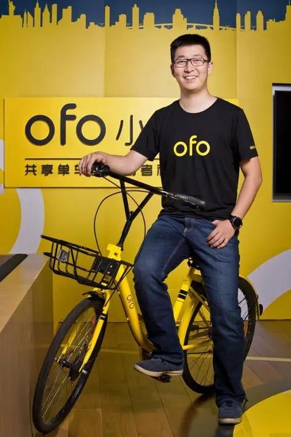

---
>## 2015 was known as the year of capital-driven mergers and monopolization.
2015年，资本主导合并垄断之年

---
In January 2015, the first internet bank was established: Shenzhen Qianhai WeBank began trial operations, with a registered capital of 3 billion yuan. Its business scope included accepting public deposits, primarily from individuals and small and micro enterprises; issuing short-, medium-, and long-term loans to individuals and small businesses; handling domestic and international settlements, as well as services related to bills, bonds, foreign exchange, and bank cards. Compared to traditional banks, WeBank innovated financial business models and transaction methods, disrupting traditional branch and counter services. Its positioning was as a bank with "no physical branches, no counters, and no need for asset guarantees, but instead providing loans through facial recognition technology and big data credit ratings."

2015年1月，首家互联网银行成立：深圳前海微众银行试营业，注册资本30亿元，经营范围包括吸收公众，主要是个人及小微企业的存款；主要针对个人及小微企业发放短期、中期和长期贷款；办理国内外结算以及票据、债券、外汇、银行卡等业务。与传统银行相比，微众银行创新了金融业务模式和金融交易方式，是对原有的网点和柜台业务的一种颠覆。其定位是“既无营业网点，也无营业柜台，更无须财产担保，而是通过人脸识别技术和大数据信用评级发放贷款”的银行。

---
In February 2015, ride-hailing giants Didi and Kuaidi merged strategically to become the leader in the transportation sector.

2015年2月，网约车巨头滴滴与快的战略合并成出行老大。

---
In March 2015, the State Council’s government work report first mentioned the "Internet Plus" plan and the concept of "mass entrepreneurship and innovation," promoting the integration of mobile internet, cloud computing, big data, and the Internet of Things with modern manufacturing. This also aimed to encourage the healthy development of e-commerce, industrial internet, and internet finance, and guide internet companies to expand into international markets. To implement the central government's decisions, the "Internet Plus" action plan was launched, which required a deeper understanding of the essence and growth model of "Internet Plus."

2015年3月，国务院政府工作报告首提“互联网+”计划、首提“大众创业、万众创新”，推动移动互联网、云计算、大数据、物联网等与现代制造业结合，促进电子商务、工业互联网和互联网金融健康发展，引导互联网企业拓展国际市场。落实中央决策部署，推进“互联网+”行动计划，需要进一步认清“互联网+”的本质与增长模式。

---
In April 2015, 58.com and Ganji merged to become the largest classified information website.

2015年4月，58同城、赶集合并成为最大分类信息网站。

---
In September 2015, "Ganjihouse" was officially renamed "Guazi Second-hand Car Direct Selling Network."

2015年9月，“赶集好车”正式更名为“瓜子二手车直卖网”。

---
In September 2015, Huang Zheng founded Shanghai Xunmeng and officially launched the social e-commerce platform Pinduoduo.

2015年9月，黄峥创立的上海寻梦正式创办社交新电商平台拼多多。

---
In October 2015, Ctrip and Qunar merged to become the largest online travel website.

2015年10月，携程、去哪儿合并成为最大线上旅游网站。

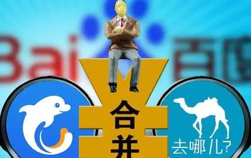

---
In October 2015, the group-buying giants Meituan and Dianping merged.

2015年10月，团购巨头美团和大众点评合并。

---
In December 2015, Jiayuan and Baihe also chose to "be together." These mergers were primarily driven by capital, and behind these "marriages," the three major internet giants, BAT (Baidu, Alibaba, Tencent), were typically involved.

2015年12月，世纪佳缘和百合网也选择了“在一起”。这些合并主要原因是受资本驱动，上述提到的“联姻”背后，基本上也都有BAT三大互联网巨头的身影。

---
In December 2015, There are 688 million internet users in China.

2015年12月，中国有 6.88 亿互联网用户。

---
>## 2016 was the year of live streaming and the sharing economy.
2016年，直播与共享经济之年。

---
In April 2016, Mobike launched its bike-sharing service, starting to compete with ofo in occupying streets and alleys.

2016年4月，摩拜单车上线，开始与ofo占领大街小巷。

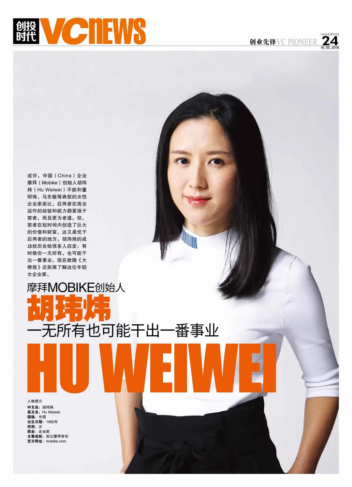

---
In May 2016, the article "A Young Man Who Died at the Hands of Baidu and the Military Hospital" went viral on WeChat, triggering a nationwide discussion on "the regulatory responsibilities of online platforms" and "who should bear the responsibility." This became known as the "Wei Zexi incident."

2016年5月，一篇《一个死在百度和部队医院之手的年轻人》的文章刷爆微信朋友圈。“魏则西事件”引发了一场关于“网络平台的监管责任边界在哪里”、“罪责到底是谁”的全民大讨论。

---
In July 2016, Nintendo’s mobile game *Pokémon GO* made augmented reality (AR) technology widely popular, and Alipay followed with its own AR red envelopes, further embedding AR technology in the public’s consciousness.

2016年7月，任天堂推出的手游《pokemongo》使得AR大受欢迎，之后支付宝也推出AR红包，让AR技术更加深入人心。

 technology widely popular")

---
In August 2016, Didi merged with Uber China, becoming the dominant player in the domestic transportation business.

2016年8月，滴滴与优步中国合并，从此成为国内出行业务龙头企业。

---
In September 2016, A.me officially launched and was later renamed Douyin. The short video market exploded in popularity.

2016年9月，A.me正式上线，后更名抖音，短视频市场空前火爆。

---
In December 2016, the developer of Meitu XiuXiu, Meitu Inc., went public in Hong Kong.

2016年12月，美图秀秀的开发商美图公司赴港上市。

---
In 2016, live streaming and internet celebrities (influencers) began to rise, with Papi Jiang becoming the first short video internet celebrity in China.

2016年，直播与网红开始兴起，papi酱成为国内首个短视频网红。

---
The development of China's self-media can be divided into four stages:
* 2009: Sina Weibo launched, sparking the self-media trend on social platforms.
* 2012: WeChat public accounts were launched, leading self-media to mobile platforms.
* 2012–2014: Portal websites, video platforms, and e-commerce platforms began to enter the self-media field, diversifying the platforms.
* 2015–Present: Live streaming and short videos became new hotspots for content entrepreneurship in self-media.

中国自媒体发展主要分为了4个阶段：
2009年新浪微博上线，引起社交平台自媒体风潮；
2012年微信公众号上线，自媒体向移动端发展；
2012—2014年门户网站、视频、电商平台等纷纷涉足自媒体领域，平台多元化；
2015—至今，直播、短视频等形式成为自媒体内容创业新热点。

---
2016 is referred to as the "Year of the Internet Celebrity Economy," and the term "internet celebrity" became a phenomenon in the self-media era, becoming an irreplaceable part of this new media landscape.

2016年被称为“网红经济元年”，“网红”一词彻底爆红，“网红”已经成为自媒体时代不可取代的现象级产物。

---
In 2016, blockchain technology emerged from the shell of Bitcoin. By September 2016, a total of 1,175 blockchain startups had been established worldwide, and global blockchain venture capital reached over \$1.4 billion in the first nine months of 2016.

2016年，区块链技术已然从比特币的壳中脱颖而出。据不完全统计，全球共有1175家区块链创业公司先后设立，2016年前9个月，全球区块链风险投资超过14亿美元。

---
In 2016, the paid content model gained traction, marking the internet's shift from free to paid. Knowledge-sharing economy became a significant trend, with Guokr leading with its platforms like "In Hang" and "Fenda," while Zhihu launched "Zhihu Live" and "Zhihu Value." The competition between these platforms was fierce.

2016年，内容付费，互联网正在经历从免费到付费的演变。知识分享经济一把火，将免费烧成了付费，走出了重要意义的一步。果壳网带着在行、分答，知乎带着值乎、知乎live，两只队伍你追我赶。

---
>## In 2017, self-media platforms flourished with a hundred schools of thought contending, and internet finance entered its first year of regulatory compliance.
2017年，自媒体平台百家争鸣、互联网金融进入合规元年。

---
In January 2017, WeChat introduces mini-programs, which run inside the app and allow users to interact with other services. By the next year, mini-programs will number more than 1 million.

2017年1月，微信引入了小程序，这些小程序在应用程序内运行并允许用户与其他服务进行交互。到明年，小程序数量将超过 100 万。

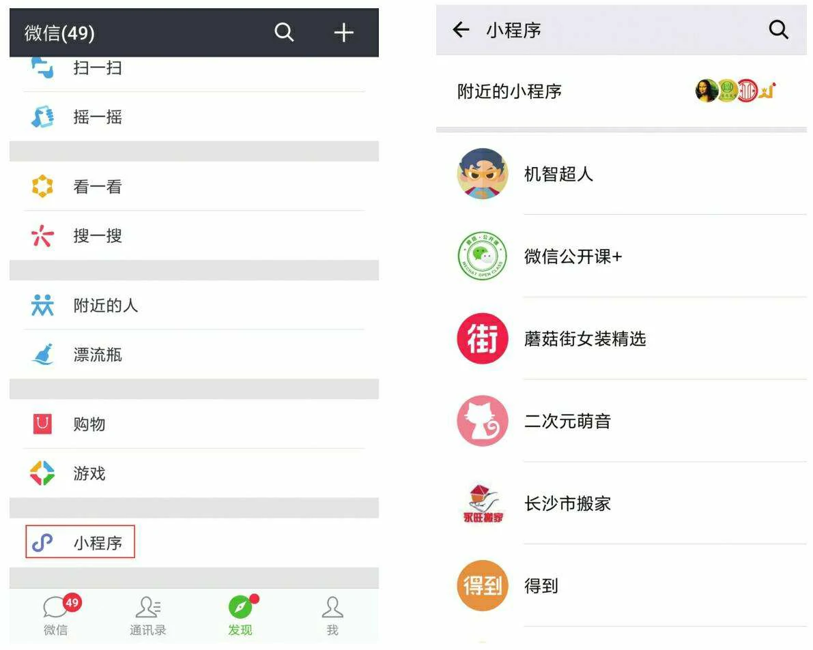

---
In May 2017, after the Go vs. AI match in Wuzhen, Ke Jie was emotionally overwhelmed, saying that AlphaGo "gave me no hope of winning." In just a year, AlphaGo's iterative progress surpassed human expectations, as Ke Jie said, AlphaGo was a game-changer for the world.

2017年5月，在浙江乌镇围棋人机大战结束后，柯洁哽咽地表示自己真的很难过， AlphaGo“让我一点获胜的希望都没有”。一年来，AlphaGo迭代进步的速度远超人类的想象，正如柯洁所言，AlphaGo改变的是整个世界。

---
In June 2017, China’s Cybersecurity Law goes into effect, laying the groundwork for one of the world’s most comprehensive internet regulatory regimes.

2017年6月，中国《网络安全法》生效，为世界上最全面的互联网监管制度之一奠定了基础。

---
In July 2017, the New Generation Artificial Intelligence Development Plan is released, drawing international attention for its ambitions to make China a world-leading AI developer by 2030.

2017年7月，《新一代人工智能发展规划》发布，其到 2030 年使中国成为世界领先的人工智能开发者的雄心壮志引起了国际关注。

---
In August 2017, Baidu’s food delivery service Baidu Waimai merged with Ele.me, which was later acquired by Alibaba.

2017年8月，百度外卖与饿了么合并，饿了么后被阿里巴巴收购。

---
In August 2017, the "2017 China Internet Enterprise Top 100 Report" by the China Internet Association and the Information Center of the Ministry of Industry and Information Technology revealed that the total internet business income of the top 100 Chinese internet companies reached 1.07 trillion yuan, surpassing the trillion-yuan mark for the first time, with a 46.8% year-on-year increase. These companies played a significant role in promoting economic growth.

2017年8月，中国互联网协会、工业和信息化部信息中心联合发布的《2017年中国互联网企业100强分析报告》显示，中国互联网百强企业的互联网业务收入总规模达到1.07万亿元，首次突破万亿大关，同比增长46.8%。我国处于新旧动能接续转换的关键时期，传统增长引擎对经济拉动作用减弱。2017年，互联网百强企业对经济增长发挥了积极作用，长期保持强劲的增长势头，综合实力持续增强，对经济发展新动能的培育和发展做出了重要贡献。

---
In September 2017, Zhang Yiming, the founder of Toutiao, predicted that "short videos are the next big trend in content entrepreneurship," and announced a 10-billion-yuan fund to support short video creators. Tencent also announced a similar fund at its global developer conference. On December 12, WeChat released version 6.5.1, extending the duration of videos shared in Moments from 6 seconds to 10 seconds.

2017年9月，今日头条创始人张一鸣作出一个判断，“短视频是内容创业的下一个风口”，随后宣布拿出10个亿扶持短视频。腾讯QQ也在腾讯全球开发者大会上宣布拿10亿元扶持短视频内容创业者。12月12日，微信发布最新6.5.1版本，朋友圈中短视频由6秒增加到10秒。

---
In November 2017, the Ministry of Industry and Information Technology released the "Industrial Internet Platform White Paper," explaining the architecture, key elements, technical system, industrial system, application scenarios, and development recommendations of industrial internet platforms.

2017年11月，工信部发布《工业互联网平台白皮书》，对工业互联网平台体系架构与关键要素、技术体系、产业体系、应用场景及案例、发展建议等进行了全面阐释。

---
In December 2017, Official statistics report that 527 million Chinese use mobile payments, and the top services—AliPay and WeChat Pay—report rapid user and volume growth.

2017年12月，官方统计数据显示，有 5.27 亿中国人使用移动支付，支付宝和微信支付等顶级服务的用户和交易量增长迅速。

---
In 2017, the self-media platform was in a state of intense competition, with major players like Tencent, Baidu, and Alibaba making big investments. The concept of universal reading became even more ingrained, with reading quality and knowledge dissemination improving. Text, video, and audio became three essential carriers of knowledge monetization, with paid reading becoming a trend.

2017年，自媒体平台百家争鸣。巨头纷纷下海押注自媒体。全民阅读理念更加深入人心，全民阅读质量和水平不断提高，文字、视频、音频成了知识变现的三种载体，付费阅读成为时尚。

---
2017 marked the first year of compliance in the internet finance sector. In February, the China Banking Regulatory Commission (CBRC) issued the *Guidelines on the Custody of Online Lending Funds*, which set out detailed requirements for conducting internet finance business, helping banks and internet users better identify the compliance and safety of online lending institutions. In August, the CBRC officially released and implemented the *Guidelines on Information Disclosure for Online Lending Information Intermediary Institutions* and the *Explanatory Notes on Information Disclosure Content*, marking the basic completion of the “1+3” regulatory framework for the online lending industry and the initial establishment of a relatively comprehensive system of rules and policies. The “cash loan” business was also brought under the scope of the special rectification of internet finance. In the payment sector, focusing on reserve fund management, cross-institution clearing, and barcode payment services, the People’s Bank of China issued several regulatory documents, including the *Notice on Centralized Custody of Customer Reserve Funds by Payment Institutions*, the *Notice on Migrating the Online Payment Business of Non-Bank Payment Institutions from Direct Connection to the UnionPay Platform*, the *Notice on Further Strengthening the Rectification of Unlicensed Payment Services*, the *Notice on Regulating Payment Innovation Services*, and the *Barcode Payment Business Standards (Trial)*.

2017年步入互联网金融合规元年。2月，银监会发布《网络借贷资金存管业务指引》，详细规定了开展互联网金融业务的各项要求，帮助银行和网民更好地辨别网贷机构的合规性和安全性。8月，银监会正式印发实施了《网络借贷信息中介机构业务活动信息披露指引》、《信息披露内容说明》，标志着网贷行业“1+3”制度框架基本搭建完成，初步形成了较为完善的制度政策体系。“现金贷”业务被纳入互联网金融专项整治范畴。在支付领域，围绕备付金管理、跨机构清算、条码支付业务等，人民银行出台《关于实施支付机构客户备付金集中存管有关事项的通知》、《关于将非银行支付机构网络支付业务由直连模式迁移至网联平台处理的通知》、《关于进一步加强无证经营支付业务整治工作的通知》、《关于规范支付创新业务的通知》、《条码支付业务规范（试行）》等规范性文件。

---
2018 was the year of the internet landing. At least 29 companies, including Pinduoduo, Qutoutiao, Xiaomi, iQIYI, Bilibili, Meituan-Dianping, and Uxin Used Cars, went public to raise capital.

2018年，是互联网着陆之年。拼多多、趣头条、小米、爱奇艺、B站、美团点评、优信二手车等至少29家企业上市融钱。

---
>## In February 2018, 360 officially renamed and listed on the Shanghai Stock Exchange (SSE) during a restructuring meeting. Over the past eight years, 360 went through the process of being listed in the United States, privatization and delisting, and IPO queuing, but ultimately chose to return to A-shares through a reverse merger.
2018年2月，360在上交所召开重组会议正式更名上市，在过去的八年间，360经历了美国上市、私有化退市、排队IPO，但最终还是选择了借壳上市回归A股。

---
In March 2018, Bilibili, abbreviated as "B站," officially listed on the NASDAQ in the United States, pricing at $11.50 per depositary share, raising a total of $483 million. The stock ticker was "BILI," with a valuation of $4.1 billion. The underwriters were Morgan Stanley, Bank of America Merrill Lynch, and J.P. Morgan. Bilibili listed one day earlier than iQIYI, becoming the first Chinese company with a focus on video websites to independently list on NASDAQ.

2018年3月，bilibili简称“B站”正式在美国纳斯达克敲钟上市，定价11.50美元/存托证券，整体募资规模达4.83亿美元，交易代码为“BILI”，估值41亿美金，承销商为摩根史丹利、美银美林和摩根大通，B站也早爱奇艺一天上市，成为第一家在纳斯达克独立上市的以视频网站为核心的中国公司。

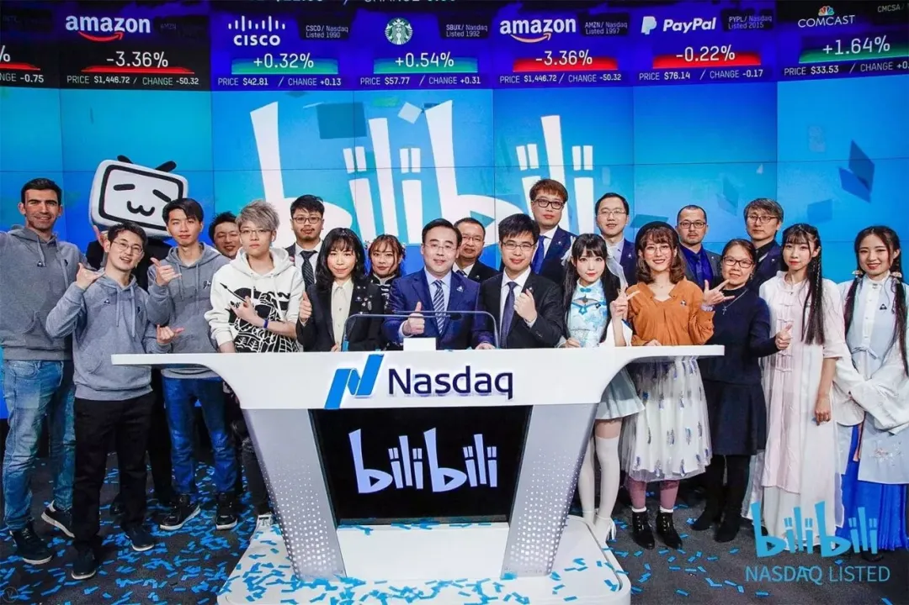

---
In March 2018, iQIYI officially listed on the NASDAQ in the United States under the stock code IQ, with a pricing of $18.00 per share and a valuation of $13.2 billion. On the day of the listing, iQIYI's founder and CEO Gong Yu, Baidu's CEO Robin Li, and other shareholders attended the ceremony. The listing billboard also appeared in Times Square, and Baidu’s headquarters lit up to celebrate iQIYI's IPO. After its listing, iQIYI's stock surged by as much as 150%, with a market capitalization exceeding $32 billion.

2018年3月，爱奇艺正式在美国纳斯达克挂牌上市，发行股票代码IQ，每股定价为18.00美元，估值132亿美元。敲钟仪式当天，爱奇艺创始人、CEO龚宇，李彦宏等股东出席现场。当天，爱奇艺上市广告牌更登陆美国时代广场，百度大厦总部也为爱奇艺亮灯祝福，上市后爱奇艺涨势幅度最高达150%，市值超320亿美元。

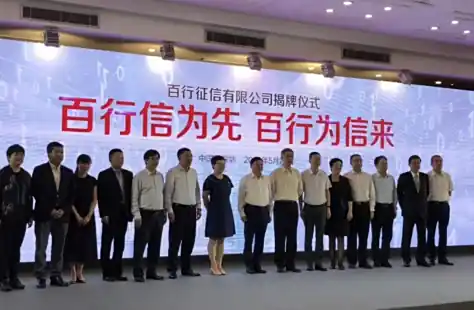

---
In April 2018, Meituan acquired Mobike and listed on the Hong Kong Stock Exchange in September. Its market capitalization reached HKD 400 billion (approximately USD 51 billion), surpassing JD.com and Xiaomi in value. At the age of 39, Wang Xing, Meituan’s founder, expressed gratitude to all employees, 340 million users, 4.7 million partner merchants, 600,000 delivery riders, and investors during the listing.

2018年4月，美团收购摩拜，9月港交所敲钟上市。市值4000亿港币，约510亿美元，超过京东和小米市值，39 岁的王兴在演进中感谢了全体员工、3.4 亿用户、470 万合作商户、60 万外卖骑手及投资人。

---
In April 2018, as the US government escalates its economic confrontation with China, Xi Jinping emphasizes the need for “indigenous innovation” in “core technologies” such as semiconductors, especially in the face of US threats to block the flow of crucial components to Chinese telecommunications giant ZTE.

2018年4月，随着美国政府与中国的经济对抗升级，习近平强调半导体等“核心技术”需要“本土创新”，特别是面对美国威胁阻止关键零部件流向中国电信巨头中兴通讯。

---
In May 2018, Baihang Credit was officially established in Shenzhen. Baihang Credit is the only market-oriented personal credit agency in China with a personal credit business license approved by the People's Bank of China. It specializes in the collection, organization, preservation, and external provision of credit reports and fraud prevention services.

2018年5月，百行征信在深圳宣布正式挂牌成立。百行征信是中国人民银行批准的全国唯一一家拥有个人征信业务牌照的市场化个人征信机构，是专业从事个人信用信息采集、整理、保存和对外提供信用报告、反欺诈等各类征信服务的机构。

---
In June 2018, Foxconn Industrial Internet Co., Ltd. was officially listed on the Shanghai Stock Exchange, with a successful A-share listing and a market capitalization of RMB 390 billion. Its fundraising scale reached RMB 27.1 billion, marking the largest financing amount for an IPO on the SSE since 2015, and the largest non-state-owned enterprise IPO in A-shares.

2018年6月，富士康工业互联网股份有限公司正式登陆上交所，成功在A股上市，市值3900亿人民币。其融资规模达271亿，是上交所2015年以来IPO最大的融资额，也是A股上IPO规模最大的非国有企业。

---
In July 2018, the People's Bank of China announced that it would take another one to two years to complete the special rectification of internet financial risks.

2018年7月，央行表示将再用1到2年时间完成互联网金融风险专项整治。

---
In July 2018, Pinduoduo listed in the United States, with an IPO price of $19 per share and a market capitalization of $24 billion, roughly equivalent to JD.com's market capitalization at that time. The high valuation of Pinduoduo's listing sparked controversy, with debates over whether it represented an upgrade or downgrade in consumption.

2018年7月，拼多多在美国上市，每股发行价19美元、市值240亿美元，市值相当于当时的京东市值。拼多多的上市高估值也被人们争议到底是消费升级还是消费降级。

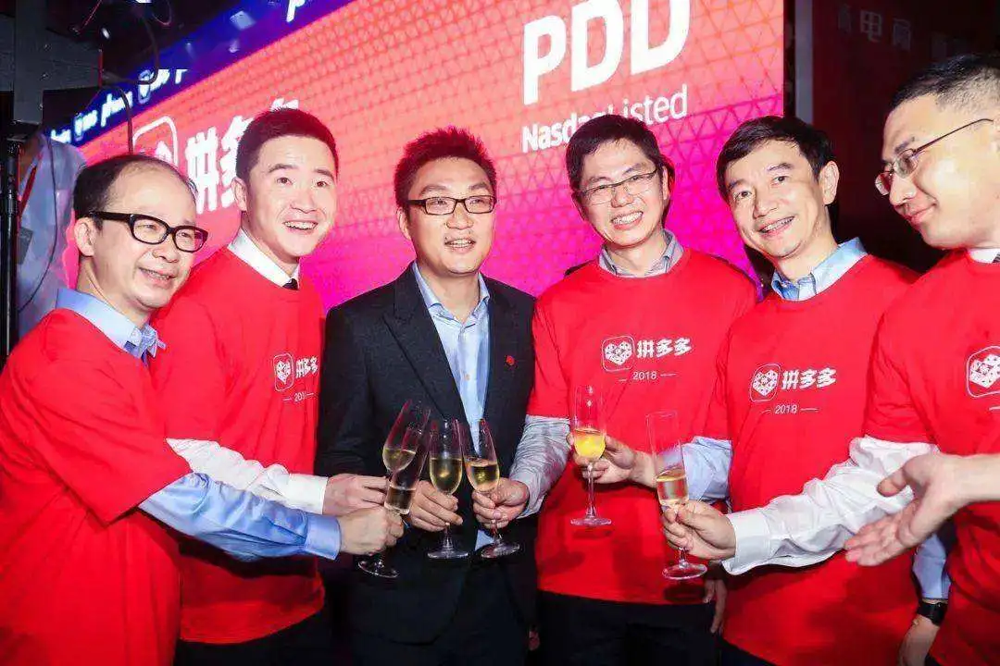

---
In August 2018, the fifth session of the 13th National People's Congress Standing Committee passed the E-Commerce Law. With seven chapters and 89 articles, the law details provisions regarding e-commerce operators, the establishment and execution of e-commerce contracts, dispute resolution, promotion of e-commerce, and legal responsibilities. The law came into effect on January 1, 2019.

2018年8月，十三届全国人大常委会第五次会议表决通过电子商务法，共七章89条，对电子商务经营者、电子商务合同的订立与履行、电子商务争议解决、电子商务促进、法律责任等进行详细规定，自2019年1月1日起施行。

---
In September 2018, the fastest listed Chinese concept stock was born. The domestic media platform, Qutoutiao, successfully completed its IPO in the US stock market, with a valuation of $1.5 billion. It became the first self-media platform to go public and saw a staggering 128.14% increase on its first day. At 2 years and 3 months old, Qutoutiao became the fastest Chinese concept stock to list, and on its listing day, it triggered a trading halt five times due to rapid price fluctuations. According to its updated prospectus, it is currently the second-largest mobile content aggregation platform in China. Founded in 2016, the startup accumulated over 100 million users in two years, with a monthly active user base of 62 million and a daily active user base of 21 million.

2018年9月，上市最快的中概股诞生。国内自媒体平台趣头条在美股成功完成了IPO上市，估值15亿美金，成自媒体平台第一股，并且首日暴涨128.14%。趣头条以2年零3个月，成为上市最快的中概股，挂牌当天，盘中因涨跌幅过快先后5次触发熔断而暂停交易。根据更新的招股书显示，它目前是中国第二大移动内容聚合平台。这家成立于2016年的初创公司，两年累积了上亿用户，MAU6200万，平均DAU2100万。

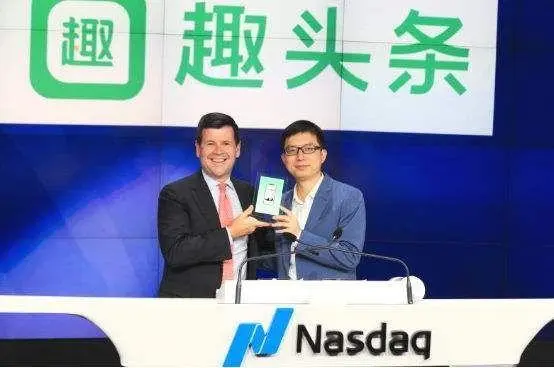

---
In September 2018, NIO, the electric vehicle company, officially listed on the New York Stock Exchange under the ticker symbol "NIO." The final price was $6.26 per share, raising approximately $1 billion through the issuance of 160 million ADS shares. The company's overall valuation stood at $6.4 billion, making NIO the second electric vehicle manufacturer to be listed in the US after Tesla.

2018年9月，蔚来汽车在纽约证券交易所正式挂牌上市，股票代码“NIO”。最终定价为6.26美元每股，以发行1.6亿股ADS计算，融资约10亿美元，公司总体估值在64亿美元，这意味着，蔚来成为继特斯拉之后，第二个在美国上市的电动汽车制造商。

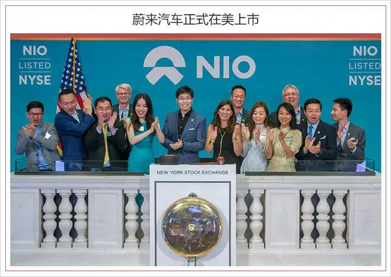

---
In December 2018, Beidou-3 began providing global services.

2018年12月，北斗三号开始提供全球服务。

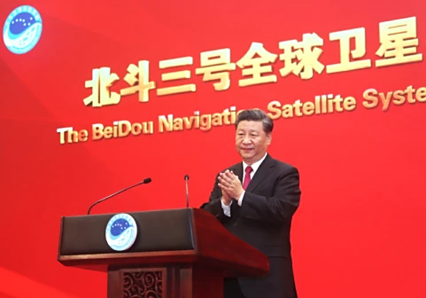

---
In 2018, the P2P online lending platform faced another round of massive defaults, causing significant losses for investors. While the 2014 defaults were largely fraudulent projects, the 2018 crisis was primarily caused by financial risks spreading to the P2P platforms due to the broader financial environment.

2018年，P2P网贷平台再度迎来一轮爆雷潮，投资人损失惨重。2014年爆雷的多是诈骗项目，而2018年暴雷潮更多是是整个金融环境引发的风险传递到了网贷平台。

---
>## In 2019, the internet experienced a lull: there were no blockbuster products, no major battles between tech giants, and growth in traffic almost stagnated. Traditional business models dominated with small-scale activities, while new trends and opportunities hesitated and tested the waters.
2019年，互联网中场无战事：这一年没有爆款产品；这一年没有巨头战争；这一年流量增速接近停滞；老派商业模式充斥小打小闹，新风口新趋势徘徊试探……

---
Early 2019, the U.S. government, concerned about China-based companies such as Huawei and ZTE growing their presence in global IT infrastructure, charges Huawei with sanctions and intellectual property violations while urging friendly governments to block the company's products from next-generation 5G wireless networks.

2019年初，美国政府担心华为和中兴通讯等中国公司在全球 IT 基础设施中不断扩大业务，指控华为实施制裁和侵犯知识产权，同时敦促友好政府阻止该公司的产品进入下一代 5G 无线网络。

---
In 2019, with the continuous rise of Bitcoin, blockchain technology became a hot buzzword.

2019年，随着比特币的持续高涨，区块链技术一度成为风口热词。

---
In 2019, international e-commerce giant Amazon announced the cessation of its services in China, marking its exit from the Chinese market.

2019年，国际电商巨头亚马逊宣布停止中国区服务，退出中国市场。

---
In 2019, social products like Matong MT, Duoshan, and Chatbao were launched, attempting to challenge WeChat.

2019年，马桶MT、多闪、聊天宝社交产品上线，企图挑战微信。

---
In 2019, the internet coffee brand Luckin Coffee achieved a lightning-fast IPO, breaking the record for the fastest IPO in global history.

2019年，互联网咖啡品牌瑞幸光速上市，打破了全球最快IPO纪录。

---
In 2019, the 996 work culture became a viral topic, sparking widespread discussions about work-life balance.

2019年，996成为网络爆火话题，引发了人们对于工作和生活的广泛讨论。

---
In 2019, the Ministry of Industry and Information Technology officially issued 5G licenses to the three major telecom operators, marking China's entry into the 5G era.

2019年，工信部正式向三大运营商发放5G牌照，中国进入5G元年。

---
On September 10, 2019, Jack Ma retired and was succeeded by Daniel. In November, Alibaba became the first company to achieve a dual listing.

2019年9月10日，马云退休，由张勇接任。11月阿里率先实现两地上市。

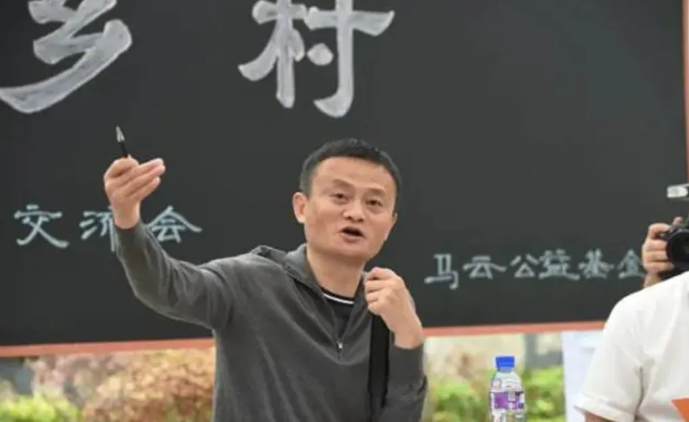

---
>## In 2020, the pandemic year: community group buying and online education surged. With global monetary overprinting, stock prices of several well-known companies soared.
2020年，疫情之年：社区团购、互联网教育火爆。全球货币超发，一众知名公司股价进入狂飙的时刻。

---
In April, Luckin Coffee announced that it had fabricated transactions worth 2.2 billion RMB, causing its stock price to plummet by 80%, with multiple trading halts during the day. On April 5, Luckin issued an apology. The scandal, driven by the founder Lu Zhengyao, triggered a trust crisis in Chinese concept stocks, severely hurting the Chinese internet sector. Lu Zhengyao’s actions were widely condemned.

4月，瑞幸咖啡发布公告，承认虚假交易22亿人民币，股价暴跌80%，盘中数次暂停交易。4月5日，瑞幸咖啡发布道歉声明。凭借一己之力，带来中概股信任危机，重伤整个中概互联板块。创始人陆正耀令人不齿。

---
In November, the Shanghai Stock Exchange announced that Ant Group's listing on the Star Market was postponed. On the same day, Ant Group announced that its listing on the Hong Kong Stock Exchange was also delayed. On November 6, Ant Group began the refund process, and on December 26, it established a rectification task force to fully implement the requirements of the government talks.

11月，上海证券交易所发布决定，暂缓蚂蚁集团在上交所科创板上市。同日，蚂蚁集团宣布暂缓在港交所上市；11月6日，蚂蚁集团启动退款程序；12月26日，蚂蚁集团成立整改工作组，全面落实约谈要求。

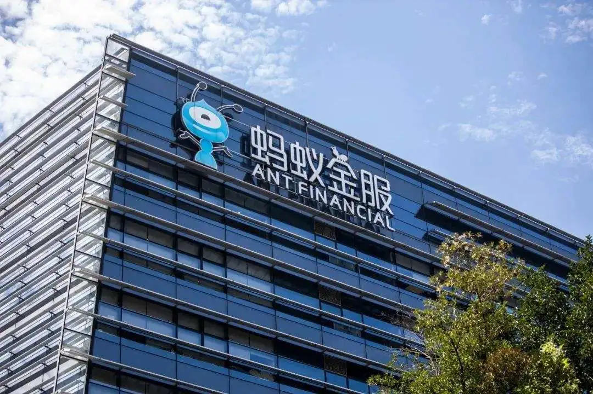

---
In November, the high-rent low-price model buried hidden risks, and the apartment rental company, Eggshell, faced a huge crisis.

11月，高收低租模式埋雷，蛋壳公寓暴雷。

---
In 2020, the surge of community group buying may have benefited from the revival of fresh food and grocery delivery services during the pandemic.By 2022, community group buying reverted to its original state.

2020年，社区团购的再次火爆，可能得益于疫情期间各类生鲜买菜配送业务的“回春”。2022年，社区团购被打回原形。

---
In 2020, the pandemic led to a boom in education and training, with stock prices soaring. However, in 2021, the government reset the distorted bottom-level economic logic, resulting in mass unemployment in the education and training sector.

2020年，疫情原因致使教育培训火爆，股价涨上天。2021年，政府重置畸形的底层经济逻辑，教培行业千万人失业。

---
In 2020, live-streaming e-commerce became a trend. In an effort to support the economic development of Hubei, state-owned enterprises and "Hubei Shopping Events" were widely praised. Subsequently, live-streaming e-commerce gained widespread popularity, with celebrities also joining in. Luo Yonghao sold Smartisan Technology and entered the live-streaming industry.

2020年，直播带货成潮流，为扶持湖北经济发展，央企带货、为湖北拼单活动广受好评，随后直播带货成潮流，明星也位列其中。罗永浩出售锤子科技，加入直播行业。

---
In 2020, the film industry experienced its darkest year. Due to the pandemic and home isolation measures, cinemas were forced to close, leading to significant losses for many offline cinemas and major companies.

2020年，电影行业最黑暗一年。受疫情影响，各地实行居家隔离措施，电影院只能停业休整。这也导致不少线下影院及头部企业巨额亏损。

---
In 2020, the path to international expansion faced obstacles. The domestic internet boom was essentially declared to have peaked. Uncontrollable factors like overseas market policies led to India suddenly banning 59 Chinese apps with one decree, turning the Indian market from a blue ocean into an investment no-go zone. Huawei struggled in the US and European markets, facing the risk of being cut off from supplies. Despite multiple attempts to distance itself from its Chinese parent company, TikTok faced the possibility of being banned and considered selling its operations.

2020年，出海之路受阻。国内互联网红利基本上宣告见顶。海外市场政策等因素不可控，一夜之间印度当局的一纸禁令封禁了59款中国应用，印度，一下子从蓝海变为投资禁区。华为在美国和欧洲市场步履维艰，面临断供风险。TikTok，虽然几度努力撇开跟中国母公司的关系，力证自己立足本地，依然一度面临被封禁而打算“卖身”。

