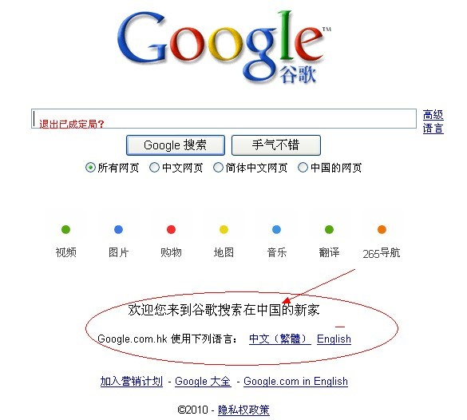
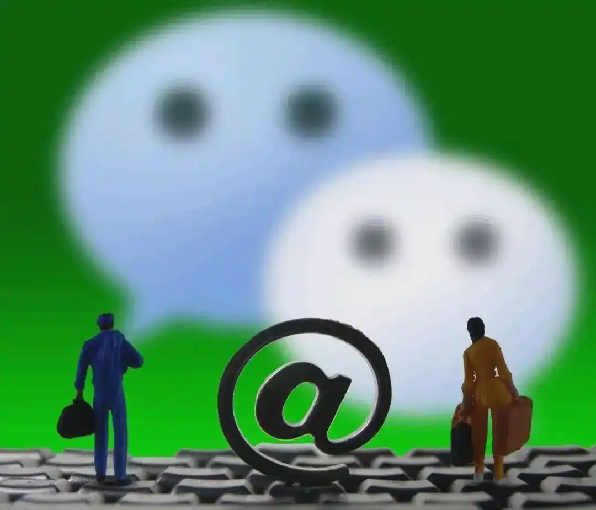

# The Early 2010s: Nailing Jell-O to the Wall
# 2010 年代初期：将果冻钉在墙上
---
Opening with the exuberance of Sina Weibo’s heyday and ending with the consolidation of internet authorities in the Cyberspace Administration of China, the early 2010s marks a transition from the free-wheeling aughts to the present era of tight control. As Sina Weibo rises in prominence, enabling millions of people to reach enormous audiences quickly, business titans and individual bloggers alike criticize the government. This dynamic chills precipitously after Chinese authorities crack down on the so-called “Big Vs”—verified accounts with large followings.  
2010 年代初，以新浪微博鼎盛时期的繁荣开端，到国家互联网信息办公室互联网当局的巩固而告终，标志着从随心所欲到现在的严格控制时代的过渡。随着新浪微博的崛起，使数百万人能够快速接触到大量受众，商业巨头和个人博主都批评政府。在中国当局打击所谓的“Big V”——拥有大量追随者的经过验证的账户——之后，这种动态急剧降温。
---
Meanwhile, Chinese officials are increasingly aware of the security risks posed by the internet after the eruption of the Arab Spring in 2011 and Edward Snowden’s 2013 revelations of US spying practices. Through technical means, as well as by creating an atmosphere of fear among the most influential online voices, the Chinese government nails Jell-O to the wall.  
与此同时，在2011年阿拉伯之春爆发和2013年爱德华·斯诺登揭露美国间谍活动后，中国官员越来越意识到互联网带来的安全风险。通过技术手段，以及在最有影响力的网络声音中营造恐惧气氛，中国政府将果冻钉在了墙上。
---
January 2010 – Google shuts down its mainland China search engine, which had controversially implemented Chinese government censorship orders. Google’s market share was never large, but its products had a devoted following.  
2010 年 1 月 – 谷歌关闭了其中国大陆搜索引擎，该搜索引擎曾有争议地实施了中国政府的审查令。谷歌的市场份额从来都不大，但其产品却拥有忠实的追随者。  

---
December 2010 – There are 547 million internet users in China.  
2010 年 12 月 ——中国有 5.47 亿互联网用户。
---
January 2011 – Tencent WeChat launches. WeChat is a robust chat platform offering text, voice, and video, from the same company behind the ubiquitous QQ chat app.  
2011 年 1 月 – 腾讯微信上线。微信是一个强大的聊天平台，提供文本、语音和视频，来自无处不在的 QQ 聊天应用程序背后的同一家公司。  

---
2010–2011 – Arab Spring. A series of so-called “Twitter revolutions” unleash instability in several authoritarian states. For Chinese authorities, these events underline the risk of unfettered online communication.  
2010–2011 – 阿拉伯之春。一系列所谓的“推特革命”在几个独裁国家引发了不稳定。对于中国当局来说，这些事件凸显了无限制的在线交流的风险。
---
November 2012 – Xi Jinping becomes General Secretary of the Chinese Communist Party.  
2012 年 11 月 ——习近平出任中国共产党总书记。
---
March 2013 – Xi Jinping becomes President of China.  
2013 年 3 月 ——习近平就任中国国家主席。
---
June 2013 – Edward Snowden leaks files on US spying, revealing US intelligence capabilities to Chinese officials and people around the world.  
2013 年 6 月 ——爱德华·斯诺登泄露了有关美国间谍活动的文件，向中国官员和世界各地的人民揭示了美国的情报能力。
---
2013 – Crackdown on the Big Vs. The golden age of Sina Weibo ends as authorities target several prominent users with strong-arm tactics.  
2013 – 打击大 Vs。新浪微博的黄金时代结束了，当局以强硬手段针对几位知名用户。
---
2014 – The Cyberspace Administration of China is founded, reflecting the administrative challenge of coordinating internet regulation among authorities focused on high-tech development, public security, and propaganda.  
2014 年 – 中国国家互联网信息办公室成立，反映了协调高科技发展、公共安全和宣传部门之间互联网监管的行政挑战。  
