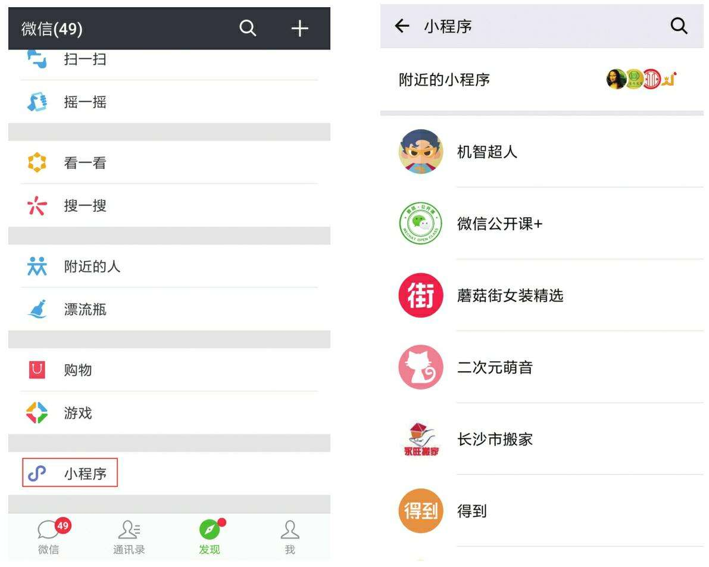
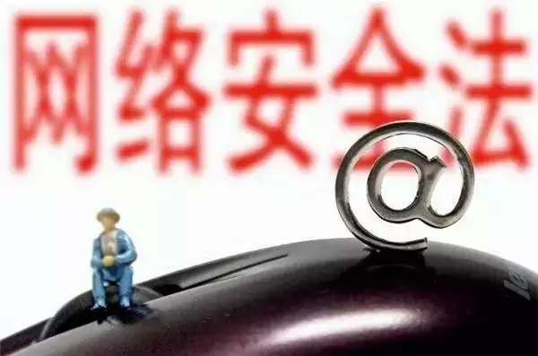
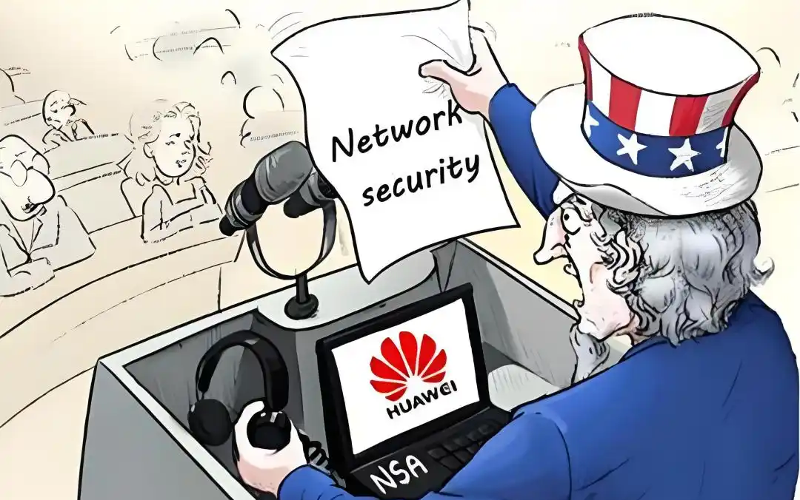

# Late 2010s: China’s Own Innovations
# 2010年代末：中国自己的创新
---
By the late 2010s, more than half of the population is using the internet, predominantly through mobile phones. But this means that the other half still aren’t online—a divide that is increasingly relevant as mobile apps become essential tools for personal finance, commerce, and transportation.  
到 2010 年代后期，超过一半的人口使用互联网，主要通过手机。但这意味着另一半仍然没有上网——随着移动应用程序成为个人理财、商业和交通的重要工具，这种鸿沟变得越来越重要。
---
There is no significant loosening of government controls over speech and political mobilization since 2013. At the same time, services driven by mobile technologies and machine learning algorithms are proliferating. Tech companies handle so many types of transactions that their systems have reordered the streetscape, where workers move goods bought and sold online and people hop on and off of shared bikes. Despite China’s particularities and Communist Party censorship and controls, some Chinese internet innovations go big abroad—including those dockless shared bikes now seen around the world, pioneered by Chinese companies like Mobike and Ofo.  
自 2013 年以来，政府对言论和政治动员的控制没有明显放松。与此同时，由移动技术和机器学习算法驱动的服务正在激增。科技公司处理的交易类型如此之多，以至于他们的系统重新排序了街景，工人在网上移动买卖的商品，人们上下共享单车。尽管中国有特殊性和共产党的审查和控制，但一些中国互联网创新在国外大放异彩——包括摩拜单车和 ofo 等中国公司开创的无桩共享单车。
---
December 2015 – There are 688 million internet users in China.  
2015 年 12 月 – 中国有 6.88 亿互联网用户。
---
January 2017 – WeChat introduces mini-programs, which run inside the app and allow users to interact with other services. By the next year, mini-programs will number more than 1 million.  
2017 年 1 月 – 微信引入了小程序，这些小程序在应用程序内运行并允许用户与其他服务进行交互。到明年，小程序数量将超过 100 万。  

---
June 2017 – China’s Cybersecurity Law goes into effect, laying the groundwork for one of the world’s most comprehensive internet regulatory regimes.  
2017 年 6 月 – 中国《网络安全法》生效，为世界上最全面的互联网监管制度之一奠定了基础。  

---
July 2017 – The New Generation Artificial Intelligence Development Plan is released, drawing international attention for its ambitions to make China a world-leading AI developer by 2030.  
2017 年 7 月 – 《新一代人工智能发展规划》发布，其到 2030 年使中国成为世界领先的人工智能开发者的雄心壮志引起了国际关注。
---
December 2017 – Official statistics report that 527 million Chinese use mobile payments, and the top services—AliPay and WeChat Pay—report rapid user and volume growth.  
2017 年 12 月 ——官方统计数据显示，有 5.27 亿中国人使用移动支付，支付宝和微信支付等顶级服务的用户和交易量增长迅速。
---
January 2018 – Ant Financial, an affiliate of Alibaba, is fined and publicly apologizes for an app that pre-checks the opt-in box for its Sesame Credit service, which provides credit scores. Greater public awareness of the risks around personal data begins to take hold.  
2018 年 1 月 – 阿里巴巴的附属公司蚂蚁金服因一款应用程序预先检查其提供信用评分的芝麻信用服务的选择加入框而被罚款并公开道歉。公众对个人数据风险的认识开始增强。
---
March 2018 – The main interagency regulator, the Cyberspace Administration of China, gains greater political clout when its bureaucratic parent organization is upgraded.  
2018 年 3 月 – 主要的跨部门监管机构——中国国家互联网信息办公室在其官僚上级组织升级后获得了更大的政治影响力。
---
April 2018 – As the US government escalates its economic confrontation with China, Xi Jinping emphasizes the need for “indigenous innovation” in “core technologies” such as semiconductors, especially in the face of US threats to block the flow of crucial components to Chinese telecommunications giant ZTE.  
2018 年 4 月 ——随着美国政府与中国的经济对抗升级，习近平强调半导体等“核心技术”需要“本土创新”，特别是面对美国威胁阻止关键零部件流向中国电信巨头中兴通讯。
---
Early 2019 — The U.S. government, concerned about China-based companies such as Huawei and ZTE growing their presence in global IT infrastructure, charges Huawei with sanctions and intellectual property violations while urging friendly governments to block the company's products from next-generation 5G wireless networks.  
2019 年初 ——美国政府担心华为和中兴通讯等中国公司在全球 IT 基础设施中不断扩大业务，指控华为实施制裁和侵犯知识产权，同时敦促友好政府阻止该公司的产品进入下一代 5G 无线网络。  
