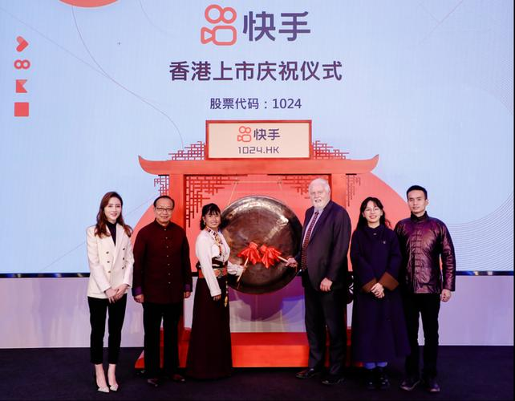
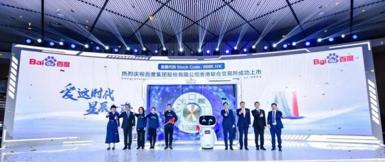
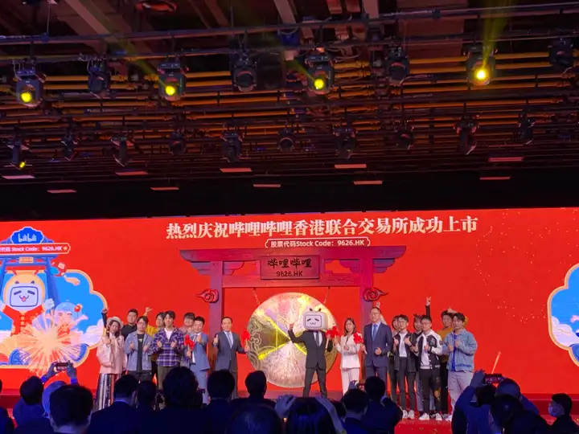
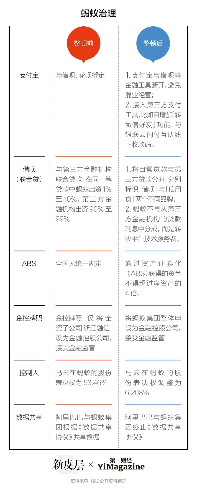
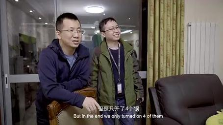
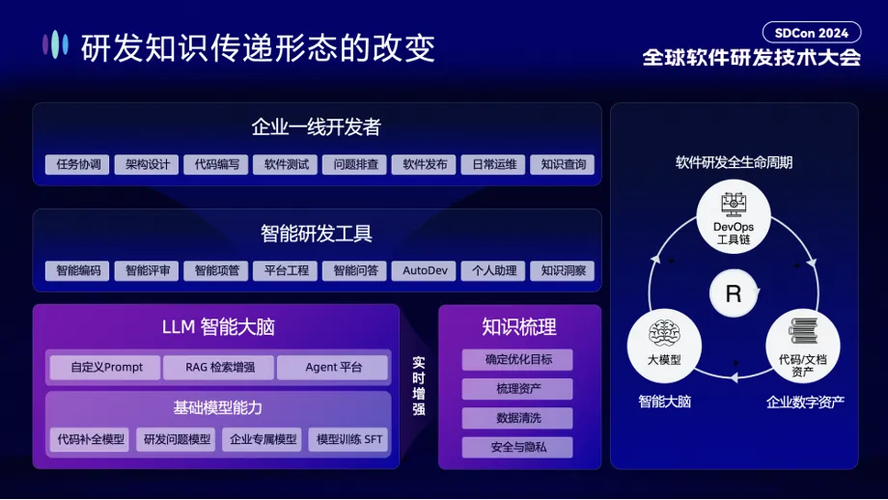
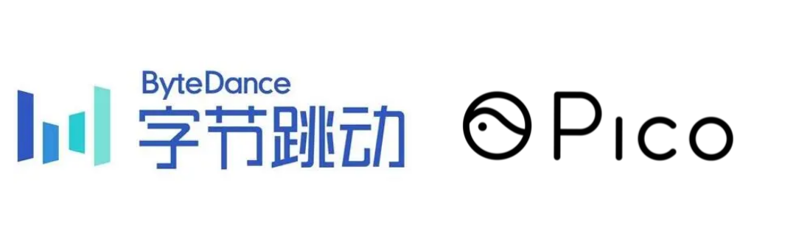

# 2021–2026: Intelligence and Integration – The Internet Enters Deeper Waters

---
In January 2021, China's Civil Code came into effect, establishing statutory rights of privacy for individuals and foundational data protection principles.

2021年1月，中国民法典正式实施，确立了个人隐私权和数据保护的法律基础原则。

---
In February 2021, the State Administration for Market Regulation (SAMR) issued landmark Anti-Monopoly Guidelines for the Platform Economy, providing first comprehensive antitrust guidance for internet platforms.

2021年2月，国家市场监督管理总局发布《关于平台经济领域的反垄断指南》，首次为互联网平台提供全面的反垄断指导。

---
In February 2021, Kuaishou completed its Hong Kong IPO, raising HK$41.28 billion ($5.32 billion), making it Hong Kong's hottest IPO with stock surging 160% on debut day.

2021年2月，快手在香港完成IPO，筹资412.8亿港元（53.2亿美元），成为香港最火爆的IPO，股价首日飙升160%。

---
In March 2021, Baidu completed secondary listing in Hong Kong, raising HK$23.9 billion ($3.1 billion) under stock code 9888.

2021年3月，百度在香港完成二次上市，筹资239亿港元（31亿美元），股票代码9888。

---
In March 2021, Bilibili completed secondary listing in Hong Kong, raising HK$20.2 billion ($2.6 billion) under stock code 9626.

2021年3月，哔哩哔哩在香港完成二次上市，筹资202亿港元（26亿美元），股票代码9626。

---
In March 2021, Xiaomi announced entry into electric vehicle business with initial investment of 10 billion yuan and plans for total investment of $10 billion over 10 years, with Lei Jun serving as CEO.

2021年3月，小米宣布进军电动汽车业务，初始投资100亿元人民币，计划总投资100亿美元，雷军担任CEO。

---
In April 2021, SAMR imposed a record-breaking antitrust fine of RMB 18.228 billion ($2.8 billion) on Alibaba for abusing market dominance through exclusivity arrangements forcing merchants to "choose one from two," equal to 4% of Alibaba's 2019 China revenue.

2021年4月，国家市场监督管理总局对阿里巴巴处以创纪录的182.28亿元人民币（28亿美元）反垄断罚款，原因是其滥用市场支配地位，强迫商家"二选一"，罚款金额相当于阿里巴巴2019年中国境内销售额的4%。

---
In April 2021, Chinese government ordered Ant Group to transform into a financial holding company supervised by People's Bank of China, requiring complete business restructuring.

2021年4月，中国政府要求蚂蚁集团转型为受中国人民银行监管的金融控股公司，需要进行全面业务重组。

---
In April 2021, SAMR held administrative guidance meeting with 34 major internet companies including Tencent, Baidu, Meituan, and ByteDance, requiring them to rectify anticompetitive practices within one month.

2021年4月，国家市场监督管理总局召集包括腾讯、百度、美团、字节跳动在内的34家互联网企业进行行政指导，要求在一个月内整改反竞争行为。

---
In April 2021, SAMR announced investigation into Meituan for alleged antitrust violations related to "choose one from two" exclusivity practices.

2021年4月，国家市场监督管理总局宣布对美团涉嫌垄断行为立案调查，涉及"二选一"独家合作安排。

---
In May 2021, ByteDance founder and CEO Zhang Yiming announced he would step down as CEO by end of 2021, to be succeeded by co-founder Liang Rubo.

2021年5月，字节跳动创始人兼CEO张一鸣宣布将于2021年底卸任CEO，由联合创始人梁汝波接任。

---
In June 2021, Beijing Academy of Artificial Intelligence released WuDao 2.0 with 1.75 trillion parameters, surpassing OpenAI's GPT-3 as the world's largest multimodal AI model at the time.

2021年6月，北京智源人工智能研究院发布悟道2.0，拥有1.75万亿参数，超越OpenAI的GPT-3，成为当时世界上最大的多模态AI模型。

---
In June 2021, the Standing Committee of the National People's Congress passed the Data Security Law, establishing categorized and graded protection system for data with penalties up to RMB 10 million, effective September 1, 2021.

2021年6月，全国人大常委会通过《数据安全法》，建立数据分类分级保护制度，最高罚款1000万元人民币，于2021年9月1日生效。

---
In June 2021, Didi Chuxing completed $4.4 billion IPO on New York Stock Exchange under ticker "DIDI," valuing the company at approximately $70 billion.

2021年6月，滴滴出行在纽约证券交易所完成44亿美元IPO，股票代码"DIDI"，估值约700亿美元。

---
In July 2021, China's Cyberspace Administration launched cybersecurity review of Didi Chuxing just two days after its NYSE IPO, citing illegal collection of users' personal information.

2021年7月，中国国家网信办在滴滴出行纽交所IPO仅两天后对其启动网络安全审查，称其非法收集用户个人信息。

---

In July 2021, Didi app was removed from all Chinese app stores on July 4, and the company was ordered to suspend new user registrations during the cybersecurity review.
2021年7月，滴滴出行应用于7月4日从所有中国应用商店下架，公司被要求在网络安全审查期间暂停新用户注册。

---
In July 2021, CAC launched cybersecurity reviews into Full Truck Alliance and Boss Zhipin, expanding enforcement beyond Didi to other recently U.S.-listed companies.

2021年7月，国家网信办对满帮集团和BOSS直聘启动网络安全审查，将执法范围扩大到滴滴之外的其他近期在美上市公司。

---
In July 2021, CAC issued draft Cybersecurity Review Measures requiring companies with data on over 1 million users to undergo security review before listing abroad.

2021年7月，国家网信办发布《网络安全审查办法》修订草案，要求掌握超过100万用户数据的公司在境外上市前必须进行安全审查。

---
In August 2021, the Standing Committee of the National People's Congress passed the Personal Information Protection Law (PIPL), establishing China's first comprehensive personal information protection law with penalties up to 50 million yuan or 5% of prior year's revenue, effective November 1, 2021.

2021年8月，全国人大常委会通过《个人信息保护法》，建立中国首部全面的个人信息保护法，最高罚款5000万元人民币或上一年度营业额的5%，于2021年11月1日生效。

---
In August 2021, National Press and Publication Administration issued notice severely restricting minors' gaming time to only 1 hour per day, limited to 8-9pm on Fridays, Saturdays, Sundays and public holidays, effective September 1, 2021.

2021年8月，国家新闻出版署发布通知，严格限制未成年人游戏时间为每天1小时，仅限周五、周六、周日及法定节假日晚8-9点，于2021年9月1日生效。

---
In August 2021, ByteDance acquired VR headset maker Pico for $1.5 billion, signaling major investment in metaverse ambitions.

2021年8月，字节跳动以15亿美元收购VR头显制造商Pico，表明其在元宇宙领域的重大投资意图。

---
In September 2021, Data Security Law took effect, implementing comprehensive data security requirements including mandatory local storage for critical information infrastructure operators.

2021年9月，《数据安全法》正式生效，实施全面的数据安全要求，包括关键信息基础设施运营者必须在境内存储数据。

---
In September 2021, Regulations on the Protection of Security of Critical Information Infrastructure came into effect, establishing security protection obligations and requiring security reviews for procurement.

2021年9月，《关键信息基础设施安全保护条例》正式生效，建立安全保护义务并要求对采购进行安全审查。

---
In September 2021, People's Bank of China and 10 other agencies declared all cryptocurrency transactions illegal, banning all crypto trading and mining activities in the most comprehensive national cryptocurrency ban globally.

2021年9月，中国人民银行等10个部门宣布所有虚拟货币交易活动均属非法，禁止所有加密货币交易和挖矿活动，成为全球最全面的国家级加密货币禁令。

---
In October 2021, SAMR fined Meituan RMB 3.44 billion ($533 million) for forcing merchants into exclusivity arrangements, equal to 3% of 2020 domestic revenue, and ordered return of RMB 1.29 billion in merchant deposits.

2021年10月，国家市场监督管理总局对美团处以34.4亿元人民币（5.33亿美元）罚款，原因是强迫商家独家合作，相当于2020年国内收入的3%，并要求退还12.9亿元人民币的商家保证金。

---
In November 2021, Personal Information Protection Law took effect, requiring consent for most personal information processing and establishing cross-border transfer mechanisms.

2021年11月，《个人信息保护法》正式生效，要求大多数个人信息处理需获得同意，并建立跨境传输机制。

---
In November 2021, ByteDance founder Zhang Yiming completed transition, stepping down as CEO with Liang Rubo officially becoming CEO.

2021年11月，字节跳动创始人张一鸣完成过渡，卸任CEO，梁汝波正式接任CEO。

---
In November 2021, SAMR fined Alibaba, Tencent, Baidu, and other companies total of 21.5 million yuan ($3.4 million) for 43 antitrust violations related to unreported deals dating back to 2012.

2021年11月，国家市场监督管理总局对阿里巴巴、腾讯、百度等公司因43起未申报的交易违规行为处以共计2150万元人民币（340万美元）罚款，这些交易可追溯至2012年。

---
In November 2021, Xiaomi signed cooperation agreement with Beijing Municipal Government to establish Xiaomi Automobile in Beijing Economic and Technological Development Zone with planned production capacity of 300,000 vehicles annually.

2021年11月，小米与北京市政府签署合作协议，在北京经济技术开发区建立小米汽车，计划年产能30万辆。

---
In December 2021, CAC, MIIT, Ministry of Public Security, and SAMR jointly issued Administrative Provisions on Algorithm Recommendation for Internet Information Services, requiring transparency, user opt-out rights, and algorithm filing for companies with public opinion properties or social mobilization capabilities, effective March 1, 2022.

2021年12月，国家网信办、工信部、公安部、市场监管总局联合发布《互联网信息服务算法推荐管理规定》，要求透明度、用户退出权，以及具有舆论属性或社会动员能力的公司必须进行算法备案，于2022年3月1日生效。

---
In December 2021, Didi announced it would delist from NYSE and pursue listing in Hong Kong following regulatory pressure, just 5 months after its IPO.

2021年12月，滴滴出行宣布将从纽交所退市并寻求在香港上市，这是在监管压力下做出的决定，距其IPO仅5个月。

---
In December 2021, Baidu launched "Land of Hope" (Xirang) metaverse platform, branded as "first Chinese-made metaverse product," used for AI developers conference.

2021年12月，百度推出"希壤"元宇宙平台，标榜为"首个国产元宇宙产品"，用于AI开发者大会。

 metaverse platform")

---
In March 2022, Algorithm Recommendation Provisions took effect, requiring companies to implement user control interfaces, algorithm filing systems, and enhanced content moderation.

2022年3月，算法推荐规定正式生效，要求公司实施用户控制界面、算法备案系统和加强内容审核。

---
In April 2022, JD.com founder Richard Liu stepped down as CEO, succeeded by Xu Lei as president/CEO, with Liu remaining as Chairman.

2022年4月，京东创始人刘强东卸任CEO，由徐磊接任总裁兼CEO，刘强东继续担任董事长。

---
In May 2022, Didi shareholders approved delisting from NYSE in shareholder vote held on May 23.

2022年5月，滴滴出行股东于5月23日的股东大会上批准从纽交所退市。

---
In June 2022, Didi completed delisting from NYSE and began trading over-the-counter under symbol "DIDIY," losing approximately $60 billion in market value since IPO.

2022年6月，滴滴出行完成从纽交所退市，开始在场外交易，股票代码"DIDIY"，自IPO以来市值损失约600亿美元。

---
In June 2022, the Standing Committee passed revised Anti-Monopoly Law, China's first amendment since 2007, specifically targeting tech platforms with prohibitions on abuse through "data, algorithms, technology, capital and platform rules," with dramatically increased penalties and effective August 1, 2022.

2022年6月，全国人大常委会通过修订的《反垄断法》，这是自2007年以来的首次修订，专门针对科技平台，禁止通过"数据、算法、技术、资本和平台规则"滥用，大幅提高处罚力度，于2022年8月1日生效。

---
In July 2022, CAC announced completion of Didi investigation and imposed fine of RMB 8.026 billion ($1.2 billion) for violations spanning 7 years, with additional fines on CEO Cheng Wei and President Liu Qing of RMB 1 million each.

2022年7月，国家网信办宣布完成对滴滴的调查，对其跨越7年的违规行为处以80.26亿元人民币（12亿美元）罚款，并对CEO程维和总裁柳青各处以100万元人民币罚款。

---
In July 2022, CAC issued Measures for Security Assessment of Outbound Data Transfer, requiring mandatory CAC security assessment for critical information infrastructure operators and companies transferring data of 1+ million individuals, effective September 1, 2022.

2022年7月，国家网信办发布《数据出境安全评估办法》，要求关键信息基础设施运营者和传输100万人以上数据的公司必须进行国家网信办安全评估，于2022年9月1日生效。

---
In August 2022, CAC published Filing List of Domestic Internet Information Service Algorithms, disclosing 30 algorithms from 24 companies including Tencent, Alibaba, ByteDance, and Baidu.

2022年8月，国家网信办公布《境内互联网信息服务算法备案清单》，披露了来自腾讯、阿里巴巴、字节跳动、百度等24家公司的30个算法。

---
In August 2022, five Chinese state-owned companies voluntarily delisted from NYSE including China Life Insurance, PetroChina, Sinopec, Aluminum Corporation of China, and Sinopec Shanghai Petrochemical.

2022年8月，五家中国国有企业自愿从纽交所退市，包括中国人寿、中国石油、中国石化、中国铝业和中国石化上海石油化工。

---
In October 2022, US Bureau of Industry and Security announced sweeping export controls on advanced computing chips, semiconductor manufacturing equipment, and prohibited "US persons" from supporting advanced chip facilities in China, marking most significant shift in US tech policy toward China since 1990s.

2022年10月，美国工业与安全局宣布对先进计算芯片、半导体制造设备实施全面出口管制，并禁止"美国人"支持中国的先进芯片设施，标志着自1990年代以来美国对华科技政策的最重大转变。

---
In November 2022, CAC, MIIT, and Ministry of Public Security jointly issued Provisions on the Administration of Deep Synthesis (Deepfake), requiring conspicuous labeling of AI-generated content, user consent for biometric data manipulation, and real-name verification, effective January 10, 2023.

2022年11月，国家网信办、工信部、公安部联合发布《互联网信息服务深度合成管理规定》，要求对AI生成内容进行明显标识，对生物特征数据处理获得用户同意，以及实名验证，于2023年1月10日生效。

---
In November 2022, MIIT released "Virtual Reality and Industry Application Integration Development Action Plan (2022-2026)" with goal to expand VR industry output to 350 billion yuan ($48 billion) by 2026.

2022年11月，工信部发布《虚拟现实与行业应用融合发展行动计划（2022-2026年）》，目标是到2026年将VR产业产值扩大至3500亿元人民币（480亿美元）。

---
In December 2022, US-China reached audit agreement allowing US Public Company Accounting Oversight Board access to audit Chinese companies, averting mass delisting of 200+ Chinese firms from US exchanges.

2022年12月，美中达成审计协议，允许美国上市公司会计监督委员会审计中国公司，避免了200多家中国公司从美国交易所大规模退市。

---
In January 2023, Deep Synthesis (Deepfake) Regulations took effect, requiring platforms to label AI-generated content and implement facial recognition and consent mechanisms.

2023年1月，深度合成（Deepfake）规定正式生效，要求平台标记AI生成内容并实施面部识别和同意机制。

---
In February 2023, CAC released Measures for the Standard Contract for Outbound Transfer of Personal Information, providing alternative to Security Assessment for smaller data exporters, effective June 1, 2023.

2023年2月，国家网信办发布《个人信息出境标准合同办法》，为较小规模数据出境者提供安全评估的替代方案，于2023年6月1日生效。

---
In February 2023, Pinduoduo changed company name to PDD Holdings Inc. to reflect expanded portfolio including international platform Temu.

2023年2月，拼多多将公司名称改为PDD Holdings Inc.，以反映包括国际平台Temu在内的扩展业务组合。

---
In March 2023, Alibaba announced historic restructuring into six independent business units in biggest organizational overhaul in company's 24-year history under "1+6+N" structure, with each unit having own CEO, board, and ability to pursue independent fundraising and IPOs.

2023年3月，阿里巴巴宣布进行历史性重组，采用"1+6+N"架构，将公司拆分为六个独立业务单元，这是公司24年历史上最大的组织变革，每个单元拥有自己的CEO、董事会，并能够独立融资和IPO。

---
In March 2023, Jack Ma made first known return to China after spending months abroad following 2020 crackdown, visiting school he established in Hangzhou.

2023年3月，马云在2020年监管整顿后出国数月后首次公开返回中国，访问了他在杭州创办的学校。

---
In March 2023, the House of Representatives passed Protecting Americans from Foreign Adversary Controlled Applications Act (PAFACA) requiring ByteDance to divest TikTok within 9 months or face US ban.

2023年3月，美国众议院通过《保护美国人免受外国对手控制应用法案》（PAFACA），要求字节跳动在9个月内剥离TikTok，否则将面临美国禁令。

---
In April 2023, SAMR issued final implementing regulations for Anti-Monopoly Law, clarifying merger control, dominance abuse, and digital economy provisions, effective April 15, 2023.

2023年4月，国家市场监督管理总局发布《反垄断法》最终实施条例，明确合并控制、支配地位滥用和数字经济条款，于2023年4月15日生效。

---
In May 2023, JD.com appointed Sandy Ran Xu as CEO, succeeding Xu Lei.

2023年5月，京东任命徐冉为CEO，接替徐磊。

---
In June 2023, Alibaba announced major leadership transition with Joseph C. Tsai becoming Chairman and Eddie Yongming Wu becoming CEO, effective September 10, 2023.

2023年6月，阿里巴巴宣布重大领导层调整，蔡崇信将担任董事长，吴泳铭将担任CEO，于2023年9月10日生效。

---
In July 2023, Ant Group was fined RMB 7.123 billion ($985 million) by CAC and financial regulators for violations of corporate governance, payment and settlement business, consumer protection, and anti-money laundering obligations, concluding two-year investigation.

2023年7月，蚂蚁集团因违反公司治理、支付结算业务、消费者保护和反洗钱义务，被国家网信办和金融监管机构处以71.23亿元人民币（9.85亿美元）罚款，结束了为期两年的调查。

---
In July 2023, PBOC fined Tencent RMB 2.99 billion ($410 million) for past regulatory breaches in payment services provision, with Chinese regulators signaling end of tech sector "rectification" period.

2023年7月，中国人民银行对腾讯过去在支付服务提供方面的违规行为处以29.9亿元人民币（4.1亿美元）罚款，中国监管机构表示科技行业"整改"期结束。

---
In July 2023, Beijing University of Post and Telecommunications established world's first 6G field test network achieving 6G capabilities on existing 4G infrastructure using semantic communication, with tenfold improvement in capacity.

2023年7月，北京邮电大学建立了世界上首个6G现场测试网络，利用语义通信在现有4G基础设施上实现6G能力，容量提升十倍。

---
In August 2023, Huawei launched Mate 60 Pro featuring domestically-produced 7nm Kirin chip manufactured by SMIC despite US sanctions, demonstrating China's ability to produce advanced chips without EUV lithography.

2023年8月，华为推出Mate 60 Pro，搭载由中芯国际制造的国产7纳米麒麟芯片，尽管美国实施制裁，展示了中国在没有EUV光刻机的情况下生产先进芯片的能力。

---
In August 2023, CAC and six other departments released Interim Measures for the Management of Generative Artificial Intelligence Services, requiring training data to be "true and accurate" and outputs to adhere to "core socialist values," effective August 15, 2023.

2023年8月，国家网信办等七部门发布《生成式人工智能服务管理暂行办法》，要求训练数据"真实准确"，输出内容符合"社会主义核心价值观"，于2023年8月15日生效。

---
In September 2023, Alibaba leadership transition completed with Joe Tsai becoming Chairman and Eddie Wu becoming CEO and board director, with Daniel Zhang unexpectedly resigning from cloud unit leadership.

2023年9月，阿里巴巴领导层过渡完成，蔡崇信成为董事长，吴泳铭成为CEO兼董事，张勇意外辞去云业务领导职务。

---
In September 2023, CAC published draft Provisions on Regulating and Promoting Cross-Border Data Flows for public consultation, proposing raising thresholds from 10,000 to 100,000 individuals and new exemptions for HR data.

2023年9月，国家网信办发布《规范和促进数据跨境流动规定（征求意见稿）》，提议将门槛从1万人提高到10万人，并为人力资源数据提供新的豁免。

---
In October 2023, US Bureau of Industry and Security expanded semiconductor export controls with updated rules focused on computing performance, added 16 Chinese entities to Entity List, and extended controls to 40+ additional countries.

2023年10月，美国工业与安全局扩大半导体出口管制，更新规则重点关注计算性能，将16个中国实体加入实体清单，并将管制扩展到40多个国家。

---
In December 2023, Xiaomi unveiled its first electric vehicle, the Xiaomi SU7 sedan, with first display models arriving in stores December 29.

2023年12月，小米发布其首款电动汽车小米SU7轿车，首批展示车型于12月29日进入门店。

---
In January 2024, Origin Quantum launched Origin Wukong, China's most advanced 72-qubit superconducting quantum computer accessible via cloud, handling hundreds of thousands of tasks in first year.

2024年1月，本源量子推出本源悟空，中国最先进的72量子比特超导量子计算机，通过云访问，第一年处理了数十万项任务。

---
In March 2024, CAC released final Provisions on Promoting and Regulating Cross-Border Data Flows, significantly easing rules by raising thresholds to 100,000 individuals, creating new exemptions for contractual necessity and international HR management, and extending assessment validity to 3 years, effective March 22, 2024.

2024年3月，国家网信办发布最终版《规范和促进数据跨境流动规定》，大幅放宽规则，将门槛提高至10万人，为合同必要性和国际人力资源管理创建新的豁免，并将评估有效期延长至3年，于2024年3月22日生效。

---
In March 2024, Xiaomi formally launched Xiaomi SU7 electric vehicle with pricing announced: standard version RMB 215,900, Pro version RMB 245,900, Max version RMB 299,900, beginning deliveries same day.

2024年3月，小米正式发布小米SU7电动汽车，公布定价：标准版21.59万元人民币，Pro版24.59万元人民币，Max版29.99万元人民币，当天开始交付。

---
In April 2024, US President Biden signed modified version of PAFACA allowing 9 months plus possible 90-day extension for ByteDance to divest TikTok or face ban, with deadline set for January 19, 2025.

2024年4月，美国总统拜登签署修订版PAFACA法案，允许字节跳动在9个月加可能的90天延期内剥离TikTok，否则将面临禁令，截止日期设定为2025年1月19日。

---
In June 2024, Huawei launched Pangu 5.0 foundation model suite with major upgrades across NLP, computer vision, multimodal learning, prediction, and scientific computing, with eight-fold improvement in inference efficiency integrated across 30+ industries.

2024年6月，华为推出盘古5.0基础模型套件，在自然语言处理、计算机视觉、多模态学习、预测和科学计算方面进行重大升级，推理效率提高八倍，集成到30多个行业。

---
In July 2024, Xiaomi Auto gained independent car-making qualification from Chinese government and purchased Beijing Yizhuang New Town for RMB 840 million to build car manufacturing plant.

2024年7月，小米汽车获得中国政府独立造车资质，并以8.4亿元人民币购买北京亦庄新城用于建设汽车制造工厂。

---
In October 2024, Baidu announced management rotation with Rong Luo moving from CFO to Executive Vice President and Junjie He appointed Interim CFO.

2024年10月，百度宣布管理层轮换，罗戎从CFO调任执行副总裁，何俊杰被任命为临时CFO。

---
In October 2024, WeRide completed IPO on Nasdaq under ticker "WRD," raising $458.5 million including concurrent private placement, becoming world's first publicly listed universal autonomous driving technology company.

2024年10月，文远知行在纳斯达克完成IPO，股票代码"WRD"，包括同步私募在内筹资4.585亿美元，成为全球首家公开上市的通用自动驾驶技术公司。

---
In November 2024, Pony.ai completed IPO on Nasdaq under ticker "PONY," raising approximately $413 million ($260M IPO + $153.4M private placements) at $13 per ADS.

2024年11月，小马智行在纳斯达克完成IPO，股票代码"PONY"，以每股美国存托股份13美元的价格筹资约4.13亿美元（2.6亿美元IPO+1.534亿美元私募）。

---
In November 2024, Jack Ma returned to Alibaba campus in Hangzhou for first known visit since March 2023, seen as showing support for company and boosting business confidence.

2024年11月，马云于11月29日返回阿里巴巴杭州园区，这是自2023年3月以来首次公开访问，被视为对公司的支持和提振商业信心。

---
In December 2024, DeepSeek released DeepSeek-V3, a 671 billion parameter model with Mixture-of-Experts architecture pre-trained on 14.8 trillion tokens, outperforming Meta's Llama 3.1 and Anthropic's Claude 3.5 Sonnet while dramatically reducing costs.

2024年12月，深度求索发布DeepSeek-V3，这是一个拥有6710亿参数的混合专家架构模型，在14.8万亿个标记上进行预训练，性能超过Meta的Llama 3.1和Anthropic的Claude 3.5 Sonnet，同时大幅降低成本。

---
In December 2024, US Bureau of Industry and Security curbed exports to 140 Chinese companies with new restrictions on high-bandwidth memory chips and 24 additional chipmaking tools, expanding semiconductor export controls.

2024年12月，美国工业与安全局限制向140家中国公司出口产品，对高带宽存储芯片和24种额外芯片制造工具实施新限制，扩大半导体出口管制。

---
In December 2024, MIIT allocated critical 6GHz frequency band for 5G/6G services, the only high-quality mid-band resource with large bandwidth suitable for large-scale 6G deployment.

2024年12月，工信部分配关键的6GHz频段用于5G/6G服务，这是唯一适合大规模6G部署的大带宽高质量中频段资源。

---
In January 2025, DeepSeek released R1 model, trained for approximately $5.6 million on ~2,000 Nvidia H800 GPUs, demonstrating 70% lower training costs than comparable Western models and sparking "Sputnik moment" in U.S. tech community.

2025年1月，深度求索发布R1模型，使用约2000个英伟达H800 GPU训练，成本约560万美元，比同类西方模型的训练成本低70%，在美国科技界引发"斯普特尼克时刻"。

---
In January 2025, Tencent was added to US Department of Defense list of entities associated with Chinese military, with Tencent calling listing "clearly a mistake" and planning to appeal.

2025年1月，腾讯被列入美国国防部与中国军方有关联的实体名单，腾讯称这一列入"明显是错误的"，并计划上诉。

---
In January 2025, CAC released draft Measures for Personal Information Protection Certification for Cross-Border Data Transfers for public consultation, further developing alternative cross-border transfer mechanism.

2025年1月，国家网信办发布《个人信息保护认证实施规则（数据出境）（征求意见稿）》公开征求意见，进一步发展跨境传输的替代机制。

---
In January 2025, TikTok voluntarily shut down services at 10:30 PM ET on January 18, twelve hours before US ban deadline, showing message "A law banning TikTok has been enacted."

2025年1月，TikTok于1月18日晚10:30（美国东部时间）自愿关闭服务，距美国禁令截止时间提前12小时，显示"禁止TikTok的法律已经生效"的消息。

---
In January 2025, US Supreme Court upheld TikTok ban on January 19, but President Trump signed executive order same day delaying enforcement 75 days to April 5, with services restored same day.

2025年1月，美国最高法院于1月19日维持TikTok禁令，但特朗普总统当天签署行政命令将执法延迟75天至4月5日，服务当天恢复。

---
In February 2025, Alibaba allocated more than RMB 380 billion to AI and cloud infrastructure over three-year period as part of major strategic pivot.

2025年2月，阿里巴巴分配超过3800亿元人民币用于三年内的AI和云基础设施建设，作为重大战略转型的一部分。

---
In February 2025, China Mobile launched world's first satellite to test 6G architecture, marking milestone in integrated space-ground communication technology development.

2025年2月，中国移动发射世界首颗测试6G架构的卫星，标志着天地一体化通信技术发展的里程碑。

---
In March 2025, Xiaomi SU7 Ultra began deliveries on March 3, with over 19,000 orders received by delivery start date.

2025年3月，小米SU7 Ultra于3月3日开始交付，截至交付开始日期已收到超过19000份订单。

---
In March 2025, China Academy of Sciences announced key breakthrough in developing advanced EUV lithography machines using laser-induced discharge plasma (LDP), with SiCarrier reportedly targeting trial production in Q3 2025 and mass production in 2026.

2025年3月，中国科学院宣布在开发使用激光诱导放电等离子体（LDP）的先进EUV光刻机方面取得关键突破，据报道芯盟科技目标是在2025年第三季度试生产，2026年量产。

---
In March 2025, China's National Laboratory for Quantum Information Sciences unveiled Zuchongzhi 3.0, a 105-qubit superconducting quantum processor completing quantum random circuit sampling 1 quadrillion times faster than most powerful supercomputers.

2025年3月，中国量子信息国家实验室发布祖冲之3.0，这是一个105量子比特超导量子处理器，完成量子随机电路采样的速度比最强大的超级计算机快1千万亿倍。

---
In April 2025, CAC published official Q&A on cross-border data transfer requirements, clarifying that as of March 2025, 298 security assessments were completed with 44 involving important data and 7 rejected (15.9% rejection rate).

2025年4月，国家网信办发布跨境数据传输要求的官方问答，阐明截至2025年3月，已完成298项安全评估，其中44项涉及重要数据，7项被拒绝（拒绝率15.9%）。

---
In April 2025, Trump extended TikTok ban deadline additional 75 days to June 19, providing further time for divestiture negotiations.

2025年4月，特朗普将TikTok禁令截止日期再延长75天至6月19日，为剥离谈判提供更多时间。

---
In May 2025, Contemporary Amperex Technology (CATL) raised HK$35.7 billion ($4.6 billion) in Hong Kong IPO under stock code 3750, becoming world's largest IPO of 2025 with stock surging 16% on debut despite Pentagon blacklist.

2025年5月，宁德时代在香港IPO筹资357亿港元（46亿美元），股票代码3750，成为2025年全球最大IPO，尽管被列入五角大楼黑名单，股价首日仍飙升16%。

---
In May 2025, Xiaomi revealed details of second vehicle, YU7 SUV, during 15th anniversary event with launch expected July 2025, originally scheduled for Auto Shanghai in April but delayed due to fatal SU7 crash controversy.

2025年5月，小米在15周年活动中公布第二款车型YU7 SUV的细节，预计2025年7月发布，原计划在4月上海车展发布但因SU7致命事故争议而推迟。

---
In May 2025, Xiaomi launched mass production of self-designed 3nm XRing O1 chip, likely manufactured by TSMC, joining Apple, Qualcomm, and MediaTek as only companies with 3nm chips with $1.9 billion already spent on R&D and $6.9 billion committed over 10 years.

2025年5月，小米推出自主设计的3纳米XRing O1芯片量产，可能由台积电制造，加入苹果、高通和联发科，成为仅有的拥有3纳米芯片的公司，已投入19亿美元研发，承诺10年投入69亿美元。

---
In June 2025, China IMT-2030 formally began technical standards research for 6G at Shanghai Global 6G Conference with first technical specification due March 2029 and commercial deployment targeting 2030.

2025年6月，中国IMT-2030在上海全球6G大会正式启动6G技术标准研究，首个技术规范预计2029年3月发布，商用部署目标2030年。

---
In June 2025, Trump extended TikTok ban deadline third time by 90 days on June 19, continuing enforcement delays amid ongoing negotiations.

2025年6月，特朗普于6月19日第三次将TikTok禁令截止日期延长90天，在持续谈判中继续延迟执法。

---
In June 2025, the Standing Committee passed revised Anti-Unfair Competition Law banning platform operators from forcing below-cost pricing and prohibiting data scraping, with significantly increased fines up to RMB 5 million, effective October 15, 2025.

2025年6月，全国人大常委会通过修订的《反不正当竞争法》，禁止平台运营商强制低于成本定价和数据抓取，大幅提高罚款至最高500万元人民币，于2025年10月15日生效。

---
In September 2025, Jack Ma returned to active involvement in Alibaba operations, more directly engaged than in past five years, instrumental in company's AI pivot and $7 billion subsidy program with internal effort branded "Make Alibaba Great Again."

2025年9月，马云重返阿里巴巴运营，比过去五年更直接参与，在公司AI转型和70亿美元补贴计划中发挥关键作用，内部称为"让阿里巴巴再次伟大"。

---
In September 2025, CAC issued draft Measures for Labelling Artificial Intelligence Generated Synthetic Content requiring both explicit labels (visible to users) and implicit labels (embedded in metadata) for all AI-generated content, with public consultation until October 15, 2025.

2025年9月，国家网信办发布《人工智能生成合成内容标识办法（征求意见稿）》，要求对所有AI生成内容进行显性标识（用户可见）和隐性标识（嵌入元数据），公开征求意见至2025年10月15日。

---
In September 2025, Wall Street Journal reported "framework of deal" reached between US and China for TikTok's US operations, with Trump signing fourth extension on September 16.

2025年9月，《华尔街日报》报道美国和中国就TikTok在美业务达成"交易框架"，特朗普于9月16日签署第四次延期。

---
In September 2025, Xiaomi announced plans to bring electric vehicles to Europe in 2027, with preparations underway for showroom locations and potential local manufacturing in future.

2025年9月，小米宣布计划于2027年将电动汽车引入欧洲，正在为展厅选址做准备，未来可能进行本地制造。

---
