## 1986–1994: Getting connected & building foundational infrastructure
## 1986–1994：接入前后与基础设施起步

---
>* **1986-08-25 -** Wu Weimin from Institute of High Energy Physics of Chinese Academy of Sciences used a IBM-PC at Beijing Information Control Institute (No.710 Institute) to remotely log into the account of Wang Shuqin on a machine VXCRNA located in CERN of Geneva via the satellite link, and sent an email to Steinberger located in Geneva.
* **1986-08-25 -** 中国科学院高能物理研究所的吴伟明使用北京信息控制研究所（710 研究所）的 IBM-PC，通过卫星链路远程登录位于日内瓦欧洲核子研究中心的 VXCRNA 机器上的王淑琴账户，并向位于日内瓦的斯坦伯格发送了一封电子邮件。

---
>* **1987-09 -** with the help of the research group led by Professor Werner Zorn from Karlsruhe University of Germany, Professor Wang Yunfeng and Doctor Li Chengjiong, etc., set up an email node at Institute of Computer Application (ICA) in Beijing, and successfully sent an email to Germany on September 20. The content of this email was "Across the Great Wall we can reach every corner in the world".
* **1987-09 -** 在德国卡尔斯鲁厄大学 Werner Zorn 教授研究小组的帮助下，王运丰教授、李澄炯博士等在北京计算机应用研究所（ICA）设立了一个电子邮件节点，并于 9 月 20 日成功向德国发送了一封电子邮件。这封电子邮件的内容是“越过长城，我们可以与世界每个角落联系”。

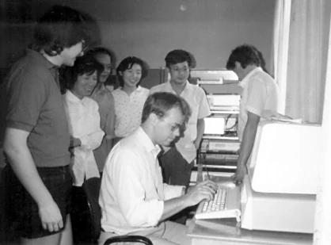

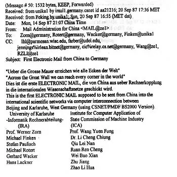 

---
>* **1988 —** China established **CNPAC**, one of the earliest nationwide X.25 packet-switched networks, covering major cities—providing a practical substrate for early email/data networking before full TCP/IP Internet access.
* **1988 —** 中国建立 **CNPAC**（早期全国性 X.25 分组交换网），覆盖多座核心城市，为早期电子邮件/数据通信提供骨干承载（在全面 TCP/IP 接入前尤为关键）。 

---
>* **1988-03 -** the China Academic Net (CANET) project was launched with a view to connecting the computers at the numerous universities and research institutions in China with the computer network in the world.
* **1988-03 -** 中国学术网（CANET）项目启动，旨在将中国众多大学和研究机构中的计算机与世界计算机网络连接起来。

---
>* **1988-07 -** Institute of High Energy Physics of Chinese Academy of Sciences turned a VAX785 machine into a subnode of European Organisation for Nuclear Research (CERN) in Geneva, Switzerland via the satellite link of Austria Radio Company by adopting the X.25 protocol.
* **1988-07 -** 中国科学院高能物理研究所通过奥地利广播公司的卫星链路，采用 X.25 协议，将一台 VAX785 机器转为欧洲核子研究组织（CERN）位于瑞士日内瓦的子节点。

---
>* **1988-12 —** Prof. Hu Daoyuan helped Tsinghua’s campus network adopt an **X.400-based email system** introduced from UBC (Canada), enabling cross-border email exchange through X.25 connectivity—an early “campus networking” milestone.
* **1988-12 —** 胡道元教授推动清华校园网采用从加拿大 UBC 引入、基于 **X.400** 的邮件系统，并通过 X.25 实现对外邮件应用，是高校网络化早期的重要落点。

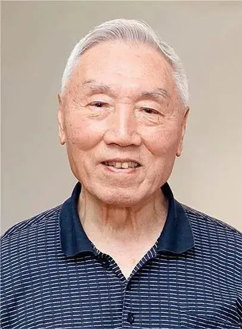

---
>* **1989-05 —** China Research Network (CRN) realized the interconnection with Germany Research Network (DFN) via the X.25 experimental network (CNPAC) of the then Ministry of Post & Telecommunications. The members of CRN included: No. 15 Institute of the Ministry of Electronics and the Electronic Science Academy of the Ministry of Electronics in Beijing, No. 30 Institute of the Ministry of Electronics in Chengdu, No. 54 Institute of the Ministry of Electronics in Shijiazhuang, Fudan University and Shanghai Jiaotong University in Shanghai, and Southeast University in Nanjing. CRN provided emails that met the X.400 (MHS) standard, file transfer that met the FTAM standard, directory services that met the X.500 standard and other functions, and could communicate with Internet via the gateway of DFN in Germany.
* **1989-05 —** 中国研究网络（CRN）通过原邮电部下属的 X.25 实验网络（CNPAC）实现了与德国研究网络（DFN）的互联。CRN 的成员包括：北京电子工业部第 15 研究所和电子科学学院、成都电子工业部第 30 研究所、石家庄电子工业部第 54 研究所、上海的复旦大学和交通大学，以及南京的东南大学。CRN 提供符合 X.400（MHS）标准的电子邮件、符合 FTAM 标准的文件传输、符合 X.500 标准的目录服务以及其他功能，并且可以通过德国 DFN 的网关与互联网进行通信。 

---
>* **1989-10~11 —** the key discipline project for which the State Development Planning Commission utilized the loan of World Bank, i.e. Education and Scientific Research Demonstration Network in Zhongguancun District, which was also named as National Computing and Networking Facility of China ("NCFC") by World Bank, was officially approved. In November, this project was officially launched. NCFC was a high-tech information infrastructure project among the "key discipline development projects" using the loan of World Bank, and was co-invested and supported by State Development Planning Commission, Chinese Academy of Sciences, National Natural Science Foundation of China and State Education Commission. The project was in the charge of Chinese Academy of Sciences, and was jointly implemented by Peking University and Tsinghua University. The primary objective of setting up the project then was to build up the backbone network and three academic networks of NCFC through the cooperation among Peking University, Tsinghua University and Chinese Academy of Sciences.
* **1989-10~11 —** 国家计委利用世界银行贷款支持的关键学科项目——中关村教育科研示范网络，该网络也由世界银行命名为“中国国家计算与网络设施”（NCFC），正式获得批准。同年 11 月，该项目正式启动。NCFC 是利用世界银行贷款的“重点学科发展项目”中的一项高科技信息基础设施项目，由国家计委、中国科学院、国家自然科学基金委员会和国家教育委员会共同投资支持。该项目由中国科学院负责，北京大学和清华大学共同实施。当时设立该项目的首要目标是，通过北京大学、清华大学和中国科学院的合作，建立起 NCFC 的主干网络和三个学术网络。 

---
>* **1990-11-28 —** With efforts from Wang Yunfeng and Werner Zorn, **.CN was registered**; Qian Tianbai served as administrative liaison. Because China wasn’t fully Internet-connected yet, the CN TLD server was temporarily hosted at Karlsruhe University.
* **1990-11-28 —** 在王运丰与 Werner Zorn 等努力下，**.CN 顶级域完成注册**，钱天白任管理联络人；由于当时尚未全功能接入互联网，CN 顶级域服务器曾暂设在德国卡尔斯鲁厄大学。 

---
>* **1991-03 —** the computer network between Institute of High Energy Physics of Chinese Academy of Sciences and Stanford Linear Accelerator Center (SLAC) of Stanford University in the U.S. was successfully connected.
* **1991-03 —** 中国科学院高能物理研究所与美国斯坦福大学的斯坦福直线加速器中心（SLAC）之间的计算机网络成功连接。

---
>* **1991-06 —** At the INET'92 annual conference held in Kobe, Japan, Researcher Qian Hualin from Chinese Academy of Sciences met with the person in charge of International Network Department of National Science Foundation of the U.S., and for the first time officially discussed the issue of China's access to the Internet. However, he was told that there was political barrier for China's access to the Internet because there were many American government organs online.
* **1991-06 —** 在日本神户举行的 INET'92 年度会议上，中国科学院研究员钱华林与美国国家科学基金会国际网络部门负责人会面，首次正式讨论了中国接入互联网的问题。然而，他被告知中国接入互联网存在政治障碍，因为许多美国政府机构已上网。

---
>* **1992-12 —** Tsinghua University’s campus network (TUNET) was completed and put into operation. It became the first campus network in China to adopt the TCP/IP architecture. The backbone network successfully used FDDI technology for the first time, making it a domestic leader in terms of network scale, technological level, and applications. At the same time, the Chinese Academy of Sciences network (CASNET, connecting more than thirty institutes in the Zhongguancun area and the CAS headquarters in Sanlihe), the Tsinghua University campus network (TUNET), and the Peking University campus network (PUNET) were all completed.
* **1992-12 —** 清华大学校园网（TUNET）建成并投入使用，是中国第一个采用TCP/IP体系结构的校园网，主干网首次成功采用FDDI技术，在网络规模、技术水平以及网络应用等方面处于国内领先水平。中科院院网（CASNET，连接了中关村地区三十多个研究所及三里河中科院院部）、清华大学校园网（TUNET）和北京大学校园网（PUNET）全部完成建设。

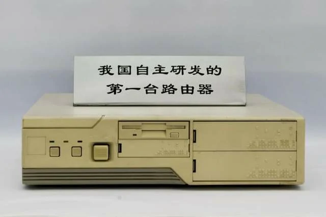

---
>* **1993-03-12 —** the 64KDECnet special line, where Institute of High Energy Physics of Chinese Academy of Sciences (Rongsheng Xu) hired the international satellite channel of AT & T Company to access Stanford Linear Accelerator Center (SLAC) of Stanford University of the U.S., was officially put into operation. After this, with the strong support of National Natural Science Foundation of China, the persons in charge of the important projects of many disciplines were able to dial and access this special line of Institute of High Energy Physics of Chinese Academy of Sciences, and a few hundred scientists were able to use emails in China.
* **1993-03-12 —** 中国科学院高能物理研究所许榕生租用美国 AT&T 公司的国际卫星频道接入斯坦福大学的斯坦福线性加速器中心（SLAC）的 64KDECnet 专线正式开通。此后，在中国国家自然科学基金的强有力支持下，许多学科的重要项目负责人能够拨号接入中国科学院高能物理研究所的这条专线，几百名科学家能够使用中国的电子邮件。

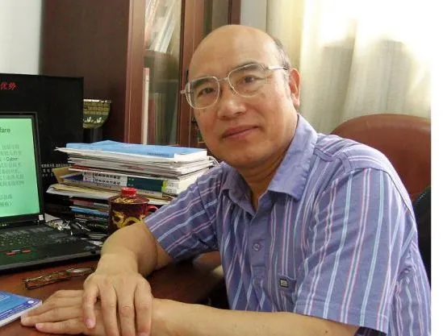

---
>* **1993-04 —** the Computer Network Information Center of the Chinese Academy of Sciences gathered several network experts in Beijing to investigate the domain name systems of various countries, and subsequently proposed and established China’s domain name system.
* **1993-04 —** 中国科学院计算机网络信息中心召集在京部分网络专家调查了各国的域名体系，提出并确定了中国的域名体系。

---
>* **1993-06 —** NCFC experts reiterated China’s demand to connect to the Internet during the INET’93 conference, seizing every opportunity to negotiate with international Internet specialists. After INET’93, Researcher Qian Hualin attended the CCIRN (Coordinating Committee for Intercontinental Research Networking) meeting, where one agenda item was devoted specifically to the issue of China’s Internet connection, gaining broad support from most participants. This meeting greatly promoted China’s eventual full integration into the Internet.
* **1993-06 —** NCFC专家们在INET’93会议上利用各种机会重申了中国连入Internet的要求，且就此问题与国际Internet界人士进行商议。INET’93会议后，钱华林研究员参加了CCIRN(Coordinating Committee for Intercontinental Research Networking)会议，其中一项议程专门讨论中国连入Internet的问题，获得大部分到会人员的支持。这次会议对中国能够最终真正连入Internet起到了很大的推动作用。

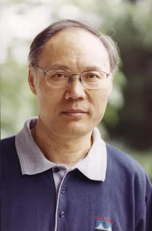

---
>* **1993-12 —** the NCFC backbone network project was completed, interconnecting three university networks with high-speed optical cables and routers.
* **1993-12 —** NCFC主干网工程完工，采用高速光缆和路由器将三个院校网互连。

---
>* **1994 —** Xing Li starts long-term technical leadership for CERNET, building an academic backbone that later supports IPv6 deployment/transition experiments and feeds into IETF standardization work.
* **1994年 -** 李星开始长期担任CERNET关键技术负责人，建设国家学术骨干网，并为后续IPv6部署、过渡技术试验与IETF标准化工作提供重要平台与工程经验。

---
>* **1994-04 —** Sino-US Science and Technology Cooperation Joint Committee Conference was held in Washington, USA. Before the conference, Hu Qiheng, Vice Director of Chinese Academy of Sciences, restated China's request to access the Internet on behalf of China to National Science Foundation (NSF), and gained recognition.
* **1994-04 —** 中美科技合作联合委员会会议在美国华盛顿举行。会议前，中国科学院副院长胡启恒代表中国向美国国家科学基金会（NSF）重申了接入互联网的请求，并获得了认可。

---
>* **1994-04-20 —** China achieved **full-function Internet connectivity**, marking the transition from partial email/experimental links to full TCP/IP Internet access and opening the door to large-scale academic and public network rollouts.
* **1994-04-20 —** 中国实现**全功能接入互联网**，从“邮件/试验性互联”迈入完整 TCP/IP 互联网阶段，并推动学术网与公众网络的规模化发展。 

---
>* **1994-05 —** the Institute of High Energy Physics, Chinese Academy of Sciences, established the first domestic Web server and launched China's first website, aimed at introducing advancements in high technology. One section of the site also provided information on economics, culture, and commerce. It was later renamed "China Window" and became one of the main channels for China to release information via the global Internet.
* **1994-05 —** 中科院高能物理研究所，建立了国内第一个Web服务器， 推出中国首套网页，用于介绍高科技发展情况， 其中一个栏目还提供包括经济、文化、商贸等方面的信息，后更名为“中国之窗”，成为中国利用国际互联网发布信息的主要渠道之一。

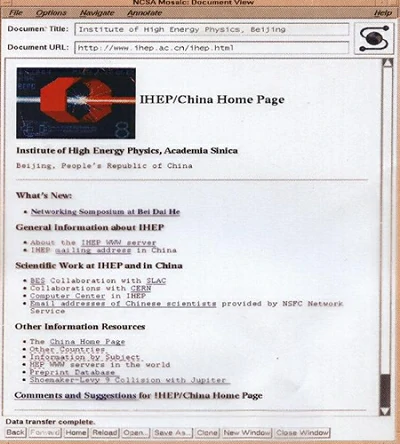

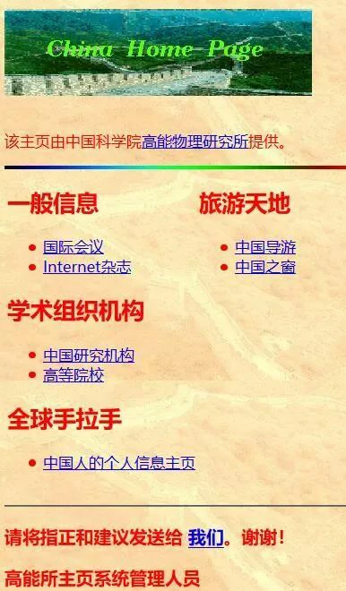

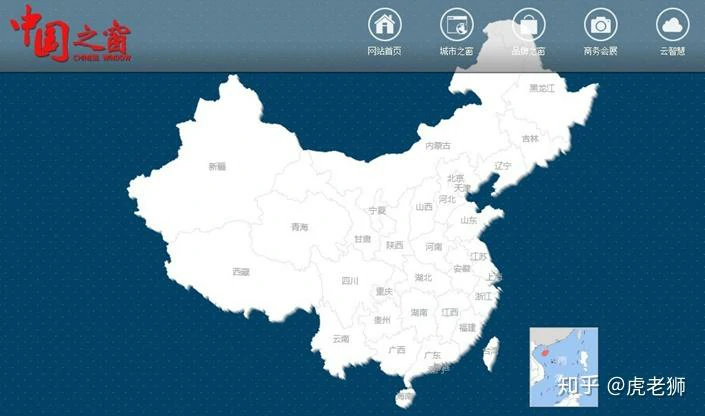

---
>* **1994-05-21 —** with the assistance of Professor Qian Tianbai and University of Karlsruhe, Computer Network Information Center of Chinese Academy of Sciences completed the setting of the national top level domain (CN) server in China, and changed the history when the CN top level domain server of China had been placed in foreign countries. Qian Tianbai and Qian Hualin acted as the administrative liaison officer and technical liaison officer respectively for the CN domain name of China.
* **1994-05-21 —** 在中国科学院计算机网络信息中心与钱天白教授及卡尔斯鲁厄大学的协助下，中国完成了国家顶级域名（CN）服务器的设置，并将 CN 顶级域名服务器从国外迁回国内，改写了历史。钱天白和钱华林分别担任中国 CN 域名的行政联络员和技术联络员。

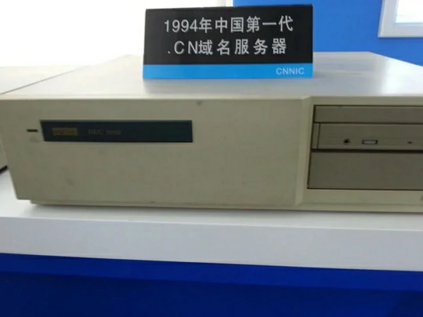

---
>* **1994-07 -** the experimental network of China Education and Research Network constructed by six colleges and universities, including Tsinghua University, was put into operation. Connecting five cities, i.e. Beijing, Shanghai, Guangzhou, Nanjing and Xi' an, this network adopted the IP/x.25 technology and, interconnected with the Internet via the international gateway of NCFC. It was a network that adopted the TCP/IP protocol.
* **1994-07 -** 由清华大学等六所高校共同构建的中国教育和科研计算机网实验网投入运行。该网络连接了北京、上海、广州、南京和西安五个城市，采用 IP/x.25 技术，并通过 NCFC 的国际网关与互联网相连。它是一个采用 TCP/IP 协议的网络。

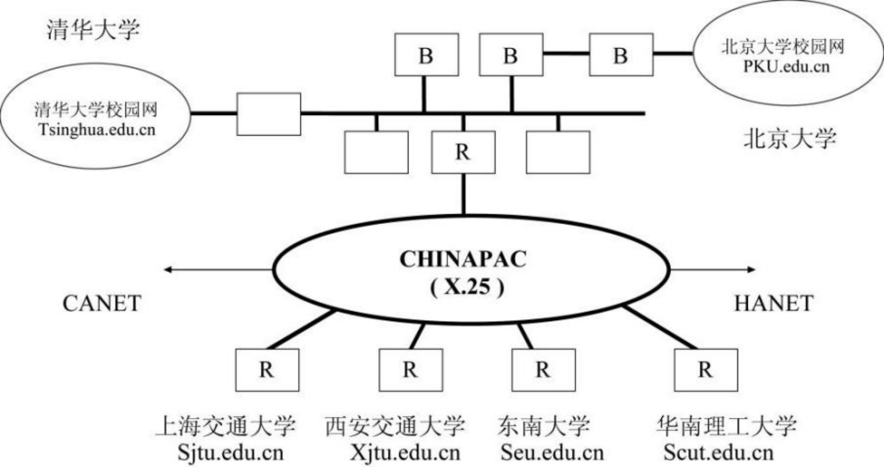

---
>* **1994-09 -** General Administration of Telecommunications of the Ministry of Post & Telecommunications signed the Sino-U.S. agreement with the Commerce Department of the U.S. on the Internet. The agreement prescribed that General Administration of Telecommunications would put into operation two 64K special lines via Sprint Company (one in Beijing, and the other in Shanghai). The construction of CHINANET began.
* **1994-09 -** 邮电部电信管理局与美国商务部签署了关于互联网的协议。该协议规定电信管理局通过斯普林特公司（北京和上海各一条）开通两条 64K 速率的特殊线路。中国公用计算机互联网（CHINANET）的建设开始启动。

---
>* **1994-11 -** the annual conference of Asia Pacific Network Working Group (APNG) sponsored by Management Committee of NCFC and co-sponsored by Chinese Academy of Sciences, Peking University and Tsinghua University was held at Tsinghua University. This was the first annual conference in the Asia Pacific region held by the Internet circle.
* **1994-11 -** 由 NCFC 管理委员会主办、中国科学院、北京大学和清华大学联合承办的亚太网络工作组（APNG）年度会议在清华大学举行。这是亚太地区互联网界首次举办的年度会议。

---
## 1995–1999: Nationwide expansion, public access & early governance
## 1995–1999：全国扩展、公众接入与治理体系萌芽

---
>* **1995-01 —** January 1995 marked the launch of ChinaNet by China Telecom, with commercial services beginning in January 1996. The network, nicknamed "163" after its dial-up access number, initially connected to the US via 64K Sprint lines in Beijing and Shanghai.
* **1995-01 —** 中国电信推出了ChinaNet，并于1996年1月开始提供商业服务。这个网络因为其拨号接入号码而被昵称为“163”，最初在北京和上海通过64K的Sprint线路连接美国。

---
>* **1995-01 —** the magazine China Scholars Abroad administrated and sponsored by State Education Commission was connected to the Internet via China Education and Research Network (CERNET) to provide those who studied abroad with news and information in a timely manner, and became the first Chinese E-journal in China.
* **1995-01 —** 由国家教育委员会主管、主办的《海外学者》杂志通过中国教育和科研计算机网（CERNET）接入互联网，及时为出国留学人员提供新闻和信息，成为中国首家中文电子期刊。

---
>* **1995-03 —** **Tony Li** (Chinese-American) co-authors **RFC 1771** “BGP-4”, defining the core inter-domain routing protocol that underpins global Internet routing between autonomous systems.
* **1995-03 —** **Tony Li**（华裔）与Yakov Rekhter共同发布**RFC 1771《BGP-4》**，定义自治系统间路由的核心协议，奠定当今互联网全球域间路由交换的基础。

---
>* **1995-03 —** Chinese Academy of Sciences completed the remote connection with its branches in Shanghai, Hefei, Wuhan and Nanjing (using IP/X.25 technology), and took the first step of spreading the Internet to the entire country.
* **1995-03 —** 中国科学院完成了与上海、合肥、武汉和南京分支机构的远程连接（使用 IP/X.25 技术），迈出了将互联网推广到全国的第一步。

---
>* **1995-03 —** Professor Li Xing from Tsinghua University was elected for the first time the member of the Executive Committee of Asia Pacific Network Information Center (APNIC).
* **1995-03 —** 清华大学李兴教授首次当选亚洲太平洋网络信息中心（APNIC）执行委员会委员。

---
>* **1995-05 —** Zhang Shuxin founded China’s first Internet service provider, Infohighway, marking the public’s entry into the Internet. At that time, computers accessed the Internet via “dial-up,” where the Internet connection and the telephone shared the same line, making it impossible to use the phone and the Internet simultaneously—an incoming call would disconnect the network.
* **1995-03 —** 张树新创立首家互联网服务供应商瀛海威，老百姓进入互联网。电脑上网是“拨号上网”，网线和电话共用一个线路，不能同时用网络电话，有电话进来就断了网。

---
>* **1995-05 —** the first 128K international special line of China Education and Research Network (CERNET) that connected to the U.S. was put into operation, and the DDN channel of the CERNET backbone network that connected to Beijing, Shanghai, Guangzhou, Nanjing, Shenyang, Xi'an, Wuhan and Chengdu was put into operation simultaneously. The speed at that time was 64Kbps, and the interconnection with NCFC was realized.
* **1995-05 —**  连接美国的第一个 128K 中国教育和科研计算机网（CERNET）国际专线投入运行，同时连接北京、上海、广州、南京、沈阳、西安、武汉和成都的 CERNET 骨干网 DDN 信道也投入运行。当时的速度为 64Kbps，实现了与 NCFC 的互联。

---
>* **1995-12 -** the Demonstration Project of China Education and Research Network (CERNET) was completed. This project was designed and constructed by China independently.
* **1995-12 -** 中国教育和科研计算机网（CERNET）示范工程完成。该项目由中国独立设计和建设。

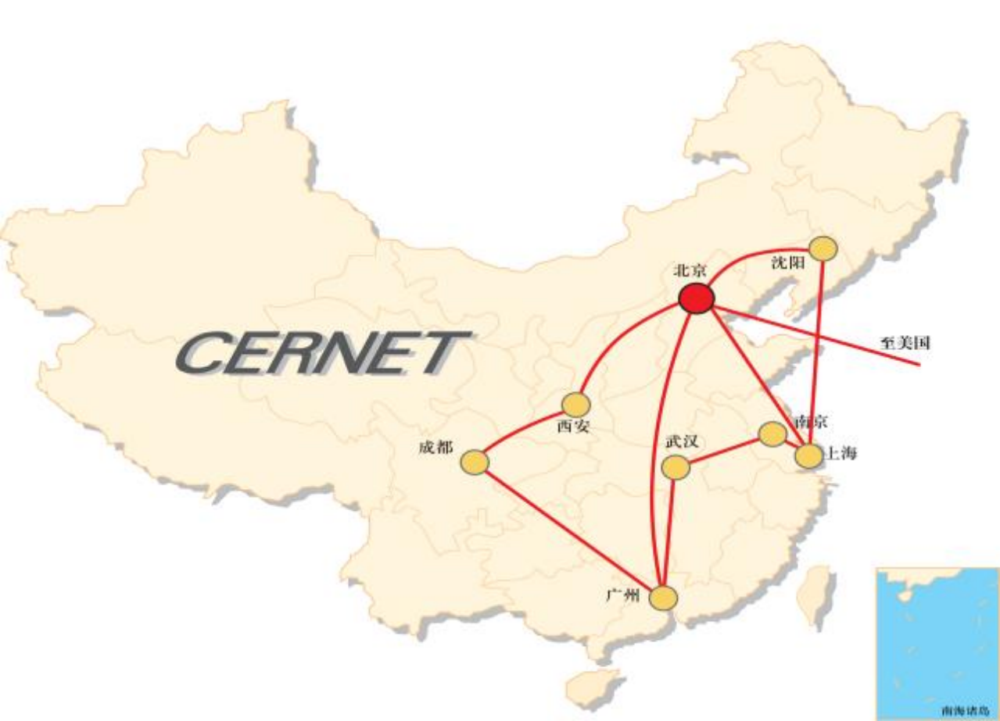

---
>* **1995-12 -** The **Sun Software, Information, and Technology Exchange (SunSITE)** of the U.S. SUN Company was officially launched at **Tsinghua University**, providing **open-source services**. This was the **first SunSITE open-source service in mainland China**.
* **1995-12 -** 美国SUN公司软件信息技术交换库SunSITE（Sun Software,Information, and Technology Exchange）正式在清华大学运行，提供开放源码服务。这是中国大陆第一个SunSITE开放源码服务。

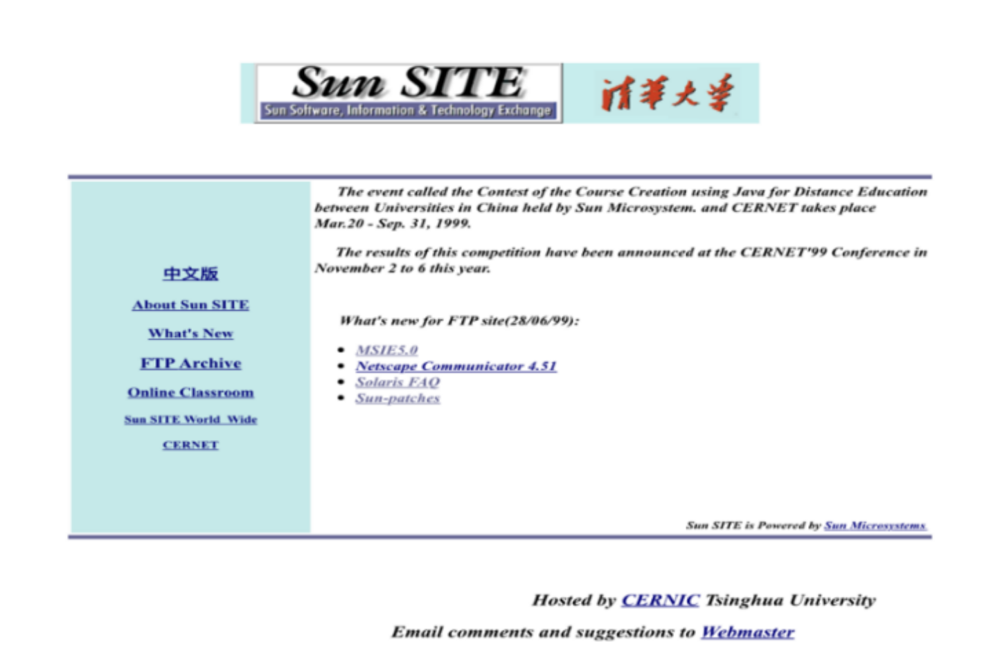

---
>* **1996 —** The **IBM SP2 massively parallel computing system** installed at the **CERNET High Performance Computing Center (CHPCC)** officially began providing services. This marked the **first time that supercomputing resources open to universities were introduced in mainland China**.
* **1996 —** CERNET高性能计算中心CHPCC（CERNET High Performance Computing Center）装备的IBM SP2大规模并行计算机系统正式提供服务。这是第一次在中国大陆引进对于高校开放的超算计算资源。

---
>* **1996-03 —** A multi-author team including HF Zhu, DY Hu, ZG Wang, TC Kao, WCH Chang publishes **RFC 1922** on Chinese character encoding for Internet messages, advancing Internet internationalization for Chinese text in email/news/telnet/web-era services.
* **1996-03 —** 由朱/胡/王/高/张等作者参与发布**RFC 1922**，面向电子邮件、新闻组、Telnet与早期Web等文本互联网服务，给出中文字符在互联网消息中的编码/传输方法，推动中文信息在互联网中的可用性与互操作。

---
>* **1996-09-06 —** **CHINAGBN** launched its 256K international line to the U.S. and announced commercial Internet services (leased-line group users + individual access), marking public-access commercialization steps.
* **1996-09-06 —** **CHINAGBN** 对美 256K 专线正式开通并宣布提供互联网服务（集团专线用户与个人接入），体现公众接入与商业化服务的关键推进。 

---
>* **1996-11 -** CERNET opened the 2M international line that connected to the U.S.. In the same month，during the German President's visit to China, CERNET- DFN, a Sino-Germany academic network interconnection line, was put into operation, which meant that the first Internet connection between the Chinese Mainland and Europe was established.
* **1996-11 -** 中国教育科研网（CERNET）开通了连接美国的 2 兆国际线路。同年，在德国总统访华期间，中德学术网络互联线路 CERNET-DFN 投入运行，这意味着中国大陆与欧洲之间的第一条互联网连接得以建立。

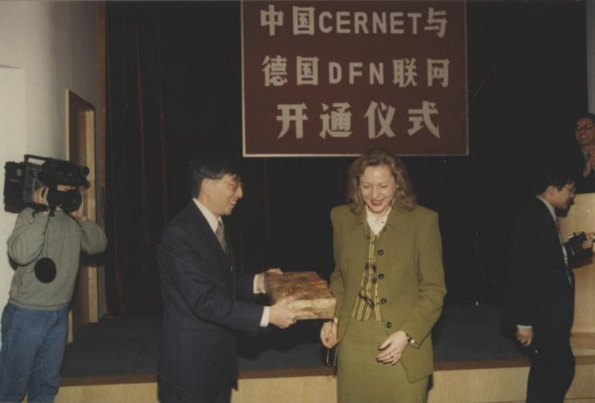

---
>* **1996-12 -** The **CERNET–HARNET interconnection line** between **CERNET and the Hong Kong Academic and Research Network (HARNET)** was opened, establishing the **first Internet connection from mainland China to Hong Kong**, enabling the academic communities in mainland China and Hong Kong to exchange information directly.
* **1996-12 -** 开通了CERNET和香港学术网络的互联线路CERNET－HARNET，建立了内地到香港的第一个Internet连接，使内地与香港的学术界可以直接交换信息。

---
>* **1997 —** China’s domain name and Internet management structures began to institutionalize (registry/service separation and industry self-regulation seeds were being laid), setting a base for large-scale DNS operations.
* **1997 —** 中国域名与互联网管理体系开始制度化演进（注册管理、服务体系与行业自律机制逐步成形），为大规模 DNS/域名运营奠定组织基础。 

---
>* **1997-09 —** Lixia Zhang (Chinese-born) is a core author of RFC 2205 “RSVP”, a standards-track protocol for QoS resource reservation and signaling, later becoming foundational for traffic engineering practices.
* **1997-09 -** 张丽霞作为主要作者之一发布RFC 2205《RSVP》（标准轨），提出面向QoS的资源预留与信令协议，长期影响骨干网流量工程与服务质量保障体系。

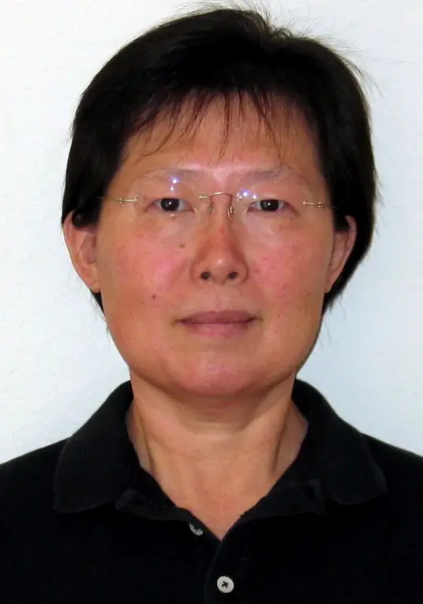

---
>* **1998 —** Jianping Wu begins major work on China’s large-scale native IPv6 backbone design and development, creating conditions for later IPv6 security/transition standards work coming out of Chinese testbeds.
* **1998 —** 吴建平开始投入中国大规模本土IPv6骨干网的设计与研发，为后来在真实源地址验证、IPv4/IPv6过渡等方向形成可验证、可落地的标准与工程体系创造条件。

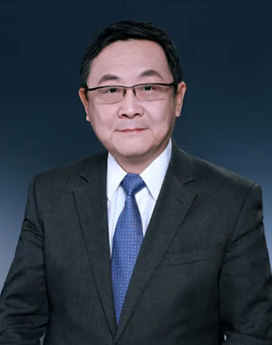

---
>* **1998-06 —** **CERNET connected to 6BONE**, joining global IPv6 experimental networking and enabling Chinese academia to test IPv6 routing, addressing, and early applications in real networks.
* **1998-06 —** **CERNET 接入 6BONE**，进入全球 IPv6 试验网络体系，使国内高校科研网络能在真实网络环境中验证 IPv6 路由、编址与应用。 

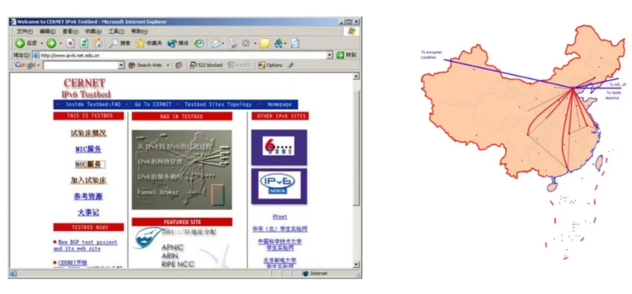

---
>* **1998-07 —** the second-stage works of the backbone network project of CHINANET began. The second-stage works would expand the backbone bandwidth among the eight major sections to 155M, and replace the node routers of the eight major sections with the kilomegabit routers.
* **1998-06 —** 中国公用计算机互联网工程骨干网项目第二阶段工程开始实施。第二阶段工程将扩展八大节点间的骨干带宽至 155M，并更换八大节点的节点路由器为千兆路由器。

---
>* **1998-07~12 —** Zhongxi Company pioneered the introduction of Chinese-language domain name registration. On the Internet, domain names typically required registration in English. The launch of Chinese domain name registration by Zhongxi Company marked a significant step forward in the localization of the Internet. Zhongxi decided to offer free Chinese domain names to 10 government agencies and 10 enterprises among the first batch of applicants.
* **1998-07~12 —** 中西公司率先推出中文域名注册服务。在互联网上，域名注册通常需要使用英文。中西公司推出中文域名注册，标志着互联网本地化进程向前迈出了重要一步。中西公司决定在首批申请单位中为10家政府机构和10家企业提供免费中文域名。

---
>* **1999-01 —** the satellite backbone network of China Education and Research Network (CERNET) was put into full operation, which had greatly improved the running speed of the network. In the same month，CSTNET put into operation two sets of satellite systems to completely replace IP/X.25, and used the high-speed satellite channel to connect with more than 40 cities nationwide.
* **1999-01 —** 中国教育和科研计算机网（CERNET）的卫星骨干网全面投入运行，这极大地提高了网络的运行速度。同年 1 月，中国科技网（CSTNET）投入运行两套卫星系统，完全取代了 IP/X.25，并利用高速卫星信道连接了全国 40 多个城市。

---
>* **1999-05 —** CERNET officially connected to **6REN (IPv6 Research & Education Networks)**, an international network providing **production IPv6 services**. This was **China’s first connection to an international IPv6 experimental network**.
* **1999-05 —**CERNET正式接入国际提供IPv6生产性服务的网络6REN（IPv6 Research & Education Networks），这是中国第一个接入国际的IPv6试验网。

---
>* **1999 —** The **“China High-Speed Interconnection Research and Experimental Network (NSFCNET)”** project was launched. Approved by the **National Natural Science Foundation of China (NSFC)**, it was a major joint research project undertaken by **Tsinghua University**, the **Computer Network Information Center of the Chinese Academy of Sciences**, **Peking University**, **Beijing University of Posts and Telecommunications**, and **Beihang University**, among others.In **July 2001**, the project passed its official evaluation and acceptance. It became **China’s first academic next-generation Internet experimental network**, establishing the **NSFCNET**, a high-speed computer interconnection research and experimental network based on **Dense Wavelength Division Multiplexing (DWDM) optical transmission technology**, with a **transmission rate of 10 Gbps**.The network also achieved connectivity with the international next-generation Internet **Internet2**, providing the necessary means and experimental environment for China to actively participate in international next-generation Internet research programs.
* **1999 —** “中国高速互连研究试验网络NSFCNET”项目启动，该项目经国家自然科学基金委员会批准，是由清华大学、中国科学院计算机网络信息中心、北京大学、北京邮电大学、北京航空航天大学等单位承担建设的重大联合研究项目。2001年7月，项目通过鉴定验收，是我国第一个下一代互联网学术性试验网，建成了基于密集波分多路复用DWDM光传输技术的中国高速互联研究试验网NSFCNET，传输速率为10Gbps的高速计算机互联研究试验网络。实现了与国际下一代互联网Internet2的连接，为我国积极参与国际下一代互联网络研究计划提供了必要手段和试验环境。

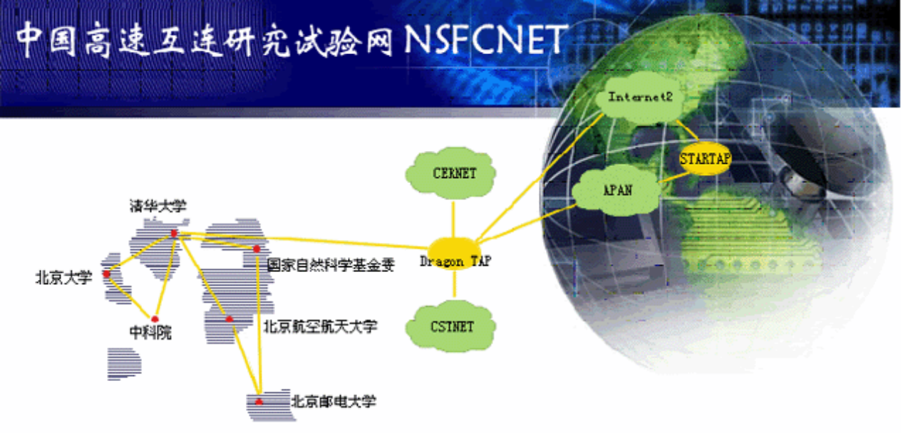

---
>* **1999-10 —** Professor Wu Jianping from Tsinghua University was elected the member of Address Committee of Address Supporting Organization (ASO) of Internet Corporation for Assigned Names and Numbers (ICANN).
* **1999-10 —** 清华大学吴建平教授当选为互联网名称与数字地址分配机构（ICANN）地址支持组织（ASO）地址委员会成员。

---
## 2000–2003: Exchange points, IPv6 services & ICANN enters China
## 2000–2003：交换中心、IPv6 服务与 ICANN 进入中国

---
>* **2000-01 —** China Internet Network Information Center (CNNIC) launched the pilot system for Chinese domain names with the approval of the Ministry of Information Industry.
* **2000-01 —** 中国互联网络信息中心（CNNIC）获信息产业部批准，启动了中文域名试点系统。

---
>* **2000-01 —** the country-level Internet exchange center was put into operation in Beijing, which increased the internetworking bandwidth of less than 10 MBPS to 100 MBPS for the major internetworks in China, speeding up the access speed.
* **2000-01 —** 国家级互联网交换中心在北京投入运营，将中国主要互联网的互联带宽从不到 10 Mbps 提升至 100 Mbps，加快了接入速度。

---
>* **2000-05 —** **BCP 38 / RFC 2827** defines network ingress filtering to mitigate spoofed-source DoS; later Chinese-led **SAVA/SAVI** work explicitly aims to complement such coarse-grained filtering with finer-grained, standardized source validation.
* **2000-05 —** **BCP 38 / RFC 2827**提出入口过滤以对抗源地址伪造；后续由中国学者深度参与的**SAVA/SAVI**体系，正是面向“更细粒度、更可标准化”的源地址验证去补强该类粗粒度机制的局限。

---
>* **2000-05-20 —** Chinese Domain Name Consortium (CDNC) was established in Beijing to coordinate and standardize the Chinese domain names in a nongovernmental way.
* **2000-05-20 —** 中国域名联合会（CDNC）在北京成立，以非政府方式协调和规范中文域名。

---
>* **2000-07-18 —** Researcher Qian Hualin from Computer Network Information Center of Chinese Academy of Sciences was elected Council Chairman of Asia Pacific Top Level Domain Association (APTLD) by a unanimous vote.
* **2000-07-18 —** 中国科学院计算机网络信息中心的研究员钱华林以全票当选亚洲太平洋顶级域名协会（APTLD）理事会主席。

---
>* **2000-09 —** Tsinghua University built **DRAGONTAP**, one of China’s earliest “next-generation Internet exchange centers,” interconnecting with Abilene/vBNS/CA*net3 via STARTAP (Chicago) and APAN (Tokyo), helping China plug into global research backbones.
* **2000-09 —** 清华大学建设 **DRAGONTAP**（国内早期“新一代互联网交换中心”），并通过 STARTAP（芝加哥）与 APAN（东京）等实现与 Abilene/vBNS/CA*net3 等国际学术网互联，增强中国学术网的国际互通能力。 

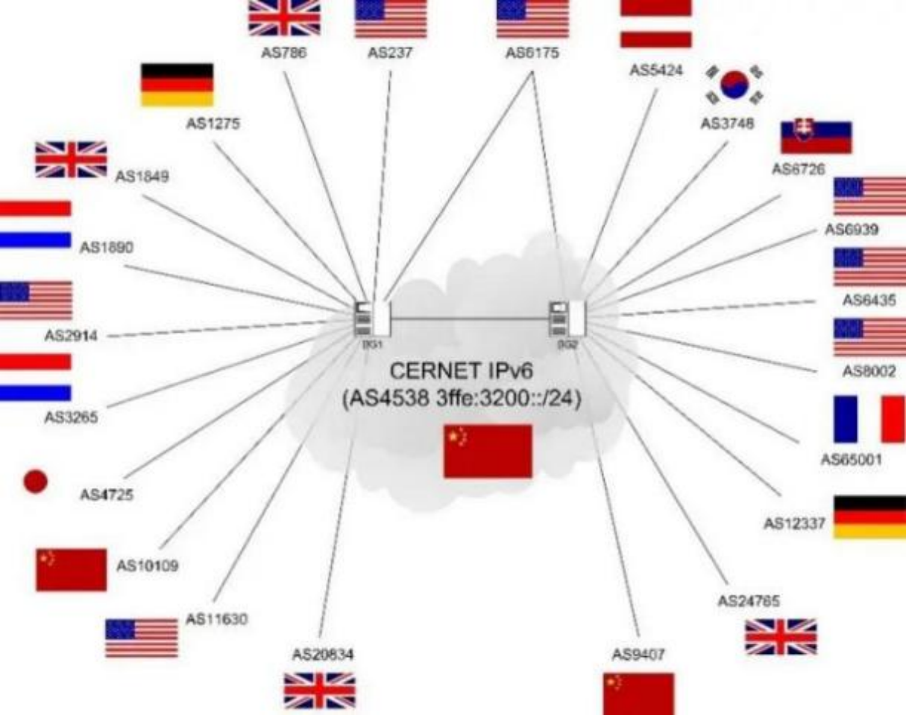

---
>* **2000-09 —** CERNIC (CERNET Information Service Center) took the lead in providing **IPv6 address assignment services**, signaling the operationalization of IPv6 resource management in China’s academic Internet.
* **2000-09 —** CERNIC（教科网信息服务中心）率先开展 **IPv6 地址分配服务**，体现 IPv6 从试验走向运营支撑的关键一步。 

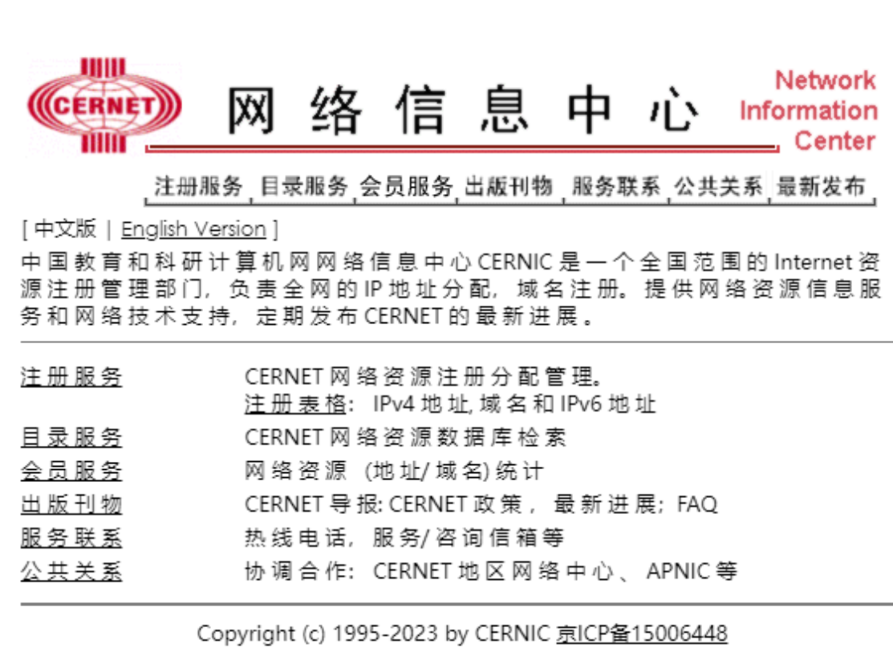

---
>* **2001-11 —** Hu Qiheng (then chair of CNNIC working committee) was appointed to ICANN’s **Multilingual Domain Name Committee**, reflecting China’s growing role in IDN (internationalized domain names) and DNS internationalization discussions.
* **2001-11 —** 胡启恒（时任 CNNIC 工作委员会主任委员等）被任命进入 ICANN 的**多语种域名委员会**，反映中国在 IDN（国际化域名）与 DNS 国际化议题中的参与度提升。 

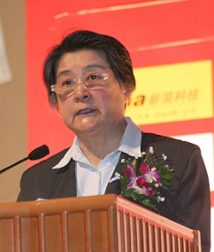

---
>* **2002 -** The **“China–Japan IPv6 Cooperation Project for the Next-Generation Internet”** was launched. **CERNET** was designated by the **State Planning Commission of China** as the Chinese implementing agency for the project. This was **China’s first international cooperation project on the next-generation Internet**.In **2004**, the **China–Japan IPv6 backbone network** connecting **Beijing, Shanghai, and Guangzhou** was put into operation. The project aimed to study **key networking technologies based on IPv6**, including **network management**, **IPv6-based routers and network systems**, as well as to **develop major IPv6-based applications** and **formulate relevant IPv6 standards**.
* **2002 -** “下一代互联网中日IPv6合作项目”启动，CERNET经国家计委选定为项目的中方实施机构代表，这是我国与国际上合作的第一个下一代互联网项目。2004年，连接北京、上海、广州的中日IPv6主干网开通，用以研究基于IPv6的网络管理等网络关键技术，研究基于IPv6的路由器等网络系统关键技术，开发基于IPv6 的重大应用，制定和形成关于IPv6的相关标准。

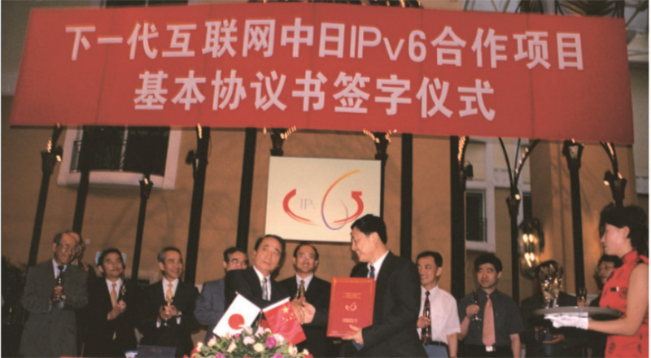

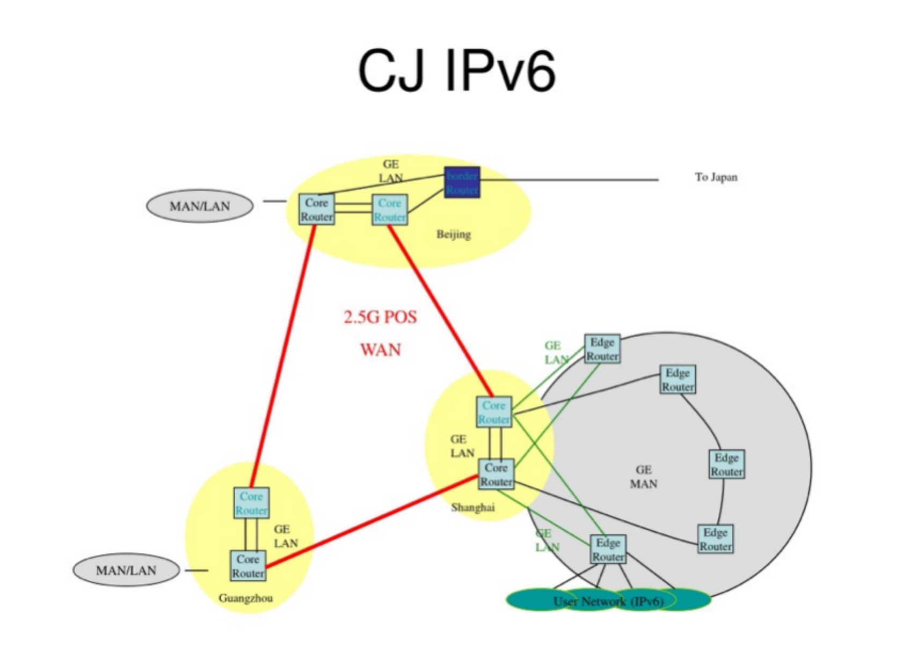

---
>* **2002-02 -** Multicast services were launched on the **CERNET backbone network**. The **CERNET-MBone** was established, becoming **China’s first multicast backbone network connected to the international multicast network**.
* **2002-02 -** CERNET主干网开通组播服务。CERNET-MBone开通，是中国第一个接入国际的组播主干网。

---
>* **2002-05 -** China Telecom launched the VNET plan in Guangzhou, indicating that ISP and ICP began to jointly build up a broadband Internet industry chain.
* **2002-05 -**中国电信在广州推出 VNET 计划，表明 ISP 和 ICP 开始共同构建宽带互联网产业链。

---
>* **2002-05 -** China Mobile took the lead in officially launching the GPRS service nationwide. On November 18, China Mobile and AT&T Wireless jointly declared that their GPRS international roaming service was officially put into operation.
* **2002-05 -** 中国移动率先在全国正式推出 GPRS 服务。11 月 18 日，中国移动与 AT&T Wireless 联合宣布，其 GPRS 国际漫游服务正式投入运营。

---
>* **2002-10-26~31 —** **ICANN held a conference in Shanghai** (first time in China), co-hosted by CNNIC and Internet Society of China—an important milestone connecting China’s DNS/identifier community with global coordination processes.
* **2002-10-26~31 —** **ICANN 在上海召开会议**（首次在中国举办），由 CNNIC 与中国互联网协会等共同承办，推动中国在域名/地址等互联网标识符国际协调体系中的对接与参与。 

---
>* **2003 —** China’s “next-generation Internet” efforts entered a more formal national-project stage (CNGI-era planning/approval), preparing for large-scale IPv6 backbone engineering and applications.
* **2003 —** 中国“下一代互联网”进入更明确的国家工程阶段（CNGI 等规划与推进），为后续大规模 IPv6 骨干建设与应用验证做准备。 

---
## 2004–2006: CNGI engineering, CERNET2 IPv6 backbone & key RFC contributions
## 2004–2006：CNGI 工程化、CERNET2 纯 IPv6 骨干与关键 RFC 贡献

---
>* **2004 -** The team led by **Academician Wu Jianping at Tsinghua University** successfully developed an **IPv6 core router independently**. This was **China’s first domestically developed IPv6 core router**.The router supports a **dual protocol stack for IPv6 and IPv4**, and it was the **first domestic router to pass the IPv6 core router network access test specification (draft) issued by the Ministry of Information Industry of China**.
* **2004 -** 清华大学吴建平院士团队自主研制成功IPv6核心路由器，这是中国第一个自主研制的IPv6核心路由器，该核心路由器具备IPv6/IPv4双协议栈功能，是我国第一个通过信息产业部IPv6核心路由器入网测试规范（草案）测试的国内路由器。

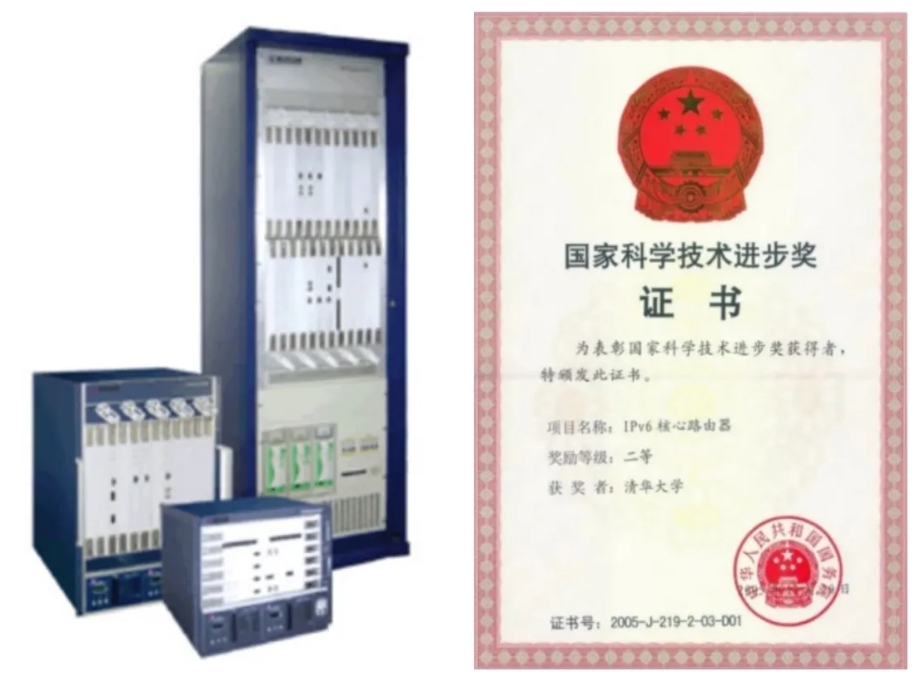

---
>* **2004-01 -** In **Brussels**, eight of the world’s largest academic Internet networks—including **China Education and Research Network (CERNET)**, the **U.S. academic network Internet2**, and the **European academic network GEANT**—jointly announced the launch of **global IPv6 next-generation Internet services**. **CERNET** became **the first organization in China to launch next-generation Internet services**.
* **2004-01 -** 在布鲁塞尔，包括中国教育和科研计算机网CERNET、美国学术网Internet2和欧盟学术网GEANT在内的全球8个最大的学术互联网宣布同时开通全球IPv6下一代互联网服务，CERNET成为中国首个开通下一代互联网服务的单位。

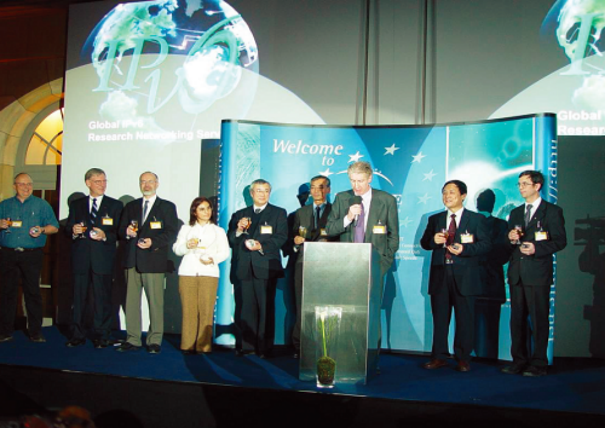

---
>* **2004-01-12 -** the three nations’ project (China-US-Russia) - “Global Ring Network for Advanced Applications Development” (GLORIAD) was accomplished. GLORIAD was funded and constructed by CAS, the National Science Foundation (US) and Russia Ministry and Science Group Alliance. GLORIAD will support the three countries even the global advanced scientific and educational applications. Computer Network Information Center of CAS, National Supercomputing Application Center of Illinois University and Kolchatov Institute of Russia.
* **2004-01-12 -** 由中国、美国、俄罗斯三国合作的项目——“面向先进应用发展的全球环网”（GLORIAD）宣告完成。GLORIAD 由中国科学院、美国国家科学基金会和俄罗斯科学与技术集团联盟共同资助和建设。GLORIAD 将支持三国乃至全球的先进科学与教育应用。参与机构包括中国科学院计算机网络信息中心、伊利诺伊大学国家超级计算应用中心以及俄罗斯的科恰托夫研究所。

---
>* **2004-04 —** IETF formally issued RFC 3743 with the title of “Joint Engineering Team (JET) Guidelines for Internationalized Domain Names (IDN) Registration and Administration for Chinese, Japanese, and Korean”, which was submitted by CNNIC, together with JPNIC and KRNIC. This is the second IETF RFC document participated and instituted by Chinese engineers ever in the history. RFC 3743 is focused on realizing equivalent conversion and transition of different forms (traditional/simplified/variant) of Chinese characters when using as IDN identifiers.
* **2004-04 —** IETF 正式发布标题为《中、日、韩国际化域名（IDN）注册和管理联合工作组（JET）指南》的 RFC 3743，该文档由 CNNIC 与 JPNIC、KRNIC 共同提交。这是中国工程师历史上参与并制定的第二份 IETF RFC 文档。RFC 3743 主要关注在使用汉字作为 IDN 标识符时，实现不同形式（传统/简化/变体）汉字的等价转换和过渡。

---
>* **2004-12-25 —** The Ministry of Education convened the opening ceremony for **CNGI core network CERNET2 backbone**, marking a major step for China’s large-scale native IPv6 backbone deployment and experimentation.
* **2004-12-25 —** 教育部在北京举行 **CNGI 核心网 CERNET2 主干网开通**相关会议活动，标志国内大规模纯 IPv6 骨干网络建设进入关键节点。 

---
>* **2004-12-29 —** the Unified Network Platform (UNINET) by China Unicom won the first prize of the Science and Technology Award offered by China Institute of Communications. UNINET has realized a network on a unified platform, simultaneously providing voice, data, video, Internet, video conference, video telephone or CDMA 1X mobile data services.
* **2004-12-29 —** 中国联通的统一网络平台（UNINET）获得中国通信学会科技奖一等奖。UNINET 实现了统一平台上的网络，同时提供语音、数据、视频、互联网、视频会议、视频电话或 CDMA 1X 移动数据服务。

---
>* **2005 —** CERNET2 (built by late 2004) connected core nodes across ~20 cities at **2.5–10 Gbps**, and interconnected with North America/Europe/Asia-Pacific next-gen networks via international links—providing IPv6 high-speed access for 100+ universities and a real environment for next-gen applications (HD video, grid, large-scale multimedia).
* **2005 —** CERNET2（2004 年底初步建成）以 **2.5–10Gbps** 连接约 20 城核心节点，并以国际链路与北美/欧洲/亚太下一代互联网互联，为 100+ 高校提供 IPv6 高速接入，同时支撑高清视频、网格、点到点多媒体等关键应用试验与开发。 

---
>* **2005-09 -** The **CERNET Network Center** won the bid to undertake the **operation and management of the backbone network of TEIN2 (the second-generation Trans-Eurasia Information Network)** funded by the **European Union**.This marked the **first time that a Chinese scientific research management institution was authorized to manage an international interconnection network**. It also represented international recognition of China’s capability to **manage and operate large-scale academic networks**, and played a **key role in strengthening China’s position in international next-generation Internet research**.
* **2005-09 -** CERNET 网络中心中标欧盟第二代跨欧亚信息网络TEIN2主干网运行管理工作。这是中国的科研管理机构首次被授权管理国际性互联网络，也是国际上对我国管理并运行大规模学术网络能力的肯定，对中国在国际下一代互联研究中占据重要地位起到关键性作用。

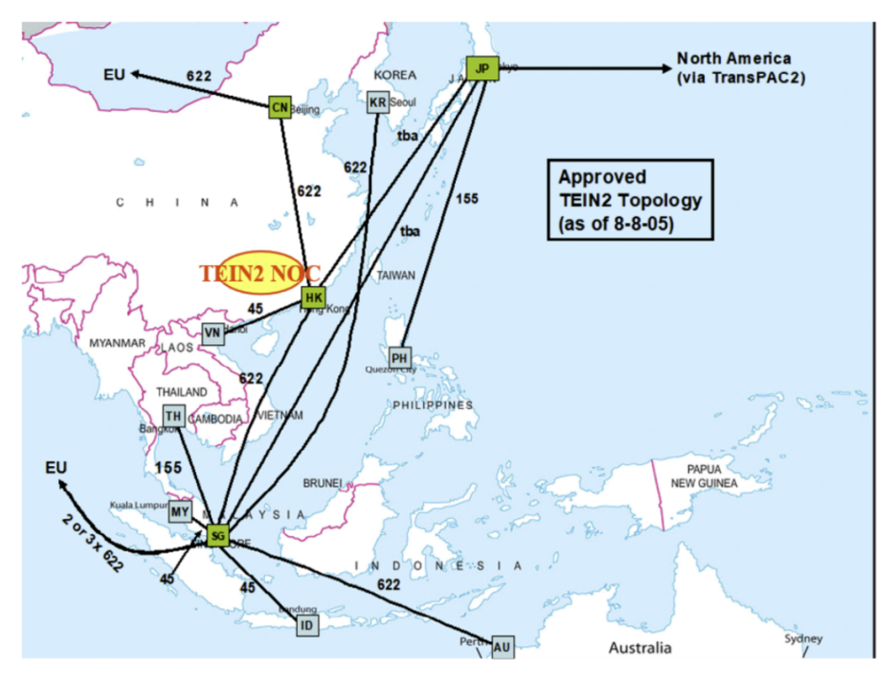

---
>* **2006-01 —** **RFC 4271 (BGP-4)** was published (Editors include **Tony Li**), representing a major core routing standard; Tony Li’s role is often cited as a prominent Chinese-heritage contribution to foundational Internet routing standardization.
* **2006-01 —** **RFC 4271（BGP-4）**发布（编者包含 **Tony Li**），这是互联网跨自治域路由的核心标准之一；Tony Li 作为华人背景技术专家参与该基础标准编纂，常被视为“底层路由标准化”的代表性贡献。 

---
>* **2006-09 —** the “Core Network (CNGI-CERNET2/6IX) of the Model Network of Chinese Next Generation Internet (CNGI) Project” built by the network center of China Education and Research Network (CERNET) and other 25 universities such as Tsinghua University was formally accepted by the country.
* **2006-09 —** 由中国教育和科研计算机网（CERNET）网络中心与清华大学等 25 所高校共同建设的“中国下一代互联网示范工程 CNGI 项目核心网（CNGI-CERNET2/6IX）”正式通过国家验收。

---
>* **2006-10 —** A team including Xiaodong Lee and Wei Mao publishes RFC 4713, giving operational recommendations for registration/administration of Chinese domain names, bridging language/culture requirements with DNS operational interoperability.
* **2006-10 —** 由Xiaodong Lee、Wei Mao等参与发布RFC 4713，给出中文域名注册与管理建议，在语言/文化需求与DNS运行互操作之间建立工程化规范。

---
## 2007–2010: IPv6 security/transition research & global recognition
## 2007–2010：IPv6 安全/过渡技术研究与国际认可

---
>* **2007 —** China’s next-gen Internet testbeds increasingly shifted from “connectivity” to “security + transition” research topics—setting the stage for architecture-level experiments (e.g., source-address validation).
* **2007 —** 下一代互联网试验从“能连通”进一步转向“更安全、更可演进”的方向，开始系统性验证安全体系与过渡架构（为后续源地址验证等研究铺垫）。

---
>* **2007-07 —** Xing Li and co-editors publish RFC 4925 “Softwire Problem Statement”, framing the IPv4-over-IPv6 transition problem space that later yields multiple standards-track mechanisms.
* **2007-07 —** 李星等发布RFC 4925《Softwire问题陈述》，系统界定IPv6过渡期“IPv4在IPv6网络上承载”的问题空间，为后续一系列标准轨机制（封装/翻译/A+P等）铺设路线图。

---
>* **2008-06 —** **RFC 5210 (SAVA testbed & deployment experience)**, authored by Jianping Wu / Jun Bi / Xing Li / Ke Xu (Tsinghua) and others, reported prototype implementation and experiments on an IPv6 operational network under the CNGI context—an influential Chinese contribution on anti-spoofing architecture.
* **2008-06 —** **RFC 5210（SAVA：源地址验证体系结构试验与部署经验）**由吴建平、毕军、李星、许科等（清华）及合作者撰写，报告了在 CNGI/IPv6 运行网络上的实现与评估，是中国团队在“反源地址伪造/网络安全架构”方向的重要 RFC 贡献。

---
>* **2010 —** Jianping Wu received the **Jonathan B. Postel Service Award** from the Internet Society, recognizing long-term contributions and leadership (including academic networking).
* **2010 —** 吴建平获 Internet Society 颁发 **Jonathan B. Postel Service Award**，表彰其在互联网发展与学术网络建设等方面的长期贡献与领导力。

---
>* **2010-10 —** **RFC 6052** (IPv6 addressing for IPv4/IPv6 translators) was published; authors include **C. Bao (CERNET/Tsinghua)** and **X. Li (CERNET/Tsinghua)** among others. It defines a well-known prefix and mechanisms used in algorithmic translation—important for IPv4/IPv6 coexistence.
* **2010-10 —** **RFC 6052**（IPv4/IPv6 转换器的 IPv6 寻址）发布，作者包含 **包昌晓**、**李星**（均为 CERNET/清华）等；该 RFC 定义“众所周知前缀”等机制，支撑 IPv4/IPv6 共存过渡中的算法映射与转换。

---
## 2011–2016: Standardization of translation/softwire techniques & large-scale transition
## 2011–2016：翻译/隧道等过渡技术标准化与规模化落地

---
>* **2011-04 —** **RFC 6145 (SIIT: Stateless IP/ICMP Translation Algorithm)** was published; authors include **X. Li** and **C. Bao** (CERNET Center/Tsinghua). SIIT is a core building block for stateless IPv4/IPv6 translation approaches.
* **2011-04 —** **RFC 6145（SIIT：无状态 IP/ICMP 翻译算法）**发布，作者包含 **李星、包昌晓**（CERNET/清华）等；SIIT 是无状态 IPv4/IPv6 翻译路线的重要基础组件。

---
>* **2012-11 —** Qin Wu publishes RFC 6792, giving guidance for using an extensible RTP monitoring framework, influencing how real-time media quality metrics are standardized and extended.
* **2012-11 —** 吴琴发布RFC 6792，给出可扩展的RTP监控框架使用指南，推动实时媒体传输质量度量的标准化与可扩展设计方法。

---
>* **2013 —** Transition technology lines (translation/encapsulation families) matured toward deployable specs, preparing the ground for the 2015 softwire RFC wave (MAP, lw4o6, etc.).
* **2013 —** 过渡技术（翻译/封装路线）逐步走向工程化与可部署规范，为 2015 年 softwire 相关 RFC 集中发布奠定基础。

---
>* **2013-09 —** RFC 7005 (Proposed Standard) includes Q. Wu as an author, defining an RTCP XR block for de-jitter buffer metrics, standardizing reporting of receiver buffer behavior for RTP applications.
* **2013-09 —** 吴琴作为作者之一发布RFC 7005（建议标准），定义抖动缓冲区度量的RTCP XR块，把RTP接收端缓冲行为的关键指标纳入可互操作的标准报告格式。
---
>* **2013-10 —** RFC 7039 (J. Wu, J. Bi, et al.) publishes the SAVI Framework, formally motivating/structuring standardized on-link source-address validation methods.
* **2013-10 —** 吴建平、毕军等发布RFC 7039《SAVI框架》，从标准层面系统阐释“链路内源地址验证”的动机、设计约束与方法框架，为后续细分场景方案奠定统一基线。

---
>* **2013-12 —** Sheng Jiang co-authors RFC 7045 (Standards Track) on IPv6 Extension Header transmission/processing, clarifying how intermediate nodes should handle extension headers and how IANA registration should work.
* **2013-12 —** 姜昇参与发布RFC 7045（标准轨），明确IPv6扩展头在转发路径中的处理规则，并对IANA注册流程给出规范化要求，影响IPv6可扩展性与互操作的工程边界。

---
>* **2013-12 —** The **“Upgrade and Expansion Project of the CERNET Backbone Network and Key Discipline Information Service System”** was completed and passed acceptance at **Tsinghua University**.This marked the birth of **China’s first 100G Internet backbone network** and **the first optical fiber transmission network using 100G wavelengths**. It also made **CERNET the largest 100G academic network in the world**.
* **2013-12 —** “中国教育和科研计算机网CERNET主干网和重点学科信息服务体系升级扩容工程”在清华大学通过验收，标志着我国第一个100G互联网主干网和第一个100G波长的光纤传输网诞生，也让CERNET成为世界上规模最大的100G学术网络。

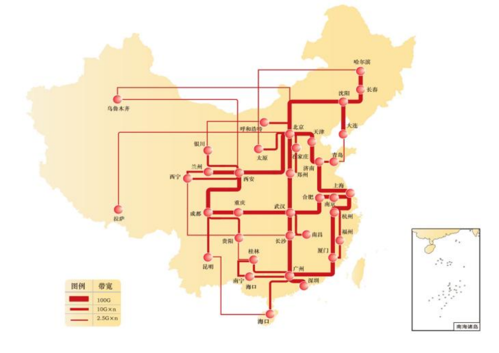

---
>* **2015-05 —** RFC 7513 (Standards Track) (Bi, Wu, Yao, Baker) specifies a SAVI solution for DHCP, addressing how switches learn bindings and validate source addresses when DHCP is used.
* **2015-05 —** 毕军、吴建平、姚广等发布RFC 7513（标准轨），面向DHCP地址分配场景给出SAVI解决方案，规范交换机如何学习绑定关系并据此实施源地址验证。

---
>* **2015-07 —** **RFC 7596 (Lightweight 4over6)** was published; key authors include **Yong Cui (Tsinghua University)** and **Qiong Sun (China Telecom)** among others. It moves NAPT from centralized CGN to the CPE side, reducing centralized state—important for carrier-scale IPv4-over-IPv6 transition.
* **2015-07 —** **RFC 7596（Lightweight 4over6）**发布，作者包含 **崔勇（清华）**、**孙琼（中国电信）**等；其将 NAPT 从集中式 CGN 下沉到用户侧 CPE，降低中心状态规模，是运营商级 IPv4-over-IPv6 过渡的重要方案。

---
>* **2015-07 —** RFC 7597 (MAP-E) includes X. Li and C. Bao as authors, defining Mapping of Address and Port with Encapsulation for stateless, algorithmic IPv4-over-IPv6.
* **2015-07 —** 李星、包从晓等发布RFC 7597《MAP-E》，以“封装+算法映射”的方式实现无状态IPv4-over-IPv6，突出可规模化与可运营性。

---
>* **2015-07 —** RFC 7598 (Softwire46 DHCPv6 options) includes C. Bao and other Chinese contributors, standardizing provisioning options for MAP-E/MAP-T/LW4o6 customer edge devices.
* **2015-07 —** RFC 7598在Softwire46体系下定义DHCPv6配置选项（作者含包从晓等），把MAP-E/MAP-T/LW4o6等机制的“终端/边缘设备可自动开通”所需参数标准化，显著提升可运营部署能力。
---
>* **2015-07 —** RFC 7599 (MAP-T) includes C. Bao and X. Li, defining Mapping of Address and Port using Translation, offering a translation-based counterpart to MAP-E.
* **2015-07 —** 包从晓、李星等发布RFC 7599《MAP-T》，以“翻译+算法映射”的方式提供与MAP-E互补的过渡路径，兼顾部署约束与互通需求。

---
## 2017–2020: National IPv6 large-scale deployment & end-to-end readiness campaigns
## 2017–2020：IPv6 国家级规模部署与端到端贯通专项

---
>* **2017-02 —** RFC 8074 (Standards Track) by Jun Bi, Guang Yao (Tsinghua University) and co-authors specifies SAVI for mixed address assignment methods, addressing coexistence/collision handling across SLAAC/DHCP/SEND/manual bindings.
* **2017-02 —** 由毕军、姚广（清华大学）等发布RFC 8074（标准轨），面向多种地址分配方式混用场景，规范SAVI方法共存与绑定冲突处理（SLAAC/DHCP/SEND/手工绑定等）。

---
>* **2017-11-26 —** China issued the **Action Plan for Promoting Large-scale Deployment of IPv6**, setting staged goals (2018/2020/2025) and requiring coordinated upgrades across backbone interconnects, LTE/5G, government & top commercial sites/apps, DNS, CDNs, clouds, and terminals.
* **2017-11-26 —** 发布《**推进 IPv6 规模部署行动计划**》，明确 2018/2020/2025 分阶段目标，并要求骨干互联、LTE/5G、政府与头部网站/应用、DNS、CDN、云平台、终端等全链路协同升级。

---
>* **2019-01 —** Official reporting discussed measurable progress: by **Nov 2018**, dozens of provincial-level government websites were reachable via IPv6, and central SOE sites largely supported IPv6—showing “government & SOE” leading effects.
* **2019-01 —** 官方解读披露阶段性成效：截至 **2018 年 11 月**，大量省部级政府网站可通过 IPv6 访问，央企网站 IPv6 支持度也显著提升，体现“政务/央企示范带动”。 

---
>* **2020-03 —** MIIT launched the **2020 IPv6 End-to-End Connectivity Capability Improvement Special Action**, specifying tasks for carriers, CDNs, clouds, data centers, terminals, and security—turning “IPv6 support” into concrete KPIs (coverage, performance parity targets, etc.).
* **2020-03 —** 工信部启动《**2020 年 IPv6 端到端贯通能力提升专项行动**》，对运营商、CDN、云、IDC、终端与安全提出明确任务，将“支持 IPv6”转化为可考核指标（覆盖率、性能趋同等）。

---
>* **2020-09 —** Progress reporting highlighted rapid growth in IPv6 addresses and users and improvements in international egress bandwidth and top-site IPv6 support, reflecting acceleration after the 2020专项行动.
* **2020-09 —** 成效通报显示 IPv6 地址与用户规模快速增长、国际出入口带宽逐步提升、头部网站/应用 IPv6 支持度增强，体现 2020 专项行动后的加速效果。

---
## 2021–2026: Deepening deployment, SRv6/Single-stack exploration & international standards presence
## 2021–2026：纵深推进、单栈/SRv6 探索与国际标准舞台

---
>* **2021 —** Xing Li and Lixia Zhang are inducted into the Internet Hall of Fame, explicitly recognizing contributions including IPv6 development/deployment (Li) and RSVP/QoS architecture influence (Zhang).
* **2021 —** 李星与张丽霞入选互联网名人堂，分别以中国互联网与IPv6发展部署贡献、以及RSVP/QoS体系影响力等获得国际层面的长期认可。
---
>* **2021-05 —** RFC 8992 (S. Jiang, Ed.; Z. Du; Q. Sun; etc.) publishes an approach to autonomic IPv6 edge prefix management for large-scale ISP networks, connecting standards thinking with operator realities (China Mobile/China Telecom participation).
* **2021-05 —** RFC 8992发布（姜昇任编者，作者含中国移动的杜宗鹏、中国电信的孙琼等），面向大规模ISP网络提出IPv6边缘前缀自治管理目标与思路，体现中国运营商/设备侧在网络自治化方向的标准贡献。

---
>* **2022-09 —** **CERNET** and **China Telecom’s ChinaNet** launched a **100G pure IPv6 interconnection link in Beijing**, pioneering the **direct interconnection of two large backbone networks using the next-generation Internet IPv6 single-stack architecture**.This was also the **first case internationally where network operators interconnected using pure IPv6 while supporting “IPv4 as a Service (IPv4aaS)”**, setting a **new benchmark for IPv6 development both in China and worldwide**.
* **2022-09 —** CERNET和中国电信ChinaNet在北京开通100G纯IPv6互联线路，开创两个大型骨干网通过下一代互联网IPv6单栈直接互联的先河。这也是国际上运营商之间以纯IPv6进行互联互通并支持“IPv4即服务（IPv4aaS）”的首个案例，在国内外树立了IPv6发展新标杆。

---
>* **2022-2025 —** Xing Li serves as an Internet Hall of Fame Advisory Board member, continuing community stewardship roles alongside technical/standards contributions.
* **2022-2025 —** 李星担任互联网名人堂Advisory Board成员，在标准与互联网治理/社区服务层面持续投入。

---
>* **2023-11 —** China launched the **world’s first 1.2T ultra-high-speed next-generation Internet backbone link**.The link connects **Beijing, Wuhan, and Guangzhou**, and was jointly developed by **Tsinghua University**, **China Mobile**, **Huawei**, and **CERNET Corporation (Sair)**. Its completion marks the **world’s first 1.2T ultra-high-speed next-generation Internet backbone**, representing **an important milestone in the development of global Internet infrastructure**.
* **2023-09 —** 我国开通全球首条1.2T超高速下一代互联网主干通路。该通路连接北京-武汉-广州，由清华大学联合中国移动、华为公司和赛尔公司共同协作研制成功，标志着全球首条1.2T超高速下一代互联网主干通路在我国面世，是全球互联网基础设施发展的一个重要里程碑。

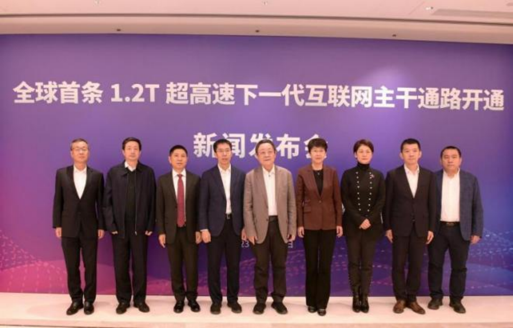

---
>* **2024 —** **Xing Li** received the Internet Society’s **Jonathan B. Postel Service Award** (2024), reflecting long-term impact on Internet development and standards/operations communities.
* **2024 —** **李星**获 Internet Society 颁发 **Jonathan B. Postel Service Award（2024）**，体现其在互联网发展与标准/运行社区中的长期影响力。 

---
>* **2025-03 —** **Wang Lang (CNNIC)** was elected **ICANN GAC Vice Chair**, reflecting continued Chinese participation in global Internet identifier policy coordination closely tied to DNS/registry operations.
* **2025-03 —** **王岚（CNNIC）**当选 **ICANN 政府咨询委员会（GAC）副主席**，体现中国持续参与与 DNS/注册局运营密切相关的全球互联网标识符政策协调。

---
>* **2025-05-20 —** The **2025 IPv6 work key points** set higher end-of-year goals (e.g., active users, IoT connections, traffic ratios) and emphasized building a globally leading IPv6 technology/industry/ecosystem and improving “default IPv6-on” for new services and terminals.
* **2025-05-20 —** 《**2025 年工作要点**》提出更高年度目标（活跃用户、物联网连接数、流量占比等），强调构建全球领先的 IPv6 技术/产业/生态体系，并推动新增网络、服务与终端“默认启用 IPv6”。

---
>* **2026-03 —** **IETF 125 Shenzhen** (agenda published; meeting held in March 2026) reflects China hosting core Internet standards work sessions—an important “standards community” milestone beyond domestic deployment.
* **2026-03 —** **IETF 125 深圳**（议程发布、2026 年 3 月举行）体现中国承办互联网核心标准制定会议的能力与参与度，是“国内部署之外”的重要国际标准舞台节点。 

---
